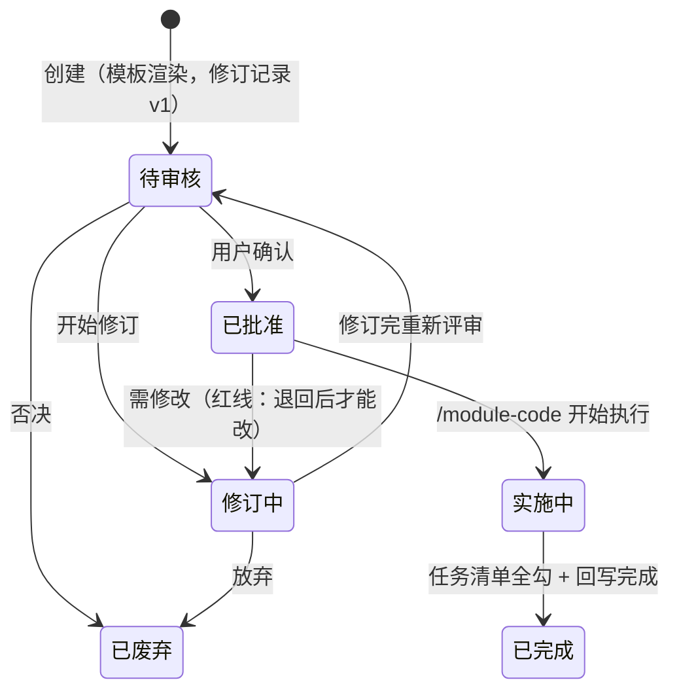
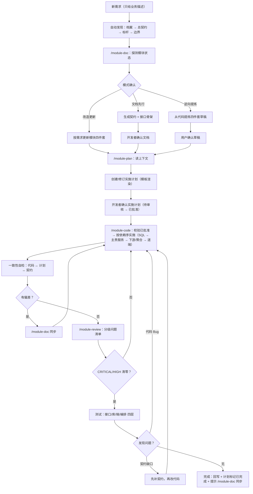

# doc-framework：面向文档开发体系

把一套在真实全栈项目中验证过的「契约文档 + 测试文档 + 实施计划」开发方法——**面向文档开发**（Document-Oriented Development）——抽象为**可跨项目复用的方法论资产**：文档模板 + 五个 skill + 安装工具。

> AI 深度参与开发的全栈项目越多，这套体系越值钱——它给 AI 定"规矩"：**文档永远反映真实代码，代码永远长在既有架构上**。
> v2.0 起支持**多应用工作区**：一个项目可登记 N 个前端端 + N 个后端服务（不同技术栈），档案「应用清单」统一路由，契约保持业务语义唯一真相，应用只是落点。

## 核心设计原则

- **skill 不焊死任何技术栈**：方法论在本仓库，项目特定约定全部收敛到「项目档案」（`doc-framework/项目档案.md`），skill 一切配置从档案读取——换技术栈只换档案，不换技能；
- **一个文档根 × N 个应用**：档案「应用清单」是 skill 的路由表（应用 → 类型/代码根/规范/数据库/依赖）；可见性 ≠ 上下文——skill 只加载涉及应用的规范与标杆；计划「逐应用表态 + 变更文件清单」即 /module-code 的路径白名单；
- **人机共读**：契约文档中的依赖图 / 状态机 / 页面结构 / 业务流程一律用 mermaid 绘制（模块依赖全景图、跨模块业务流程归总契约），人类阅读、AI 实施都靠同一份文档；
- **上下文从体系中来，不从人肉中来**：关联文档/代码地址是体系的自动产出（档案 → 总契约 → 导航区 → 代码扫描兜底），用户只给业务需求。

## 五个技能的使用方式

五个 skill 用 `/命令` 显式触发（防误触发，不用自然语言关键词），**DSH 只识别英文技能名**。核心分工一句话：**探索归 /module-explore、文档归 /module-doc、计划归 /module-plan、代码归 /module-code、检查归 /module-review**——各司其职，谁都不越界。记忆点：**探路、写文档、写计划、写代码、收尾检查**。

### 分工总览

| 技能 | 触发形式 | 职责 | 边界（明确不做什么） |
|------|----------|------|----------------------|
| `/module-explore` | `/module-explore {主题}`，可加 `落盘` 后缀 | **写契约前的探索与讨论**：按应用清单路由调研相关应用代码、澄清需求与范围、候选方案对比、有证据的推荐；重大决策经确认后落盘探索记录 | **不写契约、不写计划、不改代码**；默认不落盘；探索中的确认 ≠ 授权写文件 |
| `/module-doc` | `/module-doc {模块名}`，可加 `新建 / 补文档 / 改造 / 同步` 后缀 | 模块四件套（契约 / 接口 / 测试 / test.sh）的创建、逆向提炼、更新、同步；回写总契约索引 | 不写代码；不创建、修订实施计划；不做探索讨论（归 /module-explore） |
| `/module-plan` | `/module-plan {模块名}` / `{计划路径}` / `{模块名} {YYYY-MM-DD-主题}` / `{模块名} 归档` | 实施计划的创建、修订、状态流转、**归档**（已完成/已废弃移入 `计划/archive/`）（详见下文「实施计划」专章） | 不实施代码；不改契约文档 |
| `/module-code` | `/module-code {计划路径}` / `{模块名}` | **只执行「已批准」的实施计划**，以计划为主、契约为约束、**白名单为边界**（只允许改动计划「逐应用表态=改动」的应用代码根 ∩ 变更文件清单），按依赖序实施并**逐项勾选任务清单**，完成后回写 | 不创建 / 修改四件套文档；不创建 / 修订 / 归档计划 |
| `/module-review` | `/module-review {模块名}` | 对照四件套与各应用代码审查：分级问题清单 + **多应用对账**（落点 ↔ 表态 ↔ 接入状态 ↔ git diff）+ **完成度对账**（任务勾选 ↔ 实际产出）+ 回写查账 | 不改代码，只出清单与修复建议 |

### 0. /module-explore：探索与讨论（可选前置）

**当你不确定时，先探索再立项**：需求模糊、方案取舍、不熟代码库、范围存疑时，先做一次零承诺的对话——调研代码、比较方案、把问题问清楚，再决定立什么项。

- 触发：`/module-explore {主题}`；重大跨模块/跨应用决策要留痕时 `/module-explore {主题} 落盘`；
- 产出：**默认不落盘**（决策留在对话里）；落盘则为 `探索/YYYY-MM-DD-{主题}.md`（背景 / 候选方案对比 / 选定方案与理由 / 未决问题），定位是**单次决策记录**（不作规范依据，不参与 `check` 硬校验）；
- 硬护栏：不写代码、不写契约、不写计划、不建模块文件夹；**探索中的确认 ≠ 授权写文件**（写文件需单独确认）；不复制契约内容；
- 交接：方案清晰后 → `/module-doc {模块名} 新建`（契约导航区回链探索记录，回答"为什么这么设计"）；需求本就明确时**跳过探索**，直接 `/module-doc 新建`。

### 1. /module-doc：模块文档（四件套）

**四件套**聚合在 `模块/{模块名}/` 下：`契约.md`（语义约束，10 章含接口概览与 mermaid 图；**主责服务声明 + §5 应用落点表 + §8.2 关键验收场景（Scenario）**；§10 生产环境 SQL 执行登记防上线遗漏）、`接口.md`（字段级**服务端真相**，唯一事实源；含服务归属/消费方与各应用接入状态）、`测试.md`、`test.sh`。

| 触发 | 模式 | 何时用 |
|------|------|--------|
| `/module-doc {模块名}` | 自动探测：无文档有代码 → 逆向提炼；均无 → 文档先行；已有 → 改造更新（探测后向用户分支确认） | 日常默认 |
| `/module-doc {模块名} 新建` | 文档先行：契约 = 需求分析，生成契约 + 接口骨架 | 新模块，文档先行 |
| `/module-doc {模块名} 补文档` | 强制逆向提炼：从代码提炼四件套草稿（逐项标注置信度，确认后回写索引） | 老代码补文档 |
| `/module-doc {模块名} 改造` | 按需求更新四件套 + 回写总契约索引 | 需求变更，先改文档 |
| `/module-doc {模块名} 同步` | 按代码最新状态同步接口.md / 测试（契约语义变化走「改造」） | 代码已改、文档落后 |

要点：上下文零路径投喂（档案 → 总契约 → 边界文档，档案缺登记提示回填而非反问路径）；生成文档必须带导航区；契约 §4 只放接口概览，字段细节一律进接口.md（防双维护）。

### 2. /module-plan 与 3. /module-code：实施计划

**计划是单次决策记录，契约才是长期真相**；两者配合使用：/module-plan 建计划（待审核）→ 用户确认（已批准）→ /module-code 执行（逐项勾选任务清单）→ 登记「已完成」→ /module-plan 归档。完整说明——两类计划的落盘位置与归档、状态机与红线、触发形式怎么用、常见误解——见下方专章「实施计划：创建、修订与执行」。

### 4. /module-review：模块审查

- 流程：读档案（注入技术栈特有检查项）→ 总契约 → 四件套 → 对照代码逐项检查；
- 输出：分级问题清单 `CRITICAL / HIGH / MEDIUM / LOW` + 检查统计（总 / 通过 / 各级数量）；
- **回写查账**：校验 /module-code 的回写义务已履行（契约变更记录有登记、**含需生产执行的 SQL 时 §10 已登记**、接口.md 与代码一致、总契约索引已更新）；
- 门禁：CRITICAL 与 HIGH 清零才提示可提交；否则列出问题并建议 `/module-doc {模块名} 同步` 或 `/module-code` 修复。

### 典型协作流程

| 场景 | 流程 |
|------|------|
| 正向开发 | `/module-doc 新建`（契约先行）→ `/module-plan`（创建计划）→ `/module-code`（实施 + 回写）→ `/module-doc 同步`（收尾）→ `/module-review`（验证） |
| 改造 | `/module-doc 改造`（更新契约）→ `/module-plan`（新计划或修订）→ `/module-code`（实施 + 回写） |
| 计划未批准 | `/module-code` 拒绝执行 → 提示 `/module-plan` 处理（修订或废弃） |

记忆点：**探路、写文档、写计划、写代码、收尾检查**。

> **触发说明**：DSH 的显式触发只匹配英文技能名（`/技能名` 手势仅支持小写字母/数字/连字符）；也可用自然语言描述（如"用模块代码技能…"），AI 会按技能目录自行加载。

## 实施计划：创建、修订与执行

**计划是单次决策记录，契约才是长期真相**：一次需求一份计划，从「待审核」走到「已完成 / 已废弃」即归档；计划归档后不作规范依据，后续改动以契约「变更记录」章节为准。计划的使用固定三步：**/module-plan 建计划 → 用户确认 → /module-code 执行**。

### 两类计划，落盘位置不同

| 类型 | 判定 | 存放位置 | 触发定位 |
|------|------|----------|----------|
| 单模块计划（默认） | 只涉及一个模块（计划文档「依据模块契约」一行） | `模块/{模块名}/计划/YYYY-MM-DD-{主题}.md` | `/module-plan {模块名}` 列清单 / 新建；`/module-plan {模块名} {YYYY-MM-DD-主题}` 精确匹配 |
| 跨模块计划 | 引用多个模块契约（「依据模块契约」多行） | `计划/YYYY-MM-DD-{主题}.md`（全局目录） | 只能 `/module-plan {计划路径}` 直达（`{模块名}` 形式不匹配全局目录） |
| **归档**（非类型，是位置） | 状态为「已完成 / 已废弃」后的计划 | 同级 `计划/archive/`（单模块 `模块/{模块名}/计划/archive/`） | `/module-plan {模块名} 归档` 移动；归档后不进 glob 清单，需路径直达 |

文件名统一带日期前缀；同模块多份计划按「日期-主题」区分。**归档是独立动作**（`/module-plan` 职责）：实施完成 ≠ 可以归档——归档让计划彻底退出活跃视图，由人决定时机（可能还要等生产 SQL 执行、等验收）；归档后"在途计划"列表始终等于"真正在办的事"。

### 状态机与红线



- 状态是**事实登记**：AI 登记、用户确认流转；评审在文档内或文档外皆可，状态如实记录即可；
- 「实施中 / 已完成」由 /module-code 实施时登记，/module-plan 不登记；**存在未勾选任务时不得登记「已完成」**；
- **任务清单是进度事实源**：计划 §四 用 `- [ ] 组.序号` 记录可独立验证的任务，/module-code 每完成一项就地勾选（**只勾事实完成的项**），/module-review 按此核对完成度（假勾选 / 漏勾 / 全勾但状态未完成都算问题）；
- **归档不是状态**，是位置：已完成/已废弃的计划由 `/module-plan {模块名} 归档` 移入 `计划/archive/`；
- **红线：已批准计划不可直接修改**——需修改先退回「修订中」，改完回到「待审核」重新评审；
- 修订一律**追加修订记录**（版本+1 / 日期 / 状态 / 修改点 / 评审结论），不覆盖历史。

### 三个触发形式怎么用

| 想做的事 | 触发 | 行为 |
|----------|------|------|
| 新建 / 查看某模块计划 | `/module-plan {模块名}` | glob 列出清单（编号\|日期-主题\|状态\|修订版本），回复编号选择；无匹配自动进入新建 |
| 直达指定计划（含跨模块） | `/module-plan {计划路径}` | 按路径打开（绝对或相对路径，相对以项目根为基准） |
| 精确找单模块计划 | `/module-plan {模块名} {YYYY-MM-DD-主题}` | 匹配 `模块/{模块名}/计划/` 下文件名 |
| 修订计划 | 先按上面任一定位，再说"修订" | 展示当前状态 + 待确认事项 + 修订记录 → 按意见改正文 → 追加修订记录 → 状态流转 |
| 执行计划 | `/module-code {计划路径}` | **仅「已批准」才执行**（SQL → 主责服务 → 下游/聚合 → 逐端，契约为约束、白名单为边界），逐项勾选任务清单，完成后登记「已完成」+ 回写 |
| 列出某模块可执行的计划 | `/module-code {模块名}` | 只列出「已批准」计划供选择 |
| 计划未批准想执行 | `/module-code {计划路径}` | 拒绝执行，提示先用 /module-plan 处理（修订或废弃） |
| **归档计划** | `/module-plan {模块名} 归档` | 列出「已完成/已废弃」计划 → 移入 `计划/archive/`（未完成计划禁止归档）；归档后不进 glob 清单 |

> **跨模块执行**：`/module-code {计划路径}` 时，模块名从路径 `模块/{模块名}/计划/` 或计划文档「依据模块契约」行解析——跨模块计划含多行，逐个模块读其四件套 + 标杆 + 边界文档实施。

### 常见误解

| 误解 | 正确理解 |
|------|----------|
| 计划确认后会自动实施 | 不会——必须显式调 `/module-code`，且计划须为「已批准」 |
| 已批准的计划可以直接改 | 不能——红线：先退回「修订中」→ 修订 → 「待审核」重新评审 |
| 任务清单可以最后一起勾 | 不——每完成一项就地勾选（只勾事实完成的项）；未勾完不得登记「已完成」 |
| 实施完成就自动归档 | 不——归档是 /module-plan 的独立动作（`/module-plan {模块名} 归档`），时机由人定（可能还要等生产 SQL 执行、等验收） |
| 跨模块计划放在某个模块目录里 | 不——在全局 `计划/`；`{模块名}` 触发形式只匹配模块内计划，跨模块一律用 `{计划路径}` |
| 计划是长期规范依据 | 不——计划是单次决策记录，归档后看契约「变更记录」章节 |
| 改计划 = 改代码，说一声就行 | 不——代码只认「已批准」的计划；改计划必须走状态机，重新批准后才可执行 |

## 快速开始

```
① 安装      → 见下方「安装」
② 接入初始化 → 对 AI 说"初始化项目"，AI 按项目根《接入指南.md》执行（完成后自动清理引导）
③ 日常开发   → （可选）/module-explore 探路 → /module-doc 定义 → /module-plan 计划 → /module-code 执行+回写 → /module-review 验证
```

## 安装

### 方式 A：npm git 依赖（推荐，适合有 package.json 的全栈项目）

```json
{
  "dependencies": {
    "doc-framework": "git+https://github.com/knight-peter/doc-framework.git#v2.0.0"
  },
  "pnpm": {
    "onlyBuiltDependencies": ["doc-framework"]
  }
}
```

`pnpm install` 后自动完成：`skills/*` → 项目级 skill 目录（默认 `.agents/skills/`，可经 `doc-framework.config.json` 配置）、`doc-framework/` 骨架目录（`模块/`、`边界/`、`规范/`、`计划/`、`探索/` + 引导 README）、`接入指南.md` → 项目根、`AGENTS.md` 写入接入引导（**已初始化项目自动跳过引导**）。

### 方式 B：一键安装脚本（无 package.json 的项目）

```bash
curl -fsSL https://raw.githubusercontent.com/knight-peter/doc-framework/main/install.sh | bash
```

> 脚本内部默认经 SSH 克隆仓库；若本机 SSH 22 端口不可达（如代理/VPN 拦截），先指定可用的仓库地址再执行：
>
> ```bash
> export DOC_FRAMEWORK_REPO="https://github.com/knight-peter/doc-framework.git"
> curl -fsSL https://raw.githubusercontent.com/knight-peter/doc-framework/main/install.sh | bash
> ```
>
> （环境变量需 `export` 后单独一行；`VAR=x curl | bash` 的写法传不到管道里的 bash。）

与方式 A 行为一致：安装 skills → 预置 `doc-framework/` 骨架目录 → 生成《接入指南.md》→ 写入 AGENTS.md（含模板来源标记：仓库地址 + 版本，供初始化时拉取模板）。

## 接入初始化（一次性）

安装后项目根出现《接入指南.md》。对 AI 说 **"初始化项目"**（或 AI 按 AGENTS.md 引导主动提示）：

- **旧项目**：AI 扫描代码库 → 生成档案草案（逐项标注证据来源与置信度）→ 开发者确认 → 提炼第一份契约（标杆）→ 生成文档骨架；
- **全新项目**：AI 提问（技术栈/约定/业务域/文档语言）→ 生成档案 + 骨架。

> **渲染纪律**：所有骨架文档一律从官方模板渲染生成（模板位置见《接入指南.md》「模板来源」），`{占位符}` 必须全部替换为项目实际值，**禁止凭空自创结构**；完成后运行 `npx doc-framework check` 自检（若可用）。

初始化完成后 AI 自动清理：移除 AGENTS.md 接入引导段、删除《接入指南.md》与 `doc-framework/README.md`（骨架引导）——一次性引导不占用后续会话上下文。

## 日常开发流程



## 文档体系（初始化后生成）

```
doc-framework/
├── 项目档案.md          ← 唯一需人工确认的文件（应用清单 = skill 路由表；通用约定全局段+应用覆盖）
├── 总契约.md            ← 总索引：业务域、应用拓扑、模块索引表（主责服务+各应用落点）、依赖矩阵+全景图、跨模块业务流程、维护规则
├── 测试规范.md          ← 通用测试方法论（接口层/库层/端层/编排层 四层验证、缺陷闭环）
├── 接口规范.md          ← 全局接口约定（REST/错误码/分页/认证/接口兼容性红线）
├── 规范/                ← 三层：类型-前端、类型-后端（类型层共性）+ 应用-{应用标识}（每应用一份差异）
├── 边界/                ← 跨模块/跨服务能力（工作流/附件/权限/服务间调用/事件与MQ/鉴权网关等）
├── 计划/                ← 跨模块实施计划（引用多个契约）；archive/ 为归档计划
├── 探索/                ← 探索记录（按需；/module-explore 落盘的单次决策记录）
└── 模块/{模块名}/       ← 模块聚合资产（业务语义唯一真相，应用只是落点）
    ├── 契约.md          ← 语义约束（10 章：主责服务声明 + §5 应用落点表 + §8.2 验收场景 + §10 生产 SQL 登记，mermaid 图）
    ├── 接口.md          ← 字段级服务端真相（唯一事实源）：服务归属/类型/消费方 + 各应用接入状态
    ├── 测试.md
    ├── test.sh          ← 多服务 BASE_URL 参数化
    └── 计划/            ← 单模块实施计划（YYYY-MM-DD-{主题}.md：逐应用表态+任务清单+按应用分节+依赖序）；archive/ 为归档计划
```

> 文档语言默认中文，可整体切换英文（`docs-framework/` 模式）；目录与文件命名要么全中文、要么全英文，禁止混用。

## 模板清单（templates/）

`profile.md.tpl`（项目档案，含应用清单）· `接入指南.md.tpl` · `AGENTS.md.tpl` · `总契约.md.tpl` · `测试规范.md.tpl` · `接口规范.md.tpl` · `规范/类型-前端.md.tpl`、`规范/类型-后端.md.tpl`、`规范/应用-{应用标识}.md.tpl`（规范三层） · `边界/{能力}边界.md.tpl` · `模块/{模块名}/{契约|接口|测试|test.sh}.tpl` · `计划/YYYY-MM-DD-{实施主题}.md.tpl` · `探索/YYYY-MM-DD-{主题}.md.tpl` · `scripts/e2e_template.sh`（共享 E2E 脚本）

## 升级

- 方式 A：更新依赖版本后 `pnpm install`（lockfile 锁死时 `pnpm update doc-framework`；store 复用跳过 postinstall 则 `pnpm rebuild doc-framework`），或 `npx doc-framework sync`
- 方式 B：重新执行安装脚本
- **本地定制过的 skill 文件自动跳过**（版本标记 + 文件对比），不会被覆盖；templates 升级只影响新项目初始化，已初始化项目的文档资产不回灌

### v1.x → v2.0（多应用工作区）

**框架升级是安全的**：已初始化项目升级后行为不变——`check` 对无「应用清单」的旧档案自动回退到旧版校验（前后端规范各一份）。想用多应用能力，需按下面的路径手动演进文档体系（框架升级 ≠ 文档体系升级，文档资产永不回灌）：

1. **档案补「应用清单」**（唯一手动步骤，参考 `templates/profile.md.tpl`）：每个应用一行（标识/类型/技术栈/代码根/规范文件/数据库/依赖）。单前端单后端项目只登记两行，行为与旧版等价，但解锁路由、白名单与 `diff-check`；
2. **规范三层拆分**：共性留在 `规范/类型-前端.md`、`规范/类型-后端.md`，各应用差异抽到 `规范/应用-{应用标识}.md`（单应用项目可只建一份）；
3. **逐模块改造**：`/module-doc {模块名} 改造`——契约补主责服务声明与 §5 应用落点表，接口.md 补服务归属/消费方/接入状态；
4. **计划新格式自然生效**：下一次 `/module-plan` 起自动带「逐应用表态 + 按应用分节 + 依赖序」；
5. `/module-review` 兜底对账。

注意：v2.0 总契约新增「§三 应用拓扑」导致章节重编号（依赖矩阵 §四→§五、业务流程 §五→§六…），新模板里的章节引用按新编号——建议迁移第 3 步时一并将存量总契约调整为新结构，避免契约内引用对不上。AGENTS.md 永久段不会自动更新（已初始化跳过引导），可手动补两条：应用清单是路由表、计划表态+清单是 /module-code 白名单。

## 常见问题（FAQ）

**Q1：`pnpm install` 装完了，但 `.agents/skills` 里没有 skill？**

pnpm v10 默认不执行依赖包的生命周期脚本，必须先配置 `pnpm.onlyBuiltDependencies: ["doc-framework"]`（见方式 A 配置）。若配置后仍缺失，多半是 **store 复用跳过了 postinstall**（安装输出显示 "reused N"），执行：

```bash
pnpm rebuild doc-framework
```

强制重跑安装脚本。

**Q2：git 依赖要不要带版本号？**

建议钉版本：`git+...#v2.0.0`。不带 `#ref` 时解析的是默认分支（main）的**最新提交**，而非最新标签；且 lockfile 会把解析到的提交 SHA 锁死，之后 main 有新提交也不会自动更新，需要 `pnpm update doc-framework`（或删除 lockfile 重新 install）。

**Q3：`doc-framework sync` 提示"跳过（本地已定制）"？**

这是防漂移设计：版本标记 `.doc-framework.json` 按相对路径（如 `module-code/SKILL.md`）逐文件记录 sha256，与官方版本不一致的文件视为本地定制，自动跳过、不被覆盖。放弃定制恢复官方版本：删除该文件后重跑 sync。

**Q4：安装失败残留了部分 skill 目录？**

安装中途失败（如 v1.0.0 的 EISDIR 崩溃）会留下不完整目录且没有版本标记。重装或 `pnpm rebuild doc-framework` 会先删后拷自动覆盖，无需手动清理。

**Q5：升级会覆盖项目里的文档吗？**

不会。templates 升级只影响新项目初始化；已初始化项目（存在 `doc-framework/项目档案.md` 或 `docs-framework/profile.md`）自动跳过接入引导写入；项目 `doc-framework/` 下的档案与契约是自有资产，永不回灌。

**Q6：`doc-framework check` 是干什么的？**

校验文档体系完整性（退出码 0=通过 / 1=有硬问题）：① **骨架完整性**——必需文件/目录是否存在（项目档案、总契约、测试/接口规范、模块/边界/规范/计划）；② **应用清单健康**——档案含「应用清单」时逐应用校验（规范文件存在、代码根存在且不嵌套、按应用类型要求类型层规范；旧版档案无应用清单则回退校验前后端规范）；③ **计划体检**——逐份在途计划校验：表态应用已登记、变更文件清单路径落在表态「改动」应用的代码根下、状态与任务进度一致（「已完成」但有未勾任务 = 硬报错；任务全勾但状态未更新 = 提示）；④ **占位符残留**——扫描文档根下 .md 中未渲染的 `{占位符}`（只报含中文的占位符，避免误报 API 路径参数 `/{id}`、MyBatis `#{version}` 等英文花括号）；⑤ **引导清理**——接入指南.md、骨架引导 README、AGENTS.md 接入引导段是否已移除。ℹ️ 提示项只在控制台列出、**不影响退出码**（旧格式计划、回写清单未勾完等）。文档根自动识别中英文模式（`doc-framework/` 或 `docs-framework/`）。初始化与日常维护后均可运行。

**Q7：`doc-framework diff-check` 是干什么的？**

提交前/CI 对账（退出码 0=通过 / 1=有越界）：`doc-framework diff-check <计划路径> [--base <ref>] [--staged] [--strict]`。解析计划的「逐应用表态 + 变更文件清单」（白名单），对照 git 变更（含未跟踪文件）逐个归属到档案应用清单的代码根：落在表态「本次不改」的应用下 → 报错；表态「改动」但清单外 → 警告（`--strict` 时报错）；某应用代码根为 `./` 时退化为纯文件级清单。把 /module-review 的多应用对账前置到提交前，零 prompt 依赖。

**Q8：`doc-framework list` / `show` 是干什么的？**

只读查询（除 sync 外所有命令都只读，可进 CI）：

- `doc-framework list` —— 列出**在途计划**（默认排除「已完成/已废弃」与归档目录），显示 模块 / 计划（日期-主题）/ 状态 / 涉及应用（表态=改动）/ 任务进度；`--module <名>` 只列某模块、`--app <标识>` 只列会改动该应用的计划（"某端还有哪些活"的入口）、`--state <状态>` 过滤、`--all` 含已完成/已废弃、`--json` 机器可读；
- `doc-framework show <计划路径>` —— 单个计划的结构化视图：状态、逐应用表态与**推导出的白名单前缀**、变更文件清单、任务进度与未完成项、回写清单进度、接口兼容性；`--json` 同源输出；
- 两者输出末尾带 `Next:` 引导（下一步该跑 diff-check 还是归档）；`--json` 是机器消费接口，当前标记 **experimental**（格式可能变动）。

> **版本提示**：v1.0.0 的 postinstall 会因 skills 为目录结构、脚本未递归处理而报 `EISDIR` 崩溃，v1.0.1 已修复（逐文件递归 sha256）。请使用 v1.0.1 及以上版本。

## 使用纪律

1. **先文档后代码**：需求再急，先建/改模块文档（契约 + 接口）——文档即需求分析；需求模糊时先 `/module-explore` 探路（探索不是必经阶段，明确时直接建文档）；
2. **测试→契约回写闭环**：发现问题先定性"代码 Bug vs 契约缺口"，涉及约定变化必回写契约；
3. **变更记录是唯一真相**：实施计划归档后不作规范依据，长期看契约的"变更记录"章节；
4. **计划是事实登记**：任务只勾事实完成的项，未勾完不得登记「已完成」；已完成/已废弃后由 /module-plan 归档。

## 维护者自检（改框架代码后必跑）

```bash
bash scripts/selftest.sh            # 需 node（可用 NODE_BIN=/path/to/node 指定）
```

临时项目里跑 10 项核心回归：官方计划模板渲染后 `check` 通过（文档路径/SQL/标题行不误报）、代码围栏示例不进白名单、含空格路径与 `./` 前缀解析、`diff-check` 对「本次不改」应用的越界拦截、坏计划显式报出、目录参数干净报错、英文模式、探索/ 豁免、v1.x 向后兼容。

## License

MIT
