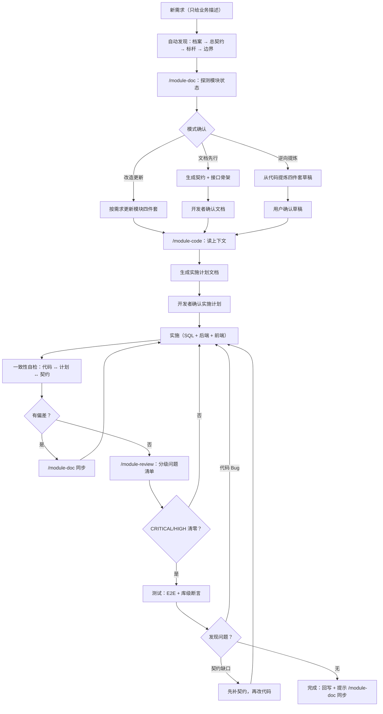

# doc-framework：面向文档开发体系

把一套在真实全栈项目中验证过的「契约文档 + 测试文档 + 实施计划」开发方法——**面向文档开发**（Document-Oriented Development）——抽象为**可跨项目复用的方法论资产**：文档模板 + 三个 skill + 安装工具。

> AI 深度参与开发的全栈项目越多，这套体系越值钱——它给 AI 定"规矩"：**文档永远反映真实代码，代码永远长在既有架构上**。

## 核心设计原则

- **skill 不焊死任何技术栈**：方法论在本仓库，项目特定约定全部收敛到「项目档案」（`doc-framework/项目档案.md`），skill 一切配置从档案读取——换技术栈只换档案，不换技能；
- **人机共读**：契约文档中的依赖图 / 状态机 / 页面结构 / 业务流程一律用 mermaid 绘制（模块依赖全景图、跨模块业务流程归总契约），人类阅读、AI 实施都靠同一份文档；
- **上下文从体系中来，不从人肉中来**：关联文档/代码地址是体系的自动产出（档案 → 总契约 → 导航区 → 代码扫描兜底），用户只给业务需求。

## 技能组合

三个 skill 用 `/命令` 显式触发（防误触发，不用自然语言关键词）。**DSH 只识别英文技能名触发**，实际触发词：

| 命令（DSH 实际触发词） | 职责 |
|------|--------|
| `/module-doc {模块名}` | 模块四件套文档：创建（文档先行）/ 逆向提炼 / 改造更新 / 同步 |
| `/module-code {模块名}` | 按实施计划实施代码（以实施计划为主、契约为约束），完成后回写 |
| `/module-review {模块名}` | 模块审查：分级问题清单 + 回写查账 |

记忆点：**写文档、写代码、收尾检查**。

> **触发说明**：DSH 的显式触发只匹配英文技能名（`/技能名` 手势仅支持小写字母/数字/连字符），实际触发词为上表三个命令；也可用自然语言描述（如"用模块代码技能…"），AI 会按技能目录自行加载。

## 快速开始

```
① 安装      → 见下方「安装」
② 接入初始化 → 对 AI 说"初始化项目"，AI 按项目根《接入指南.md》执行（完成后自动清理引导）
③ 日常开发   → /module-doc 定义 → /module-code 计划+实施+回写 → /module-review 验证
```

## 安装

### 方式 A：npm git 依赖（推荐，适合有 package.json 的全栈项目）

```json
{
  "dependencies": {
    "doc-framework": "git+https://github.com/knight-peter/doc-framework.git#v1.0.6"
  },
  "pnpm": {
    "onlyBuiltDependencies": ["doc-framework"]
  }
}
```

`pnpm install` 后自动完成：`skills/*` → 项目级 skill 目录（默认 `.agents/skills/`，可经 `doc-framework.config.json` 配置）、`doc-framework/` 骨架目录（`模块/`、`边界/`、`规范/`、`计划/` + 引导 README）、`接入指南.md` → 项目根、`AGENTS.md` 写入接入引导（**已初始化项目自动跳过引导**）。

### 方式 B：一键安装脚本（无 package.json 的项目）

```bash
curl -fsSL https://raw.githubusercontent.com/knight-peter/doc-framework/main/install.sh | bash
```

> 脚本内部默认经 SSH 克隆仓库；若本机 SSH 22 端口不可达（如代理/VPN 拦截），先指定可用的仓库地址再执行：
>
> ```bash
> export DOC_FRAMEWORK_REPO="https://github.com/knight-peter/doc-framework.git"
> curl -fsSL https://raw.githubusercontent.com/knight-peter/doc-framework/main/install.sh | bash
> ```
>
> （环境变量需 `export` 后单独一行；`VAR=x curl | bash` 的写法传不到管道里的 bash。）

与方式 A 行为一致：安装 skills → 预置 `doc-framework/` 骨架目录 → 生成《接入指南.md》→ 写入 AGENTS.md（含模板来源标记：仓库地址 + 版本，供初始化时拉取模板）。

## 接入初始化（一次性）

安装后项目根出现《接入指南.md》。对 AI 说 **"初始化项目"**（或 AI 按 AGENTS.md 引导主动提示）：

- **旧项目**：AI 扫描代码库 → 生成档案草案（逐项标注证据来源与置信度）→ 开发者确认 → 提炼第一份契约（标杆）→ 生成文档骨架；
- **全新项目**：AI 提问（技术栈/约定/业务域/文档语言）→ 生成档案 + 骨架。

> **渲染纪律**：所有骨架文档一律从官方模板渲染生成（模板位置见《接入指南.md》「模板来源」），`{占位符}` 必须全部替换为项目实际值，**禁止凭空自创结构**；完成后运行 `npx doc-framework check` 自检（若可用）。

初始化完成后 AI 自动清理：移除 AGENTS.md 接入引导段、删除《接入指南.md》与 `doc-framework/README.md`（骨架引导）——一次性引导不占用后续会话上下文。

## 日常开发流程



## 文档体系（初始化后生成）

```
doc-framework/
├── 项目档案.md          ← 唯一需人工确认的文件（技术栈/约定/标杆映射）
├── 总契约.md            ← 总索引：业务域、模块索引表、依赖矩阵+全景图、跨模块业务流程、维护规则
├── 测试规范.md          ← 通用测试方法论（E2E 双层验证、缺陷闭环）
├── 接口规范.md          ← 全局接口约定（REST/错误码/分页/认证）
├── 规范/                ← 前后端开发规范
├── 边界/                ← 跨模块能力（工作流/附件/权限等）
├── 计划/                ← 实施计划（文件名带日期，一契约多计划）
└── 模块/{模块名}/       ← 模块聚合四件套
    ├── 契约.md          ← 语义约束（9 章，含接口概览，mermaid 图）
    ├── 接口.md          ← 字段级调用细节（唯一事实源）
    ├── 测试.md
    └── test.sh
```

> 文档语言默认中文，可整体切换英文（`docs-framework/` 模式）；目录与文件命名要么全中文、要么全英文，禁止混用。

## 模板清单（templates/）

`profile.md.tpl`（项目档案）· `接入指南.md.tpl` · `AGENTS.md.tpl` · `总契约.md.tpl` · `测试规范.md.tpl` · `接口规范.md.tpl` · `规范/前端开发规范.md.tpl`、`规范/后端开发规范.md.tpl` · `边界/{能力}边界.md.tpl` · `模块/{模块名}/{契约|接口|测试|test.sh}.tpl` · `计划/YYYY-MM-DD-{实施主题}.md.tpl`

## 升级

- 方式 A：更新依赖版本后 `pnpm install`，或 `npx doc-framework sync`
- 方式 B：重新执行安装脚本
- **本地定制过的 skill 文件自动跳过**（版本标记 + 文件对比），不会被覆盖；templates 升级只影响新项目初始化，已初始化项目的文档资产不回灌

## 常见问题（FAQ）

**Q1：`pnpm install` 装完了，但 `.agents/skills` 里没有 skill？**

pnpm v10 默认不执行依赖包的生命周期脚本，必须先配置 `pnpm.onlyBuiltDependencies: ["doc-framework"]`（见方式 A 配置）。若配置后仍缺失，多半是 **store 复用跳过了 postinstall**（安装输出显示 "reused N"），执行：

```bash
pnpm rebuild doc-framework
```

强制重跑安装脚本。

**Q2：git 依赖要不要带版本号？**

建议钉版本：`git+...#v1.0.6`。不带 `#ref` 时解析的是默认分支（main）的**最新提交**，而非最新标签；且 lockfile 会把解析到的提交 SHA 锁死，之后 main 有新提交也不会自动更新，需要 `pnpm update doc-framework`（或删除 lockfile 重新 install）。

**Q3：`doc-framework sync` 提示"跳过（本地已定制）"？**

这是防漂移设计：版本标记 `.doc-framework.json` 按相对路径（如 `module-code/SKILL.md`）逐文件记录 sha256，与官方版本不一致的文件视为本地定制，自动跳过、不被覆盖。放弃定制恢复官方版本：删除该文件后重跑 sync。

**Q4：安装失败残留了部分 skill 目录？**

安装中途失败（如 v1.0.0 的 EISDIR 崩溃）会留下不完整目录且没有版本标记。重装或 `pnpm rebuild doc-framework` 会先删后拷自动覆盖，无需手动清理。

**Q5：升级会覆盖项目里的文档吗？**

不会。templates 升级只影响新项目初始化；已初始化项目（存在 `doc-framework/项目档案.md` 或 `docs-framework/profile.md`）自动跳过接入引导写入；项目 `doc-framework/` 下的档案与契约是自有资产，永不回灌。

**Q6：`doc-framework check` 是干什么的？**

校验文档体系完整性（退出码 0=通过 / 1=有问题）：① **骨架完整性**——必需文件/目录是否存在（项目档案、总契约、测试/接口规范、前后端规范、模块/边界/规范/计划）；② **占位符残留**——扫描文档根下 .md 中未渲染的 `{占位符}`（只报含中文的占位符，避免误报 API 路径参数 `/{id}`、MyBatis `#{version}` 等英文花括号）；③ **引导清理**——接入指南.md、骨架引导 README、AGENTS.md 接入引导段是否已移除。文档根自动识别中英文模式（`doc-framework/` 或 `docs-framework/`）。初始化与日常维护后均可运行。

> **版本提示**：v1.0.0 的 postinstall 会因 skills 为目录结构、脚本未递归处理而报 `EISDIR` 崩溃，v1.0.1 已修复（逐文件递归 sha256）。请使用 v1.0.1 及以上版本。

## 使用纪律

1. **先文档后代码**：需求再急，先建/改模块文档（契约 + 接口）——文档即需求分析；
2. **测试→契约回写闭环**：发现问题先定性"代码 Bug vs 契约缺口"，涉及约定变化必回写契约；
3. **变更记录是唯一真相**：实施计划归档后不作规范依据，长期看契约的"变更记录"章节。

## License

MIT
