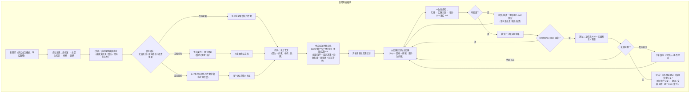

# doc-framework：面向文档开发体系

把一套在真实全栈项目中验证过的「契约文档 + 测试文档 + 实施计划」开发方法——**面向文档开发**（Document-Oriented Development）——抽象为**可跨项目复用的方法论资产**：文档模板 + 三个 skill + 安装工具。

> AI 深度参与开发的全栈项目越多，这套体系越值钱——它给 AI 定"规矩"：**文档永远反映真实代码，代码永远长在既有架构上**。

## 核心设计原则

- **skill 不焊死任何技术栈**：方法论在本仓库，项目特定约定全部收敛到「项目档案」（`doc/项目档案.md`），skill 一切配置从档案读取——换技术栈只换档案，不换技能；
- **人机共读**：契约文档中的依赖图 / 状态机 / 页面结构一律用 mermaid 绘制，人类阅读、AI 实施都靠同一份文档；
- **上下文从体系中来，不从人肉中来**：关联文档/代码地址是体系的自动产出（档案 → 总契约 → 导航区 → 代码扫描兜底），用户只给业务需求。

## 技能组合

三个 skill 用中文短命令显式触发（防误触发，不用自然语言关键词）：

| 命令 | 英文名 | 职责 |
|------|--------|------|
| `/文档 {模块名}` | `module-doc` | 模块四件套文档：创建（文档先行）/ 逆向提炼 / 改造更新 / 同步 |
| `/代码 {模块名}` | `module-code` | 按实施计划实施代码（以实施计划为主、契约为约束），完成后回写 |
| `/检查 {模块名}` | `module-review` | 模块审查：分级问题清单 + 回写查账 |

记忆点：**写文档、写代码、收尾检查**。

## 快速开始

```
① 安装      → 见下方「安装」
② 接入初始化 → 对 AI 说"初始化项目"，AI 按项目根《接入指南.md》执行（完成后自动清理引导）
③ 日常开发   → /文档 定义 → /代码 计划+实施+回写 → /检查 验证
```

## 安装

### 方式 A：npm git 依赖（推荐，适合有 package.json 的全栈项目）

```json
{
  "dependencies": {
    "doc-framework": "git+https://github.com/{账号}/doc-framework.git#v1.0.0"
  },
  "pnpm": {
    "onlyBuiltDependencies": ["doc-framework"]
  }
}
```

`pnpm install` 后自动完成：`skills/*` → 项目级 skill 目录（默认 `.agents/skills/`，可经 `doc-framework.config.json` 配置）、`接入指南.md` → 项目根、`AGENTS.md` 写入接入引导（**已初始化项目自动跳过引导**）。

### 方式 B：一键安装脚本（无 package.json 的项目）

```bash
curl -fsSL https://raw.githubusercontent.com/{账号}/doc-framework/main/install.sh | bash
```

## 接入初始化（一次性）

安装后项目根出现《接入指南.md》。对 AI 说 **"初始化项目"**（或 AI 按 AGENTS.md 引导主动提示）：

- **旧项目**：AI 扫描代码库 → 生成档案草案（逐项标注证据来源与置信度）→ 开发者确认 → 提炼第一份契约（标杆）→ 生成文档骨架；
- **全新项目**：AI 提问（技术栈/约定/业务域/文档语言）→ 生成档案 + 骨架。

初始化完成后 AI 自动清理：移除 AGENTS.md 接入引导段、删除《接入指南.md》——一次性引导不占用后续会话上下文。

## 日常开发流程



## 文档体系（初始化后生成）

```
doc/
├── 项目档案.md          ← 唯一需人工确认的文件（技术栈/约定/标杆映射）
├── 总契约.md            ← 总索引：业务域、模块索引表、依赖矩阵、维护规则
├── 测试规范.md          ← 通用测试方法论（E2E 双层验证、缺陷闭环）
├── 接口规范.md          ← 全局接口约定（REST/错误码/分页/认证）
├── 规范/                ← 前后端开发规范
├── 边界/                ← 跨模块能力（工作流/附件/权限等）
├── 计划/                ← 实施计划（文件名带日期，一契约多计划）
└── 模块/{模块名}/       ← 模块聚合四件套
    ├── 契约.md          ← 语义约束（9 章，含接口概览，mermaid 图）
    ├── 接口.md          ← 字段级调用细节（唯一事实源）
    ├── 测试.md
    └── test.sh
```

> 文档语言默认中文，可整体切换英文（`docs/` 模式）；目录与文件命名要么全中文、要么全英文，禁止混用。

## 模板清单（templates/）

`profile.md.tpl`（项目档案）· `接入指南.md.tpl` · `AGENTS.md.tpl` · `总契约.md.tpl` · `测试规范.md.tpl` · `接口规范.md.tpl` · `规范/{前端|后端}开发规范.md.tpl` · `边界/{能力}边界.md.tpl` · `模块/{模块名}/{契约|接口|测试|test.sh}.tpl` · `计划/YYYY-MM-DD-{实施主题}.md.tpl`

## 升级

- 方式 A：更新依赖版本后 `pnpm install`，或 `npx doc-framework sync`
- 方式 B：重新执行安装脚本
- **本地定制过的 skill 文件自动跳过**（版本标记 + 文件对比），不会被覆盖；templates 升级只影响新项目初始化，已初始化项目的文档资产不回灌

## 使用纪律

1. **先文档后代码**：需求再急，先建/改模块文档（契约 + 接口）——文档即需求分析；
2. **测试→契约回写闭环**：发现问题先定性"代码 Bug vs 契约缺口"，涉及约定变化必回写契约；
3. **变更记录是唯一真相**：实施计划归档后不作规范依据，长期看契约的"变更记录"章节。

## License

MIT
