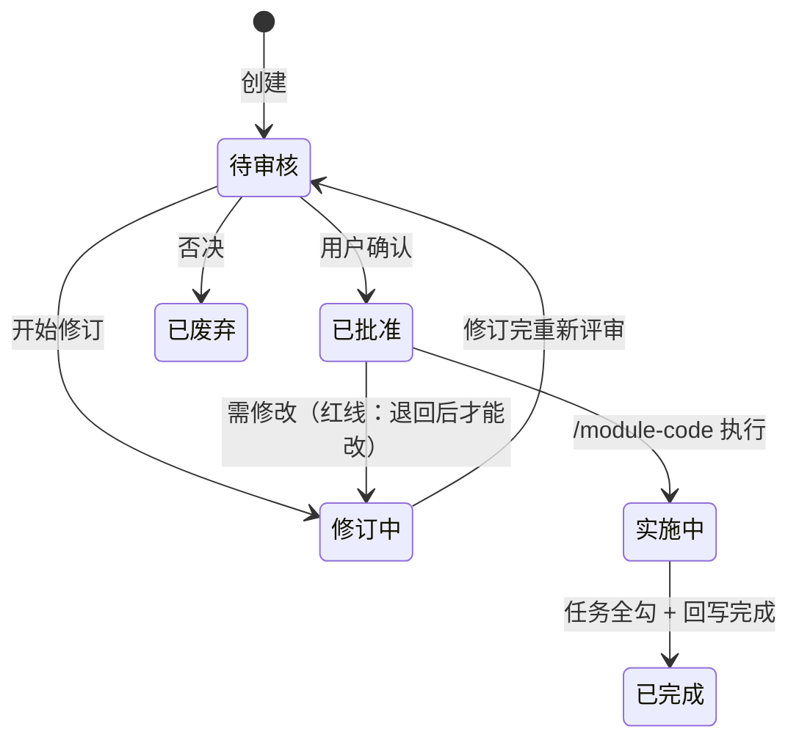
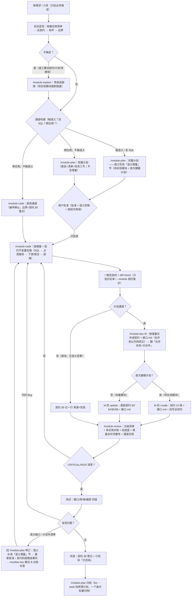

# doc-framework：面向文档开发体系

把一套在真实全栈项目中验证过的「契约文档 + 测试文档 + 实施计划」开发方法——**面向文档开发**（Document-Oriented Development）——抽象为**可跨项目复用的方法论资产**：文档模板 + 五个 skill + 安装工具。

> AI 深度参与开发的全栈项目越多，这套体系越值钱——它给 AI 定"规矩"：**文档永远反映真实代码，代码永远长在既有架构上**。
> 支持**多应用工作区**：一个项目可登记 N 个前端端 + N 个后端服务（不同技术栈），档案「应用清单」统一路由，契约保持业务语义唯一真相，应用只是落点。

**设计取向**：skill 不焊死任何技术栈（项目特定约定全在「项目档案」，换技术栈只换档案）· **契约 = 当前代码的语义映射**，是业务的唯一语义真相 · 上下文从体系中来（档案 → 总契约 → 标杆 → 边界），用户只给业务需求。

## 术语表（契约模型）

> 一句话模型：**契约 = 当前代码的语义映射（应然 ≡ 实然，永不领先代码）；语义变更 = 计划的「语义增量」，批准后被授权、实施后由 M 合并落账。**

| 术语 | 定义 |
|------|------|
| **待实现模块** | **代码库中尚无任何实现的模块**（无目录 / 无路由 / 无表 / 无接口 / 无契约）。**只要有任何一处实现，它就不是待实现模块**。英文同义词 `greenfield`。 |
| **首次建模计划** | 待实现模块的计划：必须 `完整` 形态、含全量「语义增量」（几乎全是 ADDED）与「建模补充」节。 |
| **存量模块（已建档）** | 有实现 + 有契约：改动走"计划增量 → M 的 `update` 落账"。 |
| **存量模块（未建档）** | 有实现 + 无契约（老项目接入）：走 B 代码对账补建——是"补历史"，**不是**待实现模块。 |
| **语义增量** | 计划里的 `Delta` 节：ADDED / MODIFIED / REMOVED 三张固定列表 + `主计划` 列，是**待生效语义**与 `/module-code` 的实施约束；**批准 = 语义定稿**。 |
| **合并状态**（三值） | `待合并` / `已合并`（可带日期，如 `已合并（2026-01-02）`）/ `无需合并`（英文 `pending / merged / n/a`）：`无需合并` 用于空增量（纯实现改动）或已废弃计划。 |
| **模式 M** | `/module-doc` 的合并模式：`update` = 存量模块按增量落账，`create` = 待实现模块首次建档 + 回写总契约。 |

> **最容易混的一处**：**存量模块未建档 ≠ 待实现模块**——只要有一行代码 / 一张表 / 一个接口，它就是存量模块，走 B 对账补建；待实现模块是"计划时刻"的状态，实施一落代码就转成存量模块。

### 三态与路径

| 状态 | 判定（有没有实现） | 路径 |
|------|-------------------|------|
| **待实现模块** | 零实现（无目录 / 路由 / 表 / 接口 / 契约） | `/module-explore`（**强制落盘**）→ `/module-plan`（**首次建模计划**）→ 实施 → `/module-doc` M 的 `create` 建档 + 回写总契约 |
| **存量模块（已建档）** | 有实现 + 有契约 | `/module-plan`（计划增量）→ 实施 → `/module-doc` M 的 `update` 落账 |
| **存量模块（未建档）** | 有实现 + 无契约 | `/module-doc` **模式 B 代码对账**补建（不走计划） |

## 五个技能的使用方式

五个 skill 用 `/命令` 显式触发（防误触发，不用自然语言关键词），**DSH 只识别英文技能名**。核心分工一句话：**探索归 /module-explore、文档归 /module-doc、计划归 /module-plan、代码归 /module-code、检查归 /module-review**——各司其职，谁都不越界。记忆点：**探路、写文档、写计划、写代码、收尾检查**。

### 分工总览

| 技能 | 触发形式 | 职责 | 边界（明确不做什么） |
|------|----------|------|----------------------|
| `/module-explore` | `/module-explore {主题}`，可加 `落盘` 后缀 | **写契约前的探索与讨论**：按应用清单路由调研相关应用代码、澄清需求与范围、候选方案对比、有证据的推荐；重大决策/否定结论经确认后落盘探索记录，**待实现模块场景强制落盘** | **不写契约、不写计划、不改代码**；默认不落盘；探索中的确认 ≠ 授权写文件；**不越过"契约细节"水位线** |
| `/module-doc` | `/module-doc {模块名}`（**零后缀**） | 模块四件套（契约 / 接口 / 测试 / test.sh）的创建与更新：**三模式自动探测**（**M 合并**〔create 待实现模块首次建档 / update 存量落账〕 / B 代码对账 / C 产物补齐），确认门带编号可强制切换；回写总契约索引 | 不写代码；不创建、修订、归档实施计划；不做探索讨论；**无契约 + 无代码（待实现模块）→ 重定向 `/module-plan`** |
| `/module-plan` | `/module-plan {模块名}` / `{计划路径}` / `{模块名} 归档` | 实施计划的创建、修订、状态流转、**归档**；**完整计划含「语义增量」节**（语义变更的唯一载体；待实现模块 = 首次建模计划），形态分完整/轻量（轻量=单应用小改，三节即可、**不含增量**）；跨模块计划前校验「依据模块契约」已存在 | 不实施代码；不做契约 / 接口.md 的合并落账（归 /module-doc M） |
| `/module-code` | `/module-code {计划路径}` / `{模块名}` | **执行改动，按判据自动分三通道**：完整计划 / 轻量计划 / **直改通道**（免计划小改，边界=契约 §5 应用落点，一次编号确认 + §9 一行留痕）；按依赖序实施并**逐项勾选任务清单**，完成后回写 | 不创建 / 修改四件套文档；不创建 / 修订 / 归档计划；**不得自我授权免计划** |
| `/module-review` | `/module-review {模块名}` | 对照四件套与各应用代码审查：分级问题清单 + **多应用对账** + **完成度对账** + **测试覆盖完整性** + **通道合规审计** | 不改代码，只出清单与修复建议 |

### 0. /module-explore：探索与讨论（可选前置）

**当你不确定时，先探索再立项**：需求模糊、方案取舍、不熟代码库、范围存疑时，先做一次零承诺的对话——调研代码、比较方案、把问题问清楚，再决定立什么项。

- 触发：`/module-explore {主题}`；重大决策或**否定结论**要留痕时加 `落盘`。**何时用**：看"选错了返工要动契约/计划/多个模块吗？"——要则先探索；改文案/调样式/单文件小改**不必**；
- 产出：**默认不落盘**（决策留在对话里），**待实现模块场景强制落盘**；落盘则为 `探索/YYYY-MM-DD-{主题}.md`，定位是**单次决策记录**（不作规范依据，不参与 `check` 硬校验）；
- 硬护栏：不写代码、不写契约、不写计划、不建模块文件夹；**只谈要不要做/放哪/走哪条路/范围，不设计字段接口**。方案清晰后交 `/module-plan {模块名}`；模块本就明确时**跳过探索**。

### 1. /module-doc：模块文档（四件套）

**四件套**聚合在 `模块/{模块名}/` 下：`契约.md`（语义约束，10 章含接口概览与 mermaid 图）、`接口.md`（字段级**服务端真相**，唯一事实源）、`测试.md`（含**适用层与依据**）、`test.sh`。

**零后缀、三模式**（模式由 AI 探测，确认门带编号可强制切换）：

> 语义变更**不写进契约正文**，而写进计划的「语义增量」节，实施后由 M 合并落账——**契约永不领先代码**。

| 模式 | 真相来源 | 产出与停止点 | 典型场景 |
|------|----------|--------------|----------|
| **M 合并** | 计划增量 + 代码事实 | **update 分支**（存量）：按增量更新契约 §3/§4/§5/§8 + 接口.md（**合并前以代码校正**，偏离写入 §9）；**create 分支**（待实现模块首次建档）：据增量 + 建模补充生成契约 10 章 + 接口.md，并**回写总契约**；两分支都 §9 记"合并（回链计划）"并翻计划 `合并状态=已合并` | 计划实施完成把增量落账；待实现模块首次建档 |
| **B 代码对账** | 代码 | **分组差异清单**（必改/建议/仅登记）→ 分组确认 → 回写契约 + 接口.md（§9 来源=代码） | 老模块无契约按代码生成；代码改了按代码同步；**待实现模块拒绝执行** |
| **C 产物补齐** | 契约 | 前置一致性检查 → 接口.md → 测试.md → test.sh | 契约代码已一致，补齐接口/测试 |

**确认门格式**（编号即强制入口，零记忆）：

```
探测事实：契约存在 ✓；代码落点 12 个文件，与契约有差异 → 候选 B 代码对账
将写入：契约 §3/§4 + 接口.md；不生成测试
1) 确认按 B 执行    2) 改为 M（按计划增量合并）    3) 改为 C（只补产物）
```

- **无契约 + 无代码（待实现模块）→ 重定向 `/module-plan`**：契约永不领先代码，建档在实施后由 M 的 `create` 完成；
- **无契约 + 有代码 → B 代码对账**补建历史；带新需求时先 B 建基线，再 `/module-plan` 增量，实施后 M 落账；
- **无需文档变更**：判定不影响契约语义（纯实现/文案/样式）时，说明理由后结束，不硬写变更记录；
- 要点：上下文零路径投喂；生成文档必须带导航区（未生成的文件标"（待生成）"）；契约 §4 只放接口概览，字段细节一律进接口.md（防双维护）。

### 2. /module-plan 与 3. /module-code

**计划是单次决策记录，契约才是长期真相**：/module-plan 建计划（待审核）→ 用户确认（已批准）→ /module-code 执行（逐项勾选）→ 登记「已完成」→ /module-plan 归档。

**但并非所有改动都值得一套完整计划**：授权粒度 ∝ 爆炸半径。`/module-code` 按判据自动分三通道（见下方「小改动通道」），**免计划必须经用户编号确认，AI 不得自我授权**。

### 4. /module-review：模块审查

- 流程：读档案（注入技术栈特有检查项）→ 总契约 → 四件套 → 对照代码逐项检查；
- 输出：分级问题清单 `CRITICAL / HIGH / MEDIUM / LOW` + 检查统计；
- **回写查账**：校验 /module-code 的回写义务已履行（契约变更记录有登记、含需生产执行的 SQL 时 §10 已登记、接口.md 与代码一致、总契约索引已更新）；
- 门禁：CRITICAL 与 HIGH 清零才提示可提交；否则列出问题并建议 `/module-doc` 或 `/module-code` 修复。

### 典型协作流程

| 场景 | 流程 |
|------|------|
| 正向开发（大改） | `/module-plan {模块名}`（完整计划：语义写进「语义增量」节）→ 批准 → `/module-code {计划路径}`（实施 + 回写）→ `/module-doc {模块名}`（M 合并增量落账 + 更新总契约）→ `/module-review`（验证） |
| 待实现模块（代码库零实现） | `/module-explore`（**强制落盘**）→ `/module-plan {模块名}`（**首次建模计划**）→ 批准 → `/module-code`（实施）→ `/module-doc {模块名}`（M 的 create 建档 + 回写总契约）→ `/module-review` |
| 改造（存量模块） | `/module-plan {模块名}`（新计划或修订）→ 批准 → `/module-code`（实施 + 回写）→ `/module-doc {模块名}`（M 落账） |
| **小改（单应用、不触语义）** | `/module-code {模块名}` → 探测 + 编号确认（**直改通道**）→ 实施 → `diff-check --module` + 契约 §9 一行留痕 |
| **小改（跨应用、不触语义）** | `/module-plan {模块名}`（**轻量计划**）→ 批准 → `/module-code {计划路径}`；同范围后续小改**追加任务项**即可，一个迭代批量归档一次 |
| 计划未批准 | `/module-code` 拒绝执行 → 提示 `/module-plan` 处理（修订或废弃） |
| 直改途中发现语义变更 | **立即停** → `/module-plan`（升级完整计划）→ 计划通道重做 |

> **触发说明**：DSH 的显式触发只匹配英文技能名（`/技能名` 手势仅支持小写字母/数字/连字符）；也可用自然语言描述（如"用模块代码技能…"），AI 会按技能目录自行加载。

## 计划：30 秒说明

**计划是单次决策记录，契约才是长期真相**。一次需求一份计划，从「待审核」走到「已完成 / 已废弃」即归档；计划归档后不作规范依据，后续改动以契约「变更记录」章节为准。**语义变更的载体是计划的「语义增量」节**（ADDED / MODIFIED / REMOVED 三表 + `合并状态`；**批准计划 = 语义定稿**），实施完成后由 `/module-doc` M 合并进契约正文与接口.md。

状态：`待审核 → 已批准 → 实施中 → 已完成`，另有 `修订中`（改计划必经）与 `已废弃`。



**合并状态**（语义增量的第二维，与状态正交）：`待合并 / 已合并 / 无需合并`，默认 `待合并`。

| 组合 | 含义与后果 |
|------|-----------|
| `已完成` + `待合并` | 增量已实施未落账 → `check` **硬报错**，且**拒绝归档**（先跑 `/module-doc {模块名}`） |
| `已完成` + `已合并` | 正常闭环，可归档 |
| `已完成` + `无需合并` | 纯实现改动（空增量），可归档 |
| `已废弃` + 任意 | 归档前把标记写成 `无需合并`，否则永远挂在"待合并" |

**三条纪律**：① 任务只勾事实完成的项，**未勾完不得登记「已完成」**；② 实施完成 ≠ 可以归档——归档是 `/module-plan {模块名} 归档` 的独立动作，时机由人定（可能还要等生产 SQL 执行、等验收）；③ 跨模块计划放全局 `计划/`，只能用 `{计划路径}` 直达。

**常见误解**：计划确认后不会自动实施（必须显式 `/module-code`）· 已批准计划不能直接改 · 任务不能最后一起勾 · 「已完成」的计划不能追加任务 · 小改不一定建计划（见下节）。

> 完整规则（两类计划的落盘位置、三个触发形式、11 条常见误解）见 [`docs/设计文档.md`](docs/设计文档.md) §3.6、§3.7。

## 小改动通道：直改与轻量计划

> 设计原则：**授权粒度 ∝ 爆炸半径**。三条底线不可让渡——**AI 不能自我授权**（必须有一次人的确认）、**不能改到范围外的应用**、**事后可追溯**。

判据（自上而下，先命中先定）：

| # | 判据（任一命中即取该通道） | 通道 |
|---|---------------------------|------|
| 1 | 触及契约语义（契约 §3/§4 出现**新**字段/表/接口/状态机状态/权限标识，或改动 §8 验收场景、跨应用不变量） | **完整计划**（语义写进「语义增量」节） |
| 2 | 含 SQL 变更 / 生产数据变更（契约 §10 要登记） | **完整计划** |
| 3 | 涉及 ≥2 个应用（哪怕纯文案） | **轻量计划** |
| 4 | 单应用 + 不触语义 + 无 SQL + 预计 ≤5 文件 + 无设计决策 | **直改通道**（免计划） |
| 5 | 其余（单应用但面大 / 需留决策） | **轻量计划** |

判据 1 的客观形式：**这个改动能不能在契约里找到对应条目？**——找得到是实现，找不到就是语义变更。

**直改通道**：`/module-code {模块名}` 在没有可执行计划时**探测资格并给编号确认门**（与 /module-doc 的模式确认门同构）：

```
探测：契约 §5 落点 = svc-order + app-mobile；本次未触及契约 §3/§4 任何条目
判定：实现级改动 → 直改通道（免计划）
边界：仅这 2 个应用的代码根（应用级）；预计 3 个文件；无 SQL
1) 直改（按此边界）   2) 改走轻量计划   3) 改走完整计划（语义写进「语义增量」节）
```

- **边界来源 = 契约 §5 应用落点表**（应用级）——"这个业务在哪些应用存在"天然定义"这次能碰哪些应用"，因此 §5 的准确性是直改的前提；
- **硬禁用**（不进判据权衡）：SQL 与生产数据、状态机、权限标识、跨应用不变量、公共契约/共享库；
- **自动升级**：途中发现要动契约语义 → 立即停 → 升级为完整计划；已改部分如实汇报；
- **留痕两处**：契约 §9 记一行 `来源=实现`；提交信息首行带 `模块:{模块名}`；
- **对账**：`doc-framework diff-check --module {模块名}`——无计划也能在提交前/CI 校验越界。

**轻量计划**：只保留 `逐应用表态 / 变更文件清单 / 任务清单` 三节，头部标 `> 计划形态：轻量`，**不含「语义增量」节**（发现触语义 → 升级完整计划）。**批准的对象是作用域**（表态 + 清单）：扩作用域 = 扩权，必须退回「修订中」重新批准；**作用域内追加任务项属记账**，可直接更新——一份轻量计划能承接同范围的多轮小改，配合 `list --stale {N}` 与 `/module-plan {模块名} 归档`，归档从"每改一次"降为"每迭代一次"。

> 成本对比（5 步 → 1 命令 + 1 次确认）与防滥用设计见 [`docs/设计文档.md`](docs/设计文档.md) §3.5、§3.8。

## 快速开始

```
① 安装      → 见下方「安装」
② 接入初始化 → 对 AI 说"初始化项目"，AI 按项目根《接入指南.md》执行（完成后自动清理引导）
③ 日常开发   → （可选）/module-explore 探路 → /module-plan 建计划（完整/轻量）→ 批准
              → /module-code 执行+回写（三通道，小改可免计划）→ /module-doc 合并增量落账（M）→ /module-review 验证
```

## 安装

### 方式 A：npm git 依赖（推荐，适合有 package.json 的全栈项目）

```json
{
  "dependencies": {
    "doc-framework": "git+https://github.com/knight-peter/doc-framework.git#v2.3.0"
  },
  "pnpm": {
    "onlyBuiltDependencies": ["doc-framework"]
  }
}
```

`pnpm install` 后自动完成：`skills/*` → 项目级 skill 目录（默认 `.agents/skills/`，可经 `doc-framework.config.json` 配置）、`doc-framework/` 骨架目录（`模块/`、`边界/`、`规范/`、`计划/`、`探索/` + 引导 README）、`接入指南.md` → 项目根、`AGENTS.md` 写入接入引导（**已初始化项目自动跳过引导**）。

### 方式 B：一键安装脚本（无 package.json 的项目）

```bash
curl -fsSL https://raw.githubusercontent.com/knight-peter/doc-framework/main/install.sh | bash
```

> 脚本内部默认经 SSH 克隆仓库；若本机 SSH 22 端口不可达（如代理/VPN 拦截），先指定可用的仓库地址再执行：
>
> ```bash
> export DOC_FRAMEWORK_REPO="https://github.com/knight-peter/doc-framework.git"
> curl -fsSL https://raw.githubusercontent.com/knight-peter/doc-framework/main/install.sh | bash
> ```
>
> （环境变量需 `export` 后单独一行；`VAR=x curl | bash` 的写法传不到管道里的 bash。）

与方式 A 行为一致：安装 skills → 预置 `doc-framework/` 骨架目录 → 生成《接入指南.md》→ 写入 AGENTS.md（含模板来源标记：仓库地址 + 版本，供初始化时拉取模板）。

## 接入初始化（一次性）

安装后项目根出现《接入指南.md》。对 AI 说 **"初始化项目"**（或 AI 按 AGENTS.md 引导主动提示）：

- **旧项目**：AI 扫描代码库 → 生成档案草案（逐项标注证据来源与置信度）→ 开发者确认 → 提炼第一份契约（标杆）→ 生成文档骨架；
- **全新项目**：AI 提问（技术栈/约定/业务域/文档语言）→ 生成档案 + 骨架。

> **渲染纪律**：所有骨架文档一律从官方模板渲染生成（模板位置见《接入指南.md》「模板来源」），`{占位符}` 必须全部替换为项目实际值，**禁止凭空自创结构**；完成后运行 `npx doc-framework check` 自检。

初始化完成后 AI 自动清理：移除 AGENTS.md 接入引导段、删除《接入指南.md》与 `doc-framework/README.md`（骨架引导）——一次性引导不占用后续会话上下文。

## 日常开发流程



## 文档体系（初始化后生成）

```
doc-framework/
├── 项目档案.md          ← 唯一需人工确认的文件（应用清单 = skill 路由表；通用约定全局段+应用覆盖）
├── 总契约.md            ← 总索引：业务域、应用拓扑、模块索引表（主责服务+各应用落点）、依赖矩阵+全景图、跨模块业务流程、维护规则
├── 测试规范.md          ← 通用测试方法论（接口层/库层/端层/编排层 四层验证、缺陷闭环）
├── 接口规范.md          ← 全局接口约定（REST/错误码/分页/认证/接口兼容性红线）
├── 规范/                ← 三层：类型-前端、类型-后端（类型层共性）+ 应用-{应用标识}（每应用一份差异）
├── 边界/                ← 跨模块/跨服务能力（工作流/附件/权限/服务间调用/事件与MQ/鉴权网关等）
├── 计划/                ← 跨模块实施计划（引用多个契约）；archive/ 为归档计划
├── 探索/                ← 探索记录（按需；/module-explore 落盘的单次决策记录）
└── 模块/{模块名}/       ← 模块聚合资产（业务语义唯一真相，应用只是落点）
    ├── 契约.md          ← 语义约束（10 章：主责服务声明 + §5 应用落点表 + §8.2 验收场景 + §10 生产 SQL 登记，mermaid 图）
    ├── 接口.md          ← 字段级服务端真相（唯一事实源）：服务归属/类型/消费方 + 各应用接入状态
    ├── 测试.md
    ├── test.sh          ← 多服务 BASE_URL 参数化
    └── 计划/            ← 单模块实施计划（YYYY-MM-DD-{主题}.md：形态=完整/轻量）；archive/ 为归档计划
```

文档语言默认中文，可整体切换英文——**语言由根目录名识别**：中文 `doc-framework/`、英文 `doc-framework-en/`。语言模式只决定根目录**内部**的命名，且要么全中文、要么全英文，禁止混用。

### 文档语言与命名（中／英目录与文件名）

`check`、`diff-check`（含 `--module`）、`list`、`show` 在英文模式下同样可用——解析器按根目录名自动切换映射。

| 用途 | 中文模式（`doc-framework/`） | 英文模式（`doc-framework-en/`） |
|------|------------------------------|----------------------------------|
| 项目档案（应用清单所在） | `项目档案.md`（`## 应用清单`） | `profile.md`（`## App registry`） |
| 总契约 / 测试规范 / 接口规范 | `总契约.md` / `测试规范.md` / `接口规范.md` | `contract.md` / `testing-guide.md` / `api-guide.md` |
| 顶层目录 | `模块/` `边界/` `规范/` `计划/` `探索/` | `modules/` `boundaries/` `standards/` `plans/` `explore/` |
| 模块四件套 | `契约.md` `接口.md` `测试.md` `test.sh` | `contract.md` `api.md` `testing.md` `test.sh` |
| 模块计划 / 跨模块计划 / 归档 | `模块/{模块名}/计划/`、`计划/`、`计划/归档/` | `modules/{module}/plans/`、`plans/`、`plans/archive/` |
| 规范三层 | `规范/类型-前端.md`、`规范/类型-后端.md`、`规范/应用-{应用标识}.md` | `standards/type-frontend.md`、`standards/type-backend.md`、`standards/app-{app}.md` |
| 边界 / 探索记录 | `边界/{能力}边界.md`、`探索/YYYY-MM-DD-{主题}.md` | `boundaries/{capability}.md`、`explore/YYYY-MM-DD-{topic}.md` |

英文项目**从中文模板逐项翻译渲染**（文件名 / 目录名 / 章节名 / 头部字段 / 状态与表态值按映射），首次渲染出的产物即该项目的标杆——**不提供英文模板**（理由：双份模板的长期漂移风险 > 一次性翻译成本）。文档内部章节与字段名的完整中英映射见 [`docs/设计文档.md`](docs/设计文档.md) §8.2。

> **归档目录名跟语言走**：中文 `计划/归档/`、英文 `plans/archive/`。识别层对两个名字取**并集**（与 `modules`/`plans` 的混排口径一致）——这是防"静默误判"的兜底（真混用了，归档计划也不会被当成在途计划扫回体检），**不是允许混用**：同一文档根内仍应保持单一语言。

## 升级

- 方式 A：更新依赖版本后 `pnpm install`（lockfile 锁死时 `pnpm update doc-framework`；store 复用跳过 postinstall 则 `pnpm rebuild doc-framework`），或 `npx doc-framework sync`
- 方式 B：重新执行安装脚本
- **本地定制过的 skill 文件自动跳过**（版本标记 + 文件对比），不会被覆盖；templates 升级只影响新项目初始化，已初始化项目的文档资产不回灌
- **升级命令的作用域是 skill 文件，仅此而已**：`sync` / 安装脚本**绝不**重命名、移动或改写你的文档根与 AGENTS.md（除首次安装写入引导段）。文档体系的任何结构变化一律**由人手工执行**，命令最多给出提示
- **框架升级 ≠ 文档体系升级**：模型升级（契约模型 → 语义增量模型）后，已初始化项目至少两处必改——`AGENTS.md` 编码纪律总纲、契约模板 §9（来源枚举扩为 `需求 / 代码 / 实现 / 合并`），否则新会话里的 AI 仍按旧模型工作。逐项清单见 [`docs/设计文档.md`](docs/设计文档.md) §9.3
- **小改动通道与轻量计划无需迁移**：没有 `> 计划形态：…` 行的旧计划视为"未标注"，行为与以前一致
- **旧英文文档根 `docs-framework/`**：改名 `mv docs-framework doc-framework-en`（目录改名即可，内部英文命名不变）；**不提供自动迁移**，`check` 只打印一行建议
- **中文模式的归档目录改名（`计划/archive/` → `计划/归档/`）**：中文模式此前沿用英文 `archive/`，v2.3.0 起归档目录名跟语言走。**不强制迁移**——识别层中英并集，两份目录名都算归档位置，`check`/`list` 不会把老目录里的计划当成在途计划；但建议手工 `git mv` 对齐（`git mv 计划/archive 计划/归档`，模块级同理），并同步项目 `AGENTS.md` 里的路径描述

## 常见问题（FAQ）

**Q1：`pnpm install` 装完了，但 `.agents/skills` 里没有 skill？**

pnpm v10 默认不执行依赖包的生命周期脚本，必须先配置 `pnpm.onlyBuiltDependencies: ["doc-framework"]`（见方式 A 配置）。若配置后仍缺失，多半是 **store 复用跳过了 postinstall**（安装输出显示 "reused N"），执行：

```bash
pnpm rebuild doc-framework
```

强制重跑安装脚本。（历史上 v1.0.0 的 postinstall 会因 skills 为目录结构、脚本未递归处理而报 `EISDIR` 崩溃，v1.0.1 已修复——请使用 v1.0.1 及以上版本。）

**Q2：git 依赖要不要带版本号？**

建议钉版本：`git+...#v2.3.0`。不带 `#ref` 时解析的是默认分支（main）的**最新提交**，而非最新标签；且 lockfile 会把解析到的提交 SHA 锁死，之后 main 有新提交也不会自动更新，需要 `pnpm update doc-framework`（或删除 lockfile 重新 install）。

**Q3：`doc-framework sync` 提示"跳过（本地已定制）"？**

这是防漂移设计：版本标记 `.doc-framework.json` 按相对路径（如 `module-code/SKILL.md`）逐文件记录 sha256。**判定粒度是整个 skill 目录**——该目录里任一文件与官方版本不一致，整个目录就被视为本地定制、跳过不覆盖。

放弃定制恢复官方版本：跑 `pnpm rebuild doc-framework`（安装脚本会**无条件先删后拷**）。注意 `sync` 在版本标记已是当前版本时对该目录整体跳过，所以**"删掉某个文件再跑 sync"找不回来**。

**Q4：安装失败残留了部分 skill 目录？**

安装中途失败会留下不完整目录且没有版本标记。重装或 `pnpm rebuild doc-framework` 会先删后拷自动覆盖，无需手动清理。

**Q5：升级会覆盖项目里的文档吗？**

不会。templates 升级只影响新项目初始化；已初始化项目（存在 `doc-framework/项目档案.md` 或 `doc-framework-en/profile.md`）自动跳过接入引导写入；项目 `doc-framework/` 下的档案与契约是自有资产，永不回灌。

**Q6：`doc-framework check` 是干什么的？**

校验文档体系完整性（**退出码 0=通过 / 1=有硬问题**；ℹ️ 提示项不影响退出码）。五类：① **骨架完整性**（必需文件/目录）；② **应用清单健康**（逐应用的规范文件、代码根、类型层规范；旧版档案回退校验前后端规范）；③ **计划体检**（表态应用已登记、清单路径落在表态「改动」的代码根下、状态与任务进度一致；轻量计划另需表态+清单齐全）；④ **占位符残留**；⑤ **引导清理**。契约模型 v2.2 起另校验**语义增量与合并状态**（I2/I3、首次建模形态与分档、依据探索记录），归档计划也做 I2 兜底。

> **完整规则清单不在本文件复述**（会随实现漂移）：见 `doc-framework --help` 与 [`docs/设计文档.md`](docs/设计文档.md) §6.2。

**Q7：`doc-framework diff-check` 是干什么的？**

提交前/CI 对账（退出码 0=通过 / 1=有越界）：

- `doc-framework diff-check <计划路径> [--base <ref>] [--staged] [--strict]`——解析计划的「逐应用表态 + 变更文件清单」（白名单），对照 git 变更（含未跟踪文件）逐个归属到档案应用清单的代码根：落在表态「本次不改」的应用下 → 报错；表态「改动」但清单外 → 警告（`--strict` 时报错）；
- `doc-framework diff-check --module <模块名> [--base <ref>] [--staged] [--strict]`——**直改通道对账**：无计划时从契约 §5 应用落点表推导**应用级**白名单，改动落在落点外应用 → 报错；
- 某应用代码根为 `./` 时退化为纯文件级清单。把 /module-review 的多应用对账前置到提交前，零 prompt 依赖。

**Q8：`doc-framework list` / `show` 是干什么的？**

只读查询（除 sync 外所有命令都只读，可进 CI）：

- `doc-framework list`——列出**在途计划**（默认排除「已完成/已废弃」与归档目录），显示 模块 / 计划（带「（轻量）」「（待合并）」「（已合并）」与增量条数）/ 状态 / 涉及应用 / 任务进度；`--module <名>` 只列某模块、`--app <标识>` 只列会改动该应用的计划、`--state <状态>` 过滤（中英枚举都收）、`--stale <天数>` 只列日期早于 N 天前的在途计划（**批量归档入口**）、`--orphans` 只列"缺契约**且无在途计划**"的模块（在途 = 未归档 ∧ 状态 ∈ {已批准, 实施中, 已完成}；**代码是否存在需人工确认**）、`--all` 含已完成/已废弃、`--json` 机器可读；
- `doc-framework show <计划路径>`——单个计划的结构化视图：状态、形态、逐应用表态与**推导出的白名单前缀**、变更文件清单、任务进度与未完成项、回写清单进度、接口兼容性；`--json` 同源输出；
- 两者输出末尾带 `Next:` 引导（`list` 一般指向 `show <计划路径>`，`--stale` 命中停滞计划时指向归档；`show` 在待审核/已废弃状态不给 Next）。

## 使用纪律

1. **语义先于代码、记录后于代码**：**语义变更**（字段 / 接口 / 状态机 / 权限标识 / 应用落点）先在**计划的「语义增量」节**定稿（**批准计划 = 语义定稿**），代码照增量实现；实施完成后由 `/module-doc` M 把增量合并进契约正文（§1–§8）与接口.md（**记录后于代码**：契约 = 当前代码的语义映射，永不领先代码），并做**事实登记**（契约 §9 来源 `需求 / 代码 / 实现 / 合并`、含生产 SQL 时 §10、接口.md 各应用接入状态）——**两者方向相反、不可互相替代**。例外的"代码在前"：代码是既成事实（老模块无契约 / 体系外已改）走模式 B 对账、旧项目接入初始化时从代码提炼标杆契约；**待实现模块（零实现）**走"探索（强制落盘）→ 首次建模计划 → 实施 → M 的 `create` 建档"。需求模糊时先 `/module-explore` 探路（探索不是必经阶段，明确时直接 `/module-plan`）；
2. **测试→契约回写闭环**：发现问题先定性"代码 Bug vs 契约缺口"，涉及约定变化必回写契约；
3. **变更记录是唯一真相**：实施计划归档后不作规范依据，长期看契约的"变更记录"章节（含直改通道的 `来源=实现` 行）；
4. **计划是事实登记**：任务只勾事实完成的项，未勾完不得登记「已完成」；已完成/已废弃后由 /module-plan 归档；
5. **通道可以降级，边界与留痕不能**：小改免计划必须过编号确认（AI 不得自我授权），改完跑 `diff-check --module` 并留一行 §9——省的是仪式，不是纪律。

## 参与开发

改这套框架本身（`templates/` `skills/` `scripts/`）请先读 [`docs/设计文档.md`](docs/设计文档.md)：总体架构、契约模型规格、各层实现、同步 checklist（§11.2）都在那里。改动后跑回归：

```bash
bash scripts/selftest.sh            # 需 node（可用 NODE_BIN=/path/to/node 指定）
```

## License

MIT
