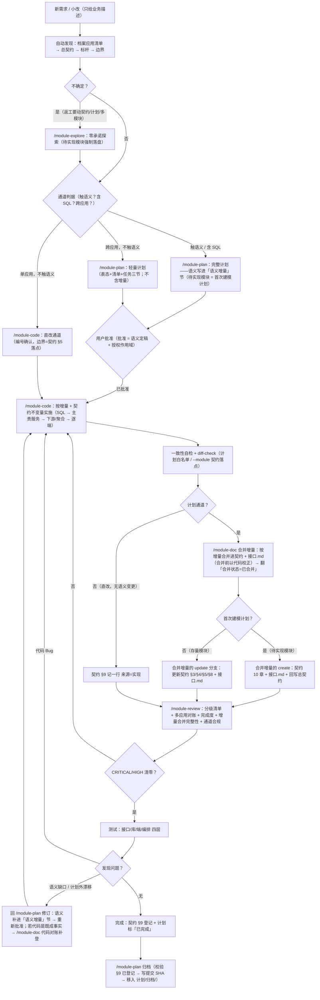

# doc-framework：面向文档开发体系

把一套在真实全栈项目中验证过的「契约文档 + 测试文档 + 实施计划」开发方法——**面向文档开发**（Document-Oriented Development）——抽象为**可跨项目复用的方法论资产**：文档模板 + 六个 skill + 安装工具。

> AI 深度参与开发的全栈项目越多，这套体系越值钱——它给 AI 定"规矩"：**文档永远反映真实代码，代码永远长在既有架构上**。
> 支持**多应用工作区**：一个项目可登记 N 个前端应用 + N 个后端服务（不同技术栈），档案「应用清单」统一路由，契约保持业务语义唯一真相，应用只是落点。

**设计取向**：skill 不焊死任何技术栈（项目特定约定全在「项目档案」，换技术栈只换档案）· **契约 = 当前代码的语义映射**，是业务的唯一语义真相 · 上下文从体系中来（档案 → 总契约 → 标杆 → 边界），用户只给业务需求。

## 从这里开始（按你的角色）

| 我是谁 | 先读什么 | 为什么 |
|---|---|---|
| **第一次用** | [快速开始](#快速开始) → [安装](#安装) → [接入初始化](#接入初始化一次性) | 三步装好并对 AI 说"初始化项目" |
| **已经接入，想知道怎么干活** | [术语表](#术语表契约模型) → [六个技能](#六个技能的使用方式) → [日常开发流程](#日常开发流程) | 先认词，再看技能分工与流程图 |
| **只想改个小东西** | [小改动通道](#小改动通道直改与轻量计划) | 三条通道判据 + 直改通道，多数小改免建计划 |
| **遇到问题** | [常见问题 FAQ](#常见问题faq) → [升级](#升级) | 安装/同步/命令用途/迁移 |
| **要改这套框架本身** | [`docs/设计文档.md`](docs/设计文档.md) → [参与开发](#参与开发) | 架构、契约模型规格、同步 checklist 都在设计文档 |

> **本文件是使用者文档**：只有"怎么用、为什么这样设计"到必要为止。**规则清单、参数全集、迁移清单、实现细节一律不在本文件复述**（会随实现漂移）——各自有唯一归属：命令参数见 `doc-framework --help` 与[设计文档 §6.2](docs/设计文档.md)；`check` 规则见[设计文档 §6.3](docs/设计文档.md)；升级迁移清单见[设计文档 §9.3](docs/设计文档.md)。

## 术语表（契约模型）

> 一句话模型：**契约 = 当前代码的语义映射（应然 ≡ 实然，永不领先代码）；语义变更 = 计划的「语义增量」，批准后被授权、实施后由合并增量落账。**

| 术语 | 定义 |
|------|------|
| **待实现模块** | **代码库中尚无任何实现的模块**（无目录 / 无路由 / 无表 / 无接口 / 无契约）。**只要有任何一处实现，它就不是待实现模块**。英文同义词 `greenfield`。 |
| **首次建模计划** | 待实现模块的计划：必须 `完整` 形态、含全量「语义增量」（几乎全是 ADDED）与「建模补充」节。 |
| **存量模块（已建档）** | 有实现 + 有契约：改动走"计划增量 → 合并增量的 `update` 落账"。 |
| **存量模块（未建档）** | 有实现 + 无契约（老项目接入）：走 `/module-doc` **代码对账**补建（不走计划）。 |
| **语义增量** | 计划里的 `Delta` 节：ADDED / MODIFIED / REMOVED 三张固定列表 + `主计划` 列，是**待生效语义**与 `/module-code` 的实施约束；**批准 = 语义定稿**。 |
| **合并状态**（三值） | `待合并` / `已合并`（可带日期，如 `已合并（2026-01-02）`）/ `无需合并`：旧英文枚举不再识别（见[产物命名](#产物命名表唯一)）；`无需合并` 用于空增量（纯实现改动）或已废弃计划。 |
| **合并增量** | `/module-doc` 的合并处理：`update` = 存量模块按增量落账，`create` = 待实现模块首次建档 + 回写总契约。 |

> **最容易混的一处**：**存量模块未建档 ≠ 待实现模块**——只要有一行代码 / 一张表 / 一个接口，它就是存量模块，走代码对账补建；待实现模块是"计划时刻"的状态，实施一落代码就转成存量模块。三态的判定与路径全表见[设计文档 §3.1](docs/设计文档.md)。

## 六个技能的使用方式

六个 skill 用 `/命令` 显式触发（防误触发，不用自然语言关键词），**DSH 只识别英文技能名**。核心分工一句话：**探索归 /module-explore、文档归 /module-doc、计划归 /module-plan、代码归 /module-code、测试归 /module-test、检查归 /module-review**——各司其职，谁都不越界。记忆点：**探路、写文档、写计划、写代码、写测试、收尾检查**。各技能的职责边界全表见[设计文档 §4.1](docs/设计文档.md)，细节详见各 `SKILL.md`。

### 技能速览

**0. `/module-explore` —— 探索与讨论（可选前置）**：需求模糊、方案取舍、不熟代码库、范围存疑时先做一次**零承诺**对话（调研代码、比较方案、把问题问清楚）。**何时用**：看"选错了返工要动契约/计划/多个模块吗？"——要则先探索，改文案/调样式/单文件小改**不必**。产出默认不落盘（决策留在对话里），**待实现模块场景强制落盘**；硬护栏：不写代码/契约/计划，只谈要不要做、放哪、走哪条路、范围，**不设计字段接口**。

**1. `/module-doc` —— 模块文档（契约 / 接口）**：**核心文档**聚合在 `模块/{模块名}/` 下——`契约.md`（语义约束，10 章）、`接口.md`（字段级**服务端真相**，唯一事实源）。测试文档和脚本可通过 `/module-test` 按需生成。

**零后缀、三种处理方式**（**合并增量**〔create 待实现模块首次建档 / update 存量落账〕/ **代码对账** / **产物补齐**），由 AI 探测、确认门带编号可强制切换——语义变更**不写进契约正文**，而写进计划的「语义增量」节，实施后由合并增量落账（**契约永不领先代码**）。三种方式的真值来源、产出与确认门格式见[设计文档 §4.2](docs/设计文档.md)。

**路由要点**：无契约 + 无代码（待实现模块）→ 重定向 `/module-plan`（建档在实施后由合并增量的 `create` 完成）；无契约 + 有代码 → 代码对账补建历史，带新需求时先代码对账建基线再走计划增量；判定"不影响契约语义"（纯实现/文案/样式）→ 说明理由后结束，**不硬写变更记录**。

**2/3. `/module-plan` 与 `/module-code` —— 计划与代码**：建计划（待审核）→ 用户确认（已批准）→ 执行（逐项勾选）→ 登记「已完成」→ 归档（校验 §9 已登记 + 写提交 SHA → 移入 `计划/归档/`）。**并非所有改动都值得一套完整计划**——`/module-code` 按判据自动分三通道（见下节）。详见[计划 30 秒](#计划30-秒说明)与[小改动通道](#小改动通道直改与轻量计划)。

**4. `/module-review` —— 模块审查**：读档案（注入技术栈特有检查项）→ 总契约 → 核心文档（契约/接口） → 对照代码逐项检查；输出分级问题清单 `CRITICAL / HIGH / MEDIUM / LOW` + **回写查账**（契约变更记录、§10 生产 SQL 登记、接口.md 与代码一致性、总契约索引）；**CRITICAL 与 HIGH 清零才提示可提交**。

**5. `/module-test` —— 模块测试（可选）**：测试 = 契约的映射，从契约 + 接口推导测试规格，不依赖人肉维护。两种场景：**生成/讨论定稿**（`/module-test {模块名}`）→ 读契约与接口 → 生成测试.md + test.sh → 多轮讨论调整 → 定稿；**校验并执行**（`/module-test {模块名} 执行`）→ 校验 SC-n 一致性 → 执行 test.sh → 按契约 §9 行数输出版本化测试报告到 `测试报告/` 目录。白盒断言写入 测试.md §7 库层断言节，不生成独立脚本。不影响核心工作流，简单模块可跳过。

**触发说明**：`/技能名` 手势仅支持小写字母/数字/连字符；也可用自然语言描述（如"用模块代码技能…"），AI 会按技能目录自行加载。

## 计划：30 秒说明

**计划是单次决策记录，契约才是长期真相**。一次需求一份计划，从「待审核」走到「已完成 / 已废弃」即可**归档**；归档时校验契约 §9 已登记本计划 → 写入**提交 SHA** → 移入 `计划/归档/`（**归档不删文件**——清理由人手动决定；长期追溯靠 §9 的回链凭据，不依赖计划文件存活）。**语义变更的载体是计划的「语义增量」节**（ADDED / MODIFIED / REMOVED 三表 + `合并状态`；**批准计划 = 语义定稿**），实施完成后由 `/module-doc` 合并进契约正文与接口.md。

状态：`待审核 → 已批准 → 实施中 → 已完成`，另有 `修订中`（改计划必经）与 `已废弃`。状态机图见[设计文档 §3.6](docs/设计文档.md)。

**合并状态**（语义增量的第二维，与状态正交）：`待合并 / 已合并 / 无需合并`，默认 `待合并`。组合后果（`已完成 + 待合并` → `check` 硬报错且拒绝归档；`已废弃` 归档前须标 `无需合并` 等）见[设计文档 §3.4](docs/设计文档.md) 不变量 I2/I4。

**三条纪律**：① 任务只勾事实完成的项，**未勾完不得登记「已完成」**；② 实施完成 ≠ 可以归档——归档是 `/module-plan {模块名} 归档` 的独立动作，时机由人定（可能还要等生产 SQL 执行、等验收）；③ 跨模块计划放全局 `计划/`，只能用 `{计划路径}` 直达。

**常见误解**：计划确认后不会自动实施（必须显式 `/module-code`）· 已批准计划不能直接改 · 任务不能最后一起勾 · 「已完成」的计划不能追加任务 · 小改不一定建计划（见下节）。

> 完整规则（两类计划的落盘位置、三个触发形式、11 条常见误解）见 [`docs/设计文档.md`](docs/设计文档.md) §3.6、§3.7。

## 小改动通道：直改与轻量计划

> 设计原则：**授权粒度 ∝ 爆炸半径**。三条底线不可让渡——**AI 不能自我授权**（必须有一次人的确认）、**不能改到范围外的应用**、**事后可追溯**。

`/module-code` 按三通道判据自动分派（先命中先定：触契约语义 / 含 SQL → **完整计划**；跨应用 → **轻量计划**；单应用 + ≤5 文件 + 无决策 → **直改通道**免计划）——判据表与判据 1 的客观形式（"能不能在契约里找到对应条目"）唯一权威源是 `skills/module-code/SKILL.md` §0.1，本文不复述。直改通道的编号确认门、边界来源（契约 §5 应用落点）、硬禁用清单与留痕（契约 §9 一行 + 提交信息 `模块:{模块名}`）见[设计文档 §3.5](docs/设计文档.md)；改完跑 `doc-framework diff-check --module {模块名}` 对账，无计划也能在提交前/CI 校验越界。途中发现要动契约语义 → 立即停，升级完整计划（已改部分如实汇报）。

**轻量计划**：只保留 `逐应用表态 / 变更文件清单 / 任务清单` 三节，头部标 `> 计划形态：轻量`，**不含「语义增量」节**（发现触语义 → 升级完整计划）。**批准的对象是作用域**（表态 + 清单）：扩作用域 = 扩权，必须退回「修订中」重新批准；**作用域内追加任务项属记账**，可直接更新——一份轻量计划能承接同范围的多轮小改，配合 `list --stale {N}` 与 `/module-plan {模块名} 归档`，归档从"每改一次"降为"每迭代一次"。

> 成本对比（5 步 → 1 命令 + 1 次确认）与防滥用设计见 [`docs/设计文档.md`](docs/设计文档.md) §3.5、§3.8。

## 快速开始

```
① 安装      → 见下方「安装」
② 接入初始化 → 对 AI 说"初始化项目"，AI 按项目根《接入指南.md》执行（完成后自动清理引导）
③ 日常开发   → （可选）/module-explore 探路 → /module-plan 建计划（完整/轻量）→ 批准
              → /module-code 执行+回写（三通道，小改可免计划）→ /module-doc 合并增量落账 → /module-review 验证
```

## 安装

### 方式 A：npm git 依赖（推荐，适合有 package.json 的全栈项目）

```json
{
  "dependencies": {
    "doc-framework": "git+https://github.com/knight-peter/doc-framework.git#<最新 tag>"
  },
  "pnpm": {
    "onlyBuiltDependencies": ["doc-framework"]
  }
}
```

> **`<最新 tag>` 怎么取**：已有本仓库检出时最省事——`git fetch --tags && git describe --tags --abbrev=0`；没有检出时 `git ls-remote --tags git@github.com:knight-peter/doc-framework.git | sed 's|.*refs/tags/||' | grep -v '\^{}' | sort -V | tail -1`。
> **本文件不写死版本号**——写死的示例会随发版腐坏（且示例里的版本一旦没有对应 tag，git 依赖会静默回落到默认分支最新提交）。已装过的项目要升级见[升级](#升级)。

`pnpm install` 后自动完成：`skills/*` → 项目级 skill 目录（默认 `.agents/skills/`，可经 `doc-framework.config.json` 配置）、`doc-framework/` 骨架目录（`模块/`、`边界/`、`规范/`、`计划/`、`探索/` + 引导 README）、`接入指南.md` → 项目根、`AGENTS.md` 写入接入引导（**已初始化项目自动跳过引导**）。

### 方式 B：一键安装脚本（无 package.json 的项目）

```bash
curl -fsSL https://raw.githubusercontent.com/knight-peter/doc-framework/main/install.sh | bash
```

> 脚本内部默认经 SSH 克隆仓库；若本机 SSH 22 端口不可达（如代理/VPN 拦截），先指定可用的仓库地址再执行：
>
> ```bash
> export DOC_FRAMEWORK_REPO="https://github.com/knight-peter/doc-framework.git"
> curl -fsSL https://raw.githubusercontent.com/knight-peter/doc-framework/main/install.sh | bash
> ```
>
> （环境变量需 `export` 后单独一行；`VAR=x curl | bash` 的写法传不到管道里的 bash。）

与方式 A 行为一致：安装 skills → 预置 `doc-framework/` 骨架目录 → 生成《接入指南.md》→ 写入 AGENTS.md（含模板来源标记：仓库地址 + 版本，供初始化时拉取模板）。

## 接入初始化（一次性）

安装后项目根出现《接入指南.md》。对 AI 说 **"初始化项目"**（或 AI 按 AGENTS.md 引导主动提示）：

- **旧项目**：AI 扫描代码库 → 生成档案草案（逐项标注证据来源与置信度）→ 开发者确认 → 提炼第一份契约（标杆）→ 生成文档骨架；
- **全新项目**：AI 提问（技术栈/约定/业务域）→ 生成档案 + 骨架。

> **渲染纪律**：所有骨架文档一律从官方模板渲染生成（模板位置见《接入指南.md》「模板来源」），`{占位符}` 必须全部替换为项目实际值，**禁止凭空自创结构**；完成后运行 `npx doc-framework check` 自检。

初始化完成后 AI 自动清理：移除 AGENTS.md 接入引导段、删除《接入指南.md》与 `doc-framework/README.md`（骨架引导）——一次性引导不占用后续会话上下文。

## 日常开发流程


```mermaid
flowchart TB
    H["新需求 / 小改（只给业务描述）"] --> I["自动发现：档案应用清单 → 总契约 → 标杆 → 边界"]
    I --> E{"不确定？"}
    E -->|"是（返工要动契约/计划/多模块）"| EX["/module-explore：零承诺探索（待实现模块强制落盘）"]
    E -->|"否"| CH{"通道判据（触语义？含 SQL？跨应用？）"}
    EX --> CH
    CH -->|"触语义 / 含 SQL"| J["/module-plan：完整计划——语义写进「语义增量」节（待实现模块 = 首次建模计划）"]
    CH -->|"跨应用，不触语义"| LIGHT["/module-plan：轻量计划（表态+清单+任务三节；不含增量）"]
    CH -->|"单应用，不触语义"| DIRECT["/module-code：直改通道（编号确认，边界=契约 §5 落点）"]
    J --> APPR{"用户批准（批准 = 语义定稿 + 授权作用域）"}
    LIGHT --> APPR
    APPR -->|"已批准"| T["/module-code：按增量 + 契约不变量实施（SQL → 主责服务 → 下游/聚合 → 逐端）"]
    DIRECT --> T
    T --> U["一致性自检 + diff-check（计划白名单 / --module 契约落点）"]
    U --> V{"计划通道？"}
    V -->|"否（直改，无语义变更）"| W["契约 §9 记一行 来源=实现"]
    V -->|"是"| M2["/module-doc 合并增量：按增量合并进契约 + 接口.md（合并前以代码校正）→ 翻「合并状态=已合并」"]
    M2 --> M3{"首次建模计划？"}
    M3 -->|"是（待实现模块）"| M4["合并增量的 create：契约 10 章 + 接口.md + 回写总契约"]
    M3 -->|"否（存量模块）"| M5["合并增量的 update 分支：更新契约 §3/§4/§5/§8 + 接口.md"]
    M4 --> X
    M5 --> X
    W --> X
    X["/module-review：分级清单 + 多应用对账 + 完成度 + 增量合并完整性 + 通道合规"]
    X --> Y{"CRITICAL/HIGH 清零？"}
    Y -->|"否"| T
    Y -->|"是"| Z["测试：接口/库/端/编排 四层"]
    Z --> AA{"发现问题？"}
    AA -->|"代码 Bug"| T
    AA -->|"语义缺口 / 计划外漂移"| AB["回 /module-plan 修订：语义补进「语义增量」节 → 重新批准；若代码是既成事实 → /module-doc 代码对账补登"]
    AB --> T
    AA -->|"无"| AC["完成：契约 §9 登记 + 计划标「已完成」"]
    AC --> AR["/module-plan 归档（校验 §9 已登记 → 写提交 SHA → 移入 计划/归档/）"]
```

> 异常分支注记：**计划未批准**时 `/module-code` 拒绝执行，退回 `/module-plan` 处理（修订或废弃）；**直改途中发现语义变更** → 立即停，升级完整计划、计划通道重做（已改部分如实汇报）；测试文档生成与执行（可选）见上文 `/module-test`。

## 文档体系（初始化后生成）

```
doc-framework/
├── 项目档案.md          ← 唯一需人工确认的文件（应用清单 = skill 路由表；通用约定全局段+应用覆盖）
├── 总契约.md            ← 总索引：业务域、应用拓扑、模块索引表（主责服务+各应用落点）、依赖矩阵+全景图、跨模块业务流程、维护规则
├── 测试规范.md          ← 通用测试方法论（接口层/库层/端层/编排层 四层验证、缺陷闭环）
├── 接口规范.md          ← 全局接口约定（REST/认证/统一响应外层与错误码/分页/接口层字段语义；兼容性红线在总契约维护规则）
├── 规范/                ← 三层：类型-前端、类型-后端（类型层共性）+ 应用-{应用标识}（每应用一份差异）
├── 边界/                ← 跨模块/跨服务能力（工作流/附件/权限/服务间调用/事件与MQ/鉴权网关等）
├── 计划/                ← 跨模块实施计划；归档/ 为已归档计划（不自动删除）
├── 探索/                ← 探索记录（/module-explore 落盘的单次决策记录；根目录 = 探索中 + 已定案待吸收，归档/ = 已使用 + 已作废）
├── 探索/归档/           ← 已消费/已作废的探索记录（可保留，也可手动删除；全景用 doc-framework list --explore）
└── 模块/{模块名}/       ← 模块聚合资产（业务语义唯一真相，应用只是落点）
    ├── 契约.md          ← 语义约束（10 章：主责服务声明 + §5 应用落点表 + §8.2 验收场景 + §10 生产 SQL 登记，mermaid 图）
    ├── 接口.md          ← 字段级服务端真相（唯一事实源）：服务归属/类型/消费方 + 各应用接入状态
    ├── 测试.md
    ├── test.sh          ← 多服务 BASE_URL 参数化
    └── 计划/            ← 单模块实施计划（YYYY-MM-DD-{主题}.md：形态=完整/轻量）；归档/ 为已归档计划
```

**产物命名只有一套：中文。** 文档根固定 `doc-framework/`，目录/文件/章节名一律中文；**英文只影响文档内容，不影响命名**。

> v2.6.0 起**不再支持英文产物命名**（旧 `doc-framework-en/` 与历史名 `docs-framework/` 已下线）。理由见 [`docs/设计文档.md`](docs/设计文档.md) §8.3——核心是"每加一个特性都要维护两套命名、英文侧还没有模板兜底，漏改即静默降级"。
> 检出这两个目录时 `check` / `list` / `diff-check` 都会**显式报错**并提示迁移方向，不会静默当成"未初始化"。迁移是人工的：`mv doc-framework-en doc-framework` + 把内部文件名/目录名/章节名改回中文。
> **老项目不受影响（仅限数据别名）**：契约 §9 来源值的英文写法（`requirement` / `code` / `implementation` / `merge`）与探索记录旧状态 `已废弃`（归一为 `已作废`）仍被识别——只用于读得进老文档，不用于写新文档；旧版中文规范文件名经「旧版档案回退」仍被校验。**命名类别名（英文状态/合并状态枚举、混排目录名 `modules/…/plans/`）一律不再识别**，含这类旧写法的文档会被 `check` 显式报错，按[产物命名表](#产物命名表唯一)人工迁移。

### 产物命名表（唯一）

| 用途 | 路径 / 名称 |
|------|-------------|
| 文档根 | `doc-framework/` |
| 项目档案（应用清单所在） | `项目档案.md`（`## 应用清单`） |
| 总契约 / 测试规范 / 接口规范 | `总契约.md` / `测试规范.md` / `接口规范.md` |
| 顶层目录 | `模块/` `边界/` `规范/` `计划/` `探索/` |
| 模块核心文档 | `模块/{模块名}/{契约.md, 接口.md}[, 测试.md, test.sh]`（测试为可选） |
| 模块计划 / 跨模块计划 / 归档 | `模块/{模块名}/计划/`、`计划/`、`计划/归档/` |
| 规范三层 | `规范/类型-前端.md`、`规范/类型-后端.md`、`规范/应用-{应用标识}.md` |
| 边界 / 探索记录 | `边界/{能力}边界.md`、`探索/YYYY-MM-DD-{主题}.md`（状态机见 设计文档 §3.9；归档 `探索/归档/`） |

> 将来若要有英文，会提供**独立的转换入口**（一次性把中文文档根转成英文产物名），而不是让解析器重回"运行时二选一"——那正是本次下线的病根。

## 升级

**怎么升**：

- 方式 A：更新依赖版本后 `pnpm install`（lockfile 锁死时 `pnpm update doc-framework`；store 复用跳过 postinstall 则 `pnpm rebuild doc-framework`），或 `npx doc-framework sync`
- 方式 B：重新执行安装脚本

**升级命令的边界（三条）**：

- **只动 skill 文件**：`sync` / 安装脚本**绝不**重命名、移动或改写你的文档根与 AGENTS.md（除首次安装写入引导段）——文档体系的任何结构变化一律**由人手工执行**，命令最多给提示；
- **本地定制过的 skill 自动跳过**（版本标记 + 文件对比），不会被覆盖；
- **templates 升级只影响新项目初始化**：已初始化项目的档案与契约是自有资产，永不回灌。

**框架升级 ≠ 文档体系升级**：升级后旧项目不迁移也能照常工作（解析器不认章节编号、旧格式计划按旧行为处理），但想用上新模型/新约定，需要**人工**对齐若干处——`AGENTS.md` 编码纪律总纲、契约模板 §9 来源枚举、归档目录名、全局文档章号与单一职责等。

> **让 AI 代劳**：给老项目的 AI 粘贴 [`docs/老项目升级上下文.md`](docs/老项目升级上下文.md)（整段可粘贴提示词：先只读勘察 → 差异报告 → 升框架 → 逐批人工迁移 → 验收报告）。该文件是 §9.3 的执行版，冲突以 §9.3 为准。

> **迁移清单与 changelog 都不在本文件复述**："框架升级后要改什么"的逐项清单见 [`docs/设计文档.md`](docs/设计文档.md) §9.3（唯一权威来源）；各版本引入了什么约定见 §12.1 沿革表；`check` 各提示级别的口径见 §6.3。两个已知特例：**小改动通道与轻量计划无需迁移**（没有 `> 计划形态：…` 行的旧计划视为"未标注"，行为与以前一致）；旧英文文档根（`doc-framework-en/`、历史名 `docs-framework/`）在 v2.6.0 已下线，`check`/`list`/`diff-check` 会显式报错并给迁移方向（迁移是**人工**的，见[产物命名](#产物命名表唯一)）。

## 常见问题（FAQ）

**Q1：`pnpm install` 装完了，但 `.agents/skills` 里没有 skill？**

pnpm v10 默认不执行依赖包的生命周期脚本，必须先配置 `pnpm.onlyBuiltDependencies: ["doc-framework"]`（见方式 A 配置）。若配置后仍缺失，多半是 **store 复用跳过了 postinstall**（安装输出显示 "reused N"），执行：

```bash
pnpm rebuild doc-framework
```

强制重跑安装脚本。

**Q2：git 依赖要不要带版本号？**

建议钉**最新 tag**（取法见[安装](#方式-anpm-git-依赖推荐适合有-packagejson-的全栈项目)，本文件不写死版本号）：`git+...#<最新 tag>`。不带 `#ref` 时解析的是默认分支（main）的**最新提交**，而非最新标签；且 lockfile 会把解析到的提交 SHA 锁死，之后 main 有新提交也不会自动更新，需要 `pnpm update doc-framework`（或删除 lockfile 重新 install）。

**Q3：`doc-framework sync` 提示"跳过（本地已定制）"？**

这是防漂移设计：版本标记 `.doc-framework.json` 按相对路径（如 `module-code/SKILL.md`）逐文件记录 sha256。**判定粒度是整个 skill 目录**——该目录里任一文件与官方版本不一致，整个目录就被视为本地定制、跳过不覆盖。

放弃定制恢复官方版本：跑 `pnpm rebuild doc-framework`（安装脚本会**无条件先删后拷**）。注意 `sync` 在版本标记已是当前版本时对该目录整体跳过，所以**"删掉某个文件再跑 sync"找不回来**。

**Q4：安装失败残留了部分 skill 目录？**

安装中途失败会留下不完整目录且没有版本标记。重装或 `pnpm rebuild doc-framework` 会先删后拷自动覆盖，无需手动清理。

**Q5：升级会覆盖项目里的文档吗？**

不会。templates 升级只影响新项目初始化；已初始化项目（存在 `doc-framework/项目档案.md`）自动跳过接入引导写入；项目 `doc-framework/` 下的档案与契约是自有资产，永不回灌。

**Q6：`doc-framework check` 是干什么的？**

校验文档体系完整性（**退出码 0=通过 / 1=有硬问题**；ℹ️ 提示项不影响退出码）：骨架完整性、应用清单健康、计划体检（含语义增量与合并状态 I2/I3）、契约 §9 回链凭据、文档结构版本哨兵、占位符残留与引导清理。

> **完整规则清单不在本文件复述**（会随实现漂移）：见 `doc-framework --help` 与 [`docs/设计文档.md`](docs/设计文档.md) §6.3。

**Q7：`doc-framework diff-check` 是干什么的？**

**提交前/CI 对账**（退出码 0=通过 / 1=有越界）：给**计划路径** → 按计划的「逐应用表态 + 变更文件清单」对账；给 **`--module <模块名>`** → 直改通道对账，按契约 §5 落点表推导应用级白名单。把 `/module-review` 的多应用对账前置到提交前，零 prompt 依赖。

> 参数全集（`--base` / `--staged` / `--strict`）与**管辖范围**（只评判应用清单登记的应用内的越界；管辖不到的文件只给一行 ⚠️、默认不影响退出码）见 `doc-framework --help` 与 [`docs/设计文档.md`](docs/设计文档.md) §6.4。

**Q8：`doc-framework list` / `show` 是干什么的？**

**只读查询**（除 `sync` 外所有命令都只读，可进 CI）：`list` 列在途计划（状态 / 形态 / 合并状态 / 涉及应用 / 任务进度），`list --explore` 聚合探索记录（`探索/`=探索中+已定案待消费，`探索/归档/`=已使用+已作废），`show <计划路径>` 给单个计划的结构化视图（含推导出的白名单与回写进度）；`list --stale <N>` 是**批量归档入口**（默认视图不含"已完成"，批量归档要 `--stale <N> --all`）。

> 选项全集见 `doc-framework --help`；输出契约（`--orphans` 的「在途」口径、`Next:` 引导等）见 [`docs/设计文档.md`](docs/设计文档.md) §6.5。

## 使用纪律

1. **语义先于代码、记录后于代码**：**语义变更**（字段 / 接口 / 状态机 / 权限标识 / 应用落点）先在**计划的「语义增量」节**定稿（**批准计划 = 语义定稿**），代码照增量实现；实施完成后由 `/module-doc` 把增量合并进契约正文（§1–§8）与接口.md（**记录后于代码**：契约 = 当前代码的语义映射，永不领先代码），并做**事实登记**（契约 §9 来源 `需求 / 代码 / 实现 / 合并`、含生产 SQL 时 §10、接口.md 各应用接入状态）——**两者方向相反、不可互相替代**。例外的"代码在前"：代码是既成事实（老模块无契约 / 体系外已改）走代码对账、旧项目接入初始化时从代码提炼标杆契约；**待实现模块（零实现）**走"探索（强制落盘）→ 首次建模计划 → 实施 → 合并增量的 `create` 建档"。需求模糊时先 `/module-explore` 探路（探索不是必经阶段，明确时直接 `/module-plan`）；
2. **测试→契约回写闭环**：发现问题先定性"代码 Bug vs 契约缺口"，涉及约定变化必回写契约；
3. **变更记录是唯一真相**：长期看契约 §9「变更记录」（含日期/来源/**结论与理由一句话**/回链凭据——计划标识 + 提交 SHA）；
4. **计划是事实登记**：任务只勾事实完成的项，未勾完不得登记「已完成」；已完成/已废弃后由 /module-plan **归档**（先校验 §9 已登记，再移入 `计划/归档/`）；
5. **通道可以降级，边界与留痕不能**：小改免计划必须过编号确认（AI 不得自我授权），改完跑 `diff-check --module` 并留一行 §9——省的是仪式，不是纪律。

## 参与开发

改这套框架本身（`templates/` `skills/` `scripts/`）请先读 [`docs/设计文档.md`](docs/设计文档.md)：总体架构、契约模型规格、各层实现、同步 checklist（§11.2）都在那里。改动后跑回归：

```bash
bash scripts/selftest.sh            # 需 node（可用 NODE_BIN=/path/to/node 指定）
```

## License

MIT
