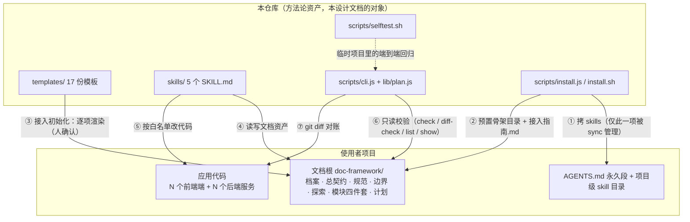
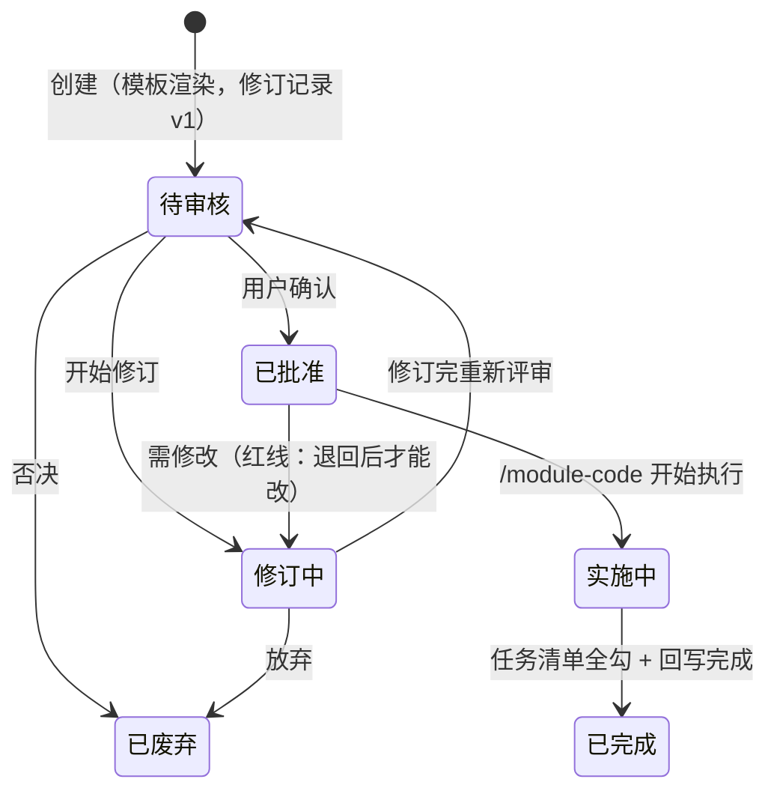
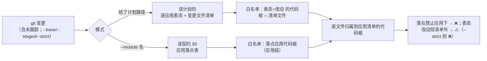

# doc-framework 设计文档

> **读者**：要改这套框架本身的人——改 `scripts/`、`skills/`、`templates/` 的开发者（含接手本仓库的 AI）。
> **不是**给使用者的：装了这套框架、在自己项目里跑五个 skill 的人看 [`README.md`](../README.md)。

## 0. 阅读约定

1. **本文是"当前实现"的权威描述**——描述仓库里的代码**现在**怎么做。设计辩论的原始提案放在 `plan/`（`契约模型改造方案.md`、`多应用全栈开发改造方案.md`、`module-doc-三模式改造实施方案.md`、`小改动通道设计方案.md`），**`plan/` 被 gitignore**，外部读者拿不到，所以本文**自包含**：不写"详见 `plan/xxx.md`"，需要讲清的就在这里讲清。
2. **提案 ≠ 现状**：`plan/` 记录的是"当时为什么这样改、否掉了什么"；代码与本文才是现状。两者冲突时以代码为准，并回来改本文。
3. **冲突时的优先级**：`scripts/`（机器行为） > `skills/` 与 `templates/`（AI 行为与骨架） > 本文 > `README.md`（使用者摘要）。
4. **清单类内容只有一个权威来源**，本文不复制正文、只指路：
   - 校验规则实现 → `scripts/cli.js` `check()`；解析语义 → `scripts/lib/plan.js`；
   - 中英映射 → `scripts/lib/plan.js` 的 `NAMES`；
   - 自检用例清单 → `scripts/selftest.sh` 头部注释。
   本文给出**结构化描述与规则表**（帮读者建立地图），但**数字与逐条清单不在此维护**——那正是上次 README 反复漂移的原因。

---

## 1. 本仓库是什么

`doc-framework` 把一套在真实全栈项目中验证过的开发方法——**面向文档开发**（Document-Oriented Development）——抽象成**可跨项目复用的方法论资产**。仓库只装三件东西：

| 目录 | 是什么 | 谁消费 |
|------|--------|--------|
| `templates/` | 17 份骨架模板（12 份文档模板 + 4 份模块四件套 + 1 份共享脚本） | 使用者项目**接入初始化**时一次性渲染；升级不覆盖已渲染的资产 |
| `skills/` | 5 个 `SKILL.md`（`module-explore` / `module-doc` / `module-plan` / `module-code` / `module-review`） | 拷进使用者项目的 skill 目录，被 AI 加载执行 |
| `scripts/` | `cli.js`（命令分发 + 校验）、`lib/plan.js`（文档解析器）、`install.js` / `install.sh`（安装）、`selftest.sh` + `e2e_template.sh`（自检） | 使用者的终端 / CI；以及本仓库自己的回归 |

**仓库不装**：任何使用者项目的文档资产（契约、计划、探索记录）。这些生成在使用者项目的文档根 `doc-framework/`（中文）或 `doc-framework-en/`（英文）下，**永不回灌本仓库**（§9.4）。

**边界一句话**：本仓库管"规矩与骨架"，使用者项目管"内容"。所以本仓库的改动永远不碰使用者的契约正文。

---

## 2. 总体架构

### 2.1 分层



四层职责，**不要跨层偷懒**：

| 层 | 载体 | 性质 | 能做什么 | 不能做什么 |
|----|------|------|----------|-----------|
| 模板层 | `templates/**` | 静态骨架 | 定义节名、字段名、占位符 | 不能改已渲染的项目资产（§5.4） |
| 技能层 | `skills/*/SKILL.md` | AI 行为约束 | 探测、确认门、读写文档与代码 | 没有机器强制力——靠流程与确认门 |
| CLI 层 | `scripts/**` | 机器硬校验 | 只读检查、git 对账、安装/同步 | **不读源码、不扫代码库**（§7.5 能力边界） |
| 资产层 | 使用者项目 `doc-framework/` | 用户资产 | 长期真相 | 不在本仓库内，永不回灌 |

### 2.2 一次改动的完整数据流

```
需求（只给业务描述）
  → [可选] /module-explore      零承诺探索；待实现模块场景强制落盘探索记录
  → 通道判定                    触语义 / 含 SQL → 完整计划；跨应用 → 轻量；单应用小改 → 直改
  → /module-plan                语义写进「语义增量」节；批准 = 语义定稿 + 授权作用域
  → /module-code                按增量 + 契约不变量实施；逐项勾任务；白名单为边界
  → diff-check                  机器对账（计划白名单 / 直改用契约 §5 落点）
  → /module-doc M               按增量合并进契约正文与接口.md → 翻「合并状态=已合并」
  → /module-review              33 项检查（含增量合并完整性、通道合规审计）
  → /module-plan 归档           「已完成 ∧ 已合并」才可归档（独立动作）
```

**关键不变量**：契约**永不领先代码**——所以语义先写进**计划**（待生效），实施后由 M **合并落账**（已生效）。这条决定了技能分工、模板节设计、以及 `check` 的全部 v2.2 规则（§3.4）。

### 2.3 四条核心设计原则

1. **skill 不焊死任何技术栈**：所有项目特定约定收敛到项目档案（`项目档案.md` / `profile.md`），skill 一切配置从档案读取——换技术栈只换档案，不换技能。
2. **一个文档根 × N 个应用**：档案「应用清单」是 skill 的路由表（应用 → 类型/代码根/规范/数据库/依赖）。可见性 ≠ 上下文——skill 只加载涉及应用的规范与标杆。计划「逐应用表态 + 变更文件清单」即 `/module-code` 的路径白名单；直改通道以契约 §5 应用落点为应用级白名单。
3. **人机共读**：依赖图 / 状态机 / 页面结构 / 业务流程一律用 mermaid 绘制（模块依赖全景图、跨模块业务流程归总契约）——人类阅读与 AI 实施共享同一份文档。
4. **上下文从体系中来，不从人肉中来**：关联文档与代码地址是体系的自动产出（档案 → 总契约 → 导航区 → 代码扫描兜底），用户只给业务需求。

---

## 3. 契约模型规格（v2.2）

这一章是整套体系的地基，也是 `check` 的规则来源。

### 3.1 模块三态

| 状态 | 判定 | 路径 |
|------|------|------|
| **待实现模块** | 代码库中**零实现**（无目录 / 路由 / 表 / 接口 / 契约） | `/module-explore`（**强制落盘**）→ `/module-plan`（首次建模计划）→ 实施 → `/module-doc` M 的 `create` 建档 |
| **存量模块（已建档）** | 有实现 + 有契约 | `/module-plan`（计划增量）→ 实施 → `/module-doc` M 的 `update` 落账 |
| **存量模块（未建档）** | 有实现 + 无契约（老项目接入） | `/module-doc` **模式 B 代码对账**补建（不走计划） |

**反例（最容易混的一处）**：存量模块未建档 ≠ 待实现模块。只要有一行代码 / 一张表 / 一个接口，它就是存量模块，走 B 对账；待实现模块是"计划时刻"的状态，实施一落代码就转成存量模块。

**定名取舍**：中文用「待实现模块」，**弃用"绿地"**——中文"绿地"的真实搭配是"绿地开发/工程/项目"，"绿地模块"不是自然搭配，且直译词依赖"棕地"成对出现才成立。英文保留 `greenfield`（`first-build` 为正式术语，`greenfield` 作同义词）。

### 3.2 首次建模计划的判定式

**不新增「计划类型」字段**——类型由依据推导，避免多一个要人工维护、且会与依据矛盾的字段：

```
首次建模计划  ⟺  无「依据模块契约」 ∧ （有「依据探索记录」 ∨ 有「语义增量」节 ∨ 有「建模补充」节）
```

约束（`check` 硬校验，规则表见 §6.2）：必须 `完整` 形态、必须含「语义增量」全量（几乎全是 ADDED）与「建模补充」节。轻量形态不承载语义，用来承载首次建模会产出"零信息建档"。

### 3.3 语义增量（Delta）

计划的「语义增量」节是**语义变更的唯一载体**，三张固定表 + `主计划` 列：

| 表 | 列（模板固定，`parseDelta` 按此解析） | 装什么 |
|----|--------------------------------------|--------|
| `ADDED（新增）` | `# \| 目标位置 \| 对象 \| 内容 \| 主计划` | 新字段/表/接口/状态机状态/权限标识 |
| `MODIFIED（修改）` | `# \| 目标位置 \| 对象 \| 现值 \| 目标值 \| 主计划` | 语义被改写的对象（现值/目标值是**两列**） |
| `REMOVED（删除）` | `# \| 目标位置 \| 对象 \| 理由 \| 主计划` | 删除项 |

三表的**第一数据列都是「目标位置」**（这是 `check --draft-contract` 能按章节派发的前提），第三列按表语义不同：ADDED 是「内容」、MODIFIED 是「现值 + 目标值」两列、REMOVED 是「理由」——解析后统一装进 `detail`（MODIFIED 拼成 `现值 → 目标值`）。

- **只写目标语义**（不写实现步骤）：每条指明**目标位置**，可被机械合并——这是 `check --draft-contract` 能输出"增量条目 → 契约章节"清单的前提；
- **一份语义变更只由一份计划承载**：拆分计划在「主计划」列回指主计划（同模块两份都为空且增量非空 → I3 ❌）；
- **位置**：模板里固定在「逐应用表态」之后、「变更文件清单」之前——因为它是"授权语义"，要和"授权作用域"（表态 + 清单）相邻；
- **空增量**：纯实现改动写"无（纯实现改动）"，并把合并状态标 `无需合并`。

### 3.4 合并状态三值与四条不变量

`合并状态`（`> Merge state:`）三值，与计划状态**正交**：

| 值 | 含义 |
|----|------|
| `待合并`（`pending`） | 增量已实施未落账 |
| `已合并`（`merged`） | 已由 `/module-doc` M 合并进契约与接口.md |
| `无需合并`（`n/a`） | 空增量（纯实现改动）或计划已废弃 |

四条不变量（设计目标，也是机器校验抓手）：

| # | 不变量 | 违反后果 |
|---|--------|----------|
| **I1** | 契约 ⊆ 代码事实（契约声明的东西必须真实存在） | `/module-review` #11 报"契约有、代码无"（漏实施） |
| **I2** | `状态=已完成 ∧ 增量非空 ∧ 合并状态≠已合并` → ❌，**且拒绝归档** | `check` 硬报错——不能带着未落账的语义归档 |
| **I3** | 同模块 ≥2 份「主计划」列为空的**非空**增量 → ❌ | `check` 硬报错——语义变更被拆散、无主。**已合并但尚未归档的计划仍计入**：同模块同一时刻只允许一份"无主的非空增量"，换新计划前先归档，或在「主计划」列回指 |
| **I4** | 增量的出口只有两个：合并，或废弃（标 `无需合并`） | 废弃计划必须把标记写成 `无需合并`，否则永远挂在"待合并" |

**I2 的归档兜底**：`git mv` 进 `计划/archive/` 不能绕过唯一机器硬校验——`check` 用 `collectArchivedPlans()` 扫模块目录与全局两个 `archive/`，对归档计划同样做 I2 判定。

### 3.5 计划形态与三通道

**授权粒度 ∝ 爆炸半径**：改一个文案的授权，不该和"改状态机 + 加表 + 三端联动"共用一套文档。三条底线**不可让渡**——AI 不能自我授权（必须有一次人的确认）、不能改到范围外的应用、事后可追溯。

判据（自上而下，先命中先定）：

| # | 判据 | 通道 |
|---|------|------|
| 1 | 触及契约语义（§3/§4 出现**新**字段/表/接口/状态机状态/权限标识，或改 §8 验收场景、跨应用不变量） | **完整计划**（语义写进增量节） |
| 2 | 含 SQL 变更 / 生产数据变更（契约 §10 要登记） | **完整计划** |
| 3 | 涉及 ≥2 个应用（哪怕纯文案） | **轻量计划** |
| 4 | 单应用 + 不触语义 + 无 SQL + 预计 ≤5 文件 + 无设计决策 | **直改通道**（免计划） |
| 5 | 其余（单应用但面大 / 需留决策） | **轻量计划** |

判据 1 的客观形式：**这个改动能不能在契约里找到对应条目？** 找得到是实现，找不到就是语义变更。

**轻量计划**是同一份计划格式的低档位：只保留 `逐应用表态 / 变更文件清单 / 任务清单` 三节，头部标 `> 计划形态：轻量`，**不含语义增量节**。`check` 对轻量计划的表态与清单**缺一即 ❌**（它们是白名单），且**含非空增量即 ❌**（形态判错，应升级完整计划）。

**批准粒度从"任务"上移到"作用域"**——这是省成本的关键：

- 批准的对象是**作用域**（表态 + 清单）；扩作用域 = 扩权 → 必须退回「修订中」重新批准；
- **作用域内追加任务项 = 记账**，可直接更新 → 一份轻量计划承接同范围多轮小改，不必每次新建；
- 「已完成」计划不得追加任务（那是新改动）。

**直改通道**（免计划小改）：

- **边界来源 = 契约 §5 应用落点表**（应用级）——契约本就是长期真相，"这个业务在哪些应用存在"天然定义"这次能碰哪些应用"，所以 §5 的准确性是直改的前提；
- **硬禁用**（不进判据权衡）：SQL 与生产数据、状态机、权限标识、跨应用不变量、公共契约/共享库；
- **一次编号确认**（与 `/module-doc` 的模式确认门同构），AI 不得自我授权；
- **自动升级**：途中发现要动语义 → 立即停 → 升级完整计划 → 计划通道重做；已改部分如实汇报；
- **留痕两处**：契约 §9 记一行 `来源=实现`；提交信息首行带 `模块:{模块名}`；
- **对账**：`doc-framework diff-check --module {模块名}`。

### 3.6 计划状态机、落盘与红线



- 状态是**事实登记**：AI 登记、用户确认流转；评审在文档内或文档外皆可；
- 「实施中 / 已完成」由 `/module-code` 登记，`/module-plan` 不登记；**存在未勾选任务时不得登记「已完成」**；
- **任务清单是进度事实源**：`- [ ] 组.序号`，每完成一项就地勾选（只勾事实完成的项）；
- **红线：已批准计划不可直接修改**——退回「修订中」→ 改 → 「待审核」重新评审；修订一律**追加修订记录**（版本+1 / 日期 / 状态 / 修改点 / 评审结论），不覆盖历史；
- **归档不是状态，是位置**：已完成/已废弃由 `/module-plan {模块名} 归档` 移入 `计划/archive/`；**归档是独立动作**（实施完成 ≠ 可以归档，可能还要等生产 SQL 执行、等验收）。

**两类计划的落盘位置**：

| 类型 | 判定 | 位置 |
|------|------|------|
| 单模块计划（默认） | 只涉及一个模块 | `模块/{模块名}/计划/YYYY-MM-DD-{主题}.md` |
| 跨模块计划 | 「依据模块契约」多行 | `计划/YYYY-MM-DD-{主题}.md`（全局，只能用 `{计划路径}` 直达） |
| 归档 | 已完成/已废弃后 | 同级 `计划/archive/`（归档后不进 glob 清单，需路径直达） |

**三个触发形式**：`{模块名}`（glob 列清单，回复编号选择；无匹配自动新建）、`{计划路径}`（直达，跨模块唯一入口）、`{模块名} {YYYY-MM-DD-主题}`（精确匹配单模块计划）。归档：`{模块名} 归档`。

**归档两道守卫**：未完成状态禁止归档；`已完成 ∧ 合并状态=待合并` 拒绝归档（先由 M 落账）。`已废弃` 允许归档，但归档前应把标记写成 `无需合并`。

**正交通道小结**（`/module-code` 的目标来源）：

| 计划形态 | 约束来源 |
|----------|----------|
| 完整计划 | 「语义增量」+ 契约不变量 |
| 轻量计划 | 表态 + 变更文件清单（白名单） |
| 无计划（直改） | 契约 §5 应用落点（应用级 + 硬禁用清单） |

### 3.7 常见误解（全表）

| 误解 | 正确理解 |
|------|----------|
| 计划确认后会自动实施 | 必须显式调 `/module-code`，且计划须为「已批准」 |
| 已批准的计划可以直接改 | **作用域**与**语义增量**都不能；红线是退回修订流程。作用域内追加任务项是记账，可直接更新 |
| 任务清单可以最后一起勾 | 每完成一项就地勾选；未勾完不得登记「已完成」 |
| 「已完成」的计划还能追加任务 | 不能——那是新改动，新建计划或先退回修订中 |
| 实施完成就自动归档 | 归档是独立动作，时机由人定；`list --stale N` 帮你找攒久的 |
| 跨模块计划放在某个模块目录里 | 在全局 `计划/`；`{模块名}` 只匹配模块内计划 |
| 计划是长期规范依据 | 计划是单次决策记录，归档后看契约「变更记录」章节 |
| 改计划 = 改代码，说一声就行 | 代码只认「已批准」的计划 |
| 小改也得先建计划 | 不一定——单应用、不触语义、无 SQL 走直改通道（但要过编号确认 + 边界 + 留痕） |
| 直改 = AI 说一声就能改 | 必须给编号确认门由用户确认；AI 不得自我授权 |
| 语义变更写进契约正文 | 写进计划的增量节；实施后由 M 合并落账（契约永不领先代码） |

### 3.8 成本模型（为什么这么设计）

| 场景 | 改造前 | 现在 |
|------|--------|------|
| 单次小改（单应用 3 文件） | doc（探测+确认）→ plan（渲染 8 节）→ 批准 → code → 归档 = 5 步 | `/module-code`（探测 + 编号确认）= **1 命令 + 1 次确认**，无归档 |
| 一迭代 5 次同范围小改 | 5×(建→批→执行) + 5 次归档 ≈ 20 步 | 1 次轻量授权 + 5 次执行（作用域内追加任务）+ 1 次归档 = **7 步** |
| 真正的功能开发 | 完整计划 | **不变**（决策记录、接口兼容性、验收标准正是完整计划的价值） |

**防滥用三条**（缺一条设计就烂）：① 禁止 AI 自降级（任何免计划判定都要过编号确认门）；② 自动升级永远安全、降级必须人确认；③ 事后审计——`/module-review` 第七节「通道合规审计」专查"本该建计划却直改/轻量""直改越界""作用域就地篡改"，这是防止直改通道吃掉"语义先于代码、记录后于代码"纪律的唯一手段。

---

## 4. 技能层实现

技能层是 **AI 行为约束**，没有机器强制力——所以每个技能都靠"探测 + 编号确认门 + 铁律"三段式保证可复现。

### 4.1 五个技能的职责边界

| 技能 | 职责 | 明确不做 |
|------|------|----------|
| `module-explore` | 写契约前的探索与讨论：按应用清单路由调研、澄清需求与范围、候选方案对比、有证据的推荐 | 不写契约/计划、不改代码；默认**不落盘**（待实现模块场景强制落盘）；**不越过"契约细节"水位线**（只谈要不要做/放哪/走哪条路/范围，不设计字段接口） |
| `module-doc` | 四件套（契约/接口/测试/test.sh）的创建与更新：**三模式自动探测**（M/B/C）+ 回写总契约 | 不写代码；不创建/修订/归档计划；不做探索讨论 |
| `module-plan` | 计划的创建、修订、状态流转、归档 | 不实施代码；不做契约/接口.md 的合并落账 |
| `module-code` | 执行改动：三通道判定 + 按依赖序实施 + 逐项勾选 + 回写 | 不创建/修改四件套；不创建/修订/归档计划；**不得自我授权免计划** |
| `module-review` | 对照四件套与各应用代码审查，出分级问题清单 | 不改代码，只出清单与修复建议 |

**防重叠硬规则**：探索中的确认 ≠ 授权写文件（探索的确认只是"方向同意"）；文档的写权限只在 `module-doc`；计划的写权限只在 `module-plan`；代码的写权限只在 `module-code`。

`module-explore` 的**判据**是"选错了返工要动契约/计划/多个模块吗？"——要则先探索；改文案/调样式/单文件小改不必探索。它还有一个隐含职责：**防模块膨胀的刹车**（`module-explore/SKILL.md` §1′）。输出**交接包五项**：目标一句话 / 模块清单与关系 / 范围与「不做」/ 选定方案与理由 / 留给 plan 的未决问题。

### 4.2 `module-doc` 三模式（M / B / C）

**零后缀、零参数**：模式由 AI 探测后带编号请用户确认；强制模式回编号或用自然语言。

| 模式 | 真相来源 | 产出与停止点 |
|------|----------|--------------|
| **M 合并** | 计划增量 + 代码事实 | `update`（存量）：按增量更新契约 §3/§4/§5/§8 + 接口.md（**合并前以代码校正**，偏离写入 §9「实施偏离」）；`create`（待实现模块首次建档）：据增量 + 建模补充生成契约 10 章 + 接口.md，并回写总契约（模块索引表 / 依赖矩阵 / 应用拓扑）；两分支都 §9 记"合并（回链计划）"并翻 `合并状态=已合并` |
| **B 代码对账** | 代码 | 分组差异清单（必改/建议/仅登记）→ 分组确认 → 回写契约 + 接口.md（§9 来源=代码）；**待实现模块拒绝执行**（无代码可对） |
| **C 产物补齐** | 契约 | 前置一致性检查 → 接口.md → 测试.md → test.sh |

**分支重定向**（判定表里的硬规则）：

- 无契约 + 无代码（待实现模块）→ **重定向 `/module-plan`**：契约永不领先代码，建档在实施后由 M 的 `create` 完成；
- 无契约 + 有代码 → B 代码对账补建历史；带新需求时先 B 建基线，再 `/module-plan` 增量，实施后 M 落账（复合流程 **B → M**）；
- 无需文档变更：判定不影响契约语义（纯实现/文案/样式）时，说明理由后结束，不硬写变更记录；
- **旧后缀**（新建/补文档/改造/同步）仍可作自然语言提示识别，但不再是正式语法。

**确认门格式**（编号即强制入口，零记忆）：

```
探测事实：契约存在 ✓；代码落点 12 个文件，与契约有差异 → 候选 B 代码对账
将写入：契约 §3/§4 + 接口.md；不生成测试
1) 确认按 B 执行    2) 改为 M（按计划增量合并）    3) 改为 C（只补产物）
```

**M 的铁律（两分支共用）：以代码为准，不照抄计划**。因为契约 = 已生效真相，而计划写的是"批准时的目标"；实施中偏离了就以代码校正，并把偏离记进契约 §9「实施偏离」——**不回改计划正文**（计划是历史决策记录）。

**建档九步**（`create` 分支，`module-doc/SKILL.md` §2.2）在首次建模计划实施完成后执行，`check --draft-contract <计划路径>` 是这条流程的只读 checklist（§6.1）。

**映射表**（`module-doc/SKILL.md` §2.4：「增量 + 建模补充 + 代码 → 契约章节」）决定"哪些条目落到契约哪一章"，例如建模补充 M1 边界 → 契约 §2、M2 状态机 → §3.2、M3 依赖 → §2.1、M4 验收场景 → §8.2。**新增增量对象类型时，必须同步这张映射表与 `check --draft-contract` 的章节映射。**

### 4.3 `module-plan` 的护栏

- **增量护栏**：语义变更只能写进「语义增量」节；I3 的「主计划」列语义（拆分计划回指主计划）；首次建模形态约束（必须完整 + 含增量节 + 含建模补充节）；
- **归档守卫**：仅 `状态=已完成 ∧ 合并状态=待合并` 拒绝归档；`已废弃` 允许归档并把标记写 `无需合并`；
- **跨模块前置校验**：跨模块计划前校验「依据模块契约」已存在（被依赖方是待实现模块时可指向其首次建模计划路径）；
- `list --stale` 提供批量归档入口。

### 4.4 `module-code` 的执行序

1. **通道判定**（§0）：三通道判据 → 需要免计划时给编号确认门；
2. **加载上下文**（§1）：档案 → 总契约 → 涉及应用规范 → 标杆 → 边界；
3. **白名单自检**（§2）：每次写文件前确认路径 = 表态"改动"应用代码根 ∩ 变更文件清单；
4. **按依赖序实施**（§3）：SQL → 主责服务 → 下游/聚合 → 逐端；每完成一项**就地勾选**；
5. **一致性自检**（§4）：代码 ↔ 计划增量 ↔ 契约不变量；偏离以代码为准；
6. **回写**（§5，交付义务）：契约 §9、接口.md 接入状态、总契约索引、计划状态与任务清单。

### 4.5 `module-review` 的七节结构

| 节 | 检查范围 | 编号 |
|----|----------|------|
| 一、通用清单 | 契约↔代码一致性、接口一致、导航区、回写查账、软删除/乐观锁、SQL 参数化、密钥、输入校验、依赖注入、生产 SQL 登记 | #1–#10 |
| 二、多应用对账 | 落点对账（契约 ⊆ 代码事实）、计划表态对账、接入状态、跨服务契约一致、跨应用不变量、应用清单健康 | #11–#16 |
| 三、完成度对账 | 任务勾选属实、状态与进度一致、验收场景可追溯、归档纪律 | #17–#20 |
| 四、测试覆盖完整性 | 黑盒底线、白盒适用判定、端层/编排层适用判定 | #21–#23 |
| 五、模式与增量对账 | §9 来源四值、C 前置可验证、增量合并完整性、待实现模块已实施但未建档、无计划外漂移 | #24–#26、#32、#33 |
| 六、档案注入清单 | 按应用读取技术栈特有检查项 | — |
| 七、通道合规审计 | 本该建计划却走轻量/直改、直改越界、轻量形态合规、作用域就地篡改、直改留痕 | #27–#31 |

**在途计划豁免**（口径统一在 `module-review/SKILL.md`）：未归档、且 `状态 ∈ {已批准, 实施中, 已完成}` 的计划。同模块存在在途计划时，其增量覆盖的对象**不计私建**——否则"实施 → 合并"窗口内必然误报（#33）。判定顺序：先看有没有在途计划 → 有则核对增量覆盖范围（#26/#33 豁免）→ 无在途计划而代码已落、契约缺失（#32）。

**报告模板**：分级清单 `CRITICAL / HIGH / MEDIUM / LOW` + 检查统计（总/通过/各级数量）+ 完成度 + 测试覆盖 + 通道合规 + 增量与建档四个专节。门禁：CRITICAL 与 HIGH 清零才提示可提交。

---

## 5. 模板层实现

### 5.1 模板清单（`templates/`，17 份）

| 文件 | 作用 | 关键点 |
|------|------|--------|
| `profile.md.tpl` | 项目档案（**唯一需人工确认的文件**） | 「应用清单」表 = skill 路由表；通用约定全局段 + 应用覆盖 |
| `接入指南.md.tpl` | 接入引导（一次性，初始化后删除） | 旧项目扫描 / 新项目提问；「模板来源」标记供初始化拉取 |
| `AGENTS.md.tpl` | 写进项目根的永久段 | 编码纪律总纲（语义先于代码、记录后于代码）；英文映射 |
| `总契约.md.tpl` | 总索引 | 业务域、应用拓扑、模块索引表、依赖矩阵 + 全景图、跨模块流程、维护规则 |
| `测试规范.md.tpl` / `接口规范.md.tpl` | 全局方法论与接口约定 | 四层验证（接口/库/端/编排）；REST/错误码/分页/认证/兼容性红线 |
| `规范/类型-前端.md.tpl`、`规范/类型-后端.md.tpl`、`规范/应用-{应用标识}.md.tpl` | 规范三层 | 类型层共性 + 每应用差异 |
| `边界/{能力}边界.md.tpl` | 跨模块/跨服务能力 | 工作流/附件/权限/服务间调用/事件与 MQ/鉴权网关 |
| `模块/{模块名}/契约.md.tpl` | **语义约束（业务语义唯一真相）** | 10 章；见 §5.2 |
| `模块/{模块名}/接口.md.tpl` | 字段级服务端真相（唯一事实源） | 服务归属/类型/消费方 + 各应用接入状态 |
| `模块/{模块名}/测试.md.tpl` | 测试用例 | 含**适用层与依据** |
| `模块/{模块名}/test.sh.tpl` | 可执行测试 | 多服务 `BASE_URL` 参数化 |
| `计划/YYYY-MM-DD-{实施主题}.md.tpl` | 实施计划 | 见 §5.2 |
| `探索/YYYY-MM-DD-{主题}.md.tpl` | 探索记录 | 第 5 节「待实现模块清单与关系」 |
| `scripts/e2e_template.sh` | 共享 E2E 脚本 | 渲染进项目；本仓库的 `scripts/e2e_template.sh` 与它同步 |

### 5.2 关键节设计

**契约模板 10 章**：`1 模块定位` / `2 边界约定（2.1 依赖关系 mermaid + 2.2 不做什么 + 2.3 业务流程）` / `3 数据模型（3.1 主表 + 3.2 流程状态机 + 3.3 其他枚举）` / `4 接口概览（4.1 基础路径 + 4.2 接口清单 + 4.3 权限校验 + 4.4 接口对状态的影响）` / **`5 应用落点`（= 直改通道边界来源）** / `6 标杆参考` / `7 特殊约定与常见陷阱` / `8 测试与验证（8.1 验收标准 + 8.2 关键验收场景 + 8.3 端与编排层验收）` / **`9 变更记录`（来源四值）** / **`10 生产环境 SQL 执行登记`（防上线遗漏）**。

**§4 只放接口概览，字段细节一律进 `接口.md`**——防双维护。这是硬规则，不是风格建议。

**§9 来源四值** `需求 / 代码 / 实现 / 合并`：

| 值 | 何时写 | 约束 |
|----|--------|------|
| `需求` | **历史遗留**：旧模型"契约先行"时代的记录 | 只约束**新增**记录，历史不回填、不删除 |
| `代码` | 模式 B 按代码对账回写 | — |
| `实现` | 直改通道（只动实现、未动语义） | 一行即可 |
| `合并` | M 把已批准增量落账（§3 契约模型） | **必须回链计划路径**——落账要有据 |

**计划模板结构**：头部字段（`依据模块契约` / `计划形态` / `状态` / `参考标杆` + `依据探索记录` / `合并状态`）→ `〇 修订记录` → `一 需求理解` → `二 逐应用表态（授权作用域）` → **`语义增量`（位置固定）** → `建模补充 M1–M4` → `三 变更文件清单（SQL/服务端/前端端/其他）` → `四 任务清单` → `五 实施顺序` → `六 关键设计决策` → `七 接口兼容性声明` → `八 验收标准` → `九 待确认事项` → `十 里程碑` → `十一 回写清单`。

**建模补充 M1–M4**：语义增量三张表装不下图与边界约定，建档时（M 的 `create` 分支）依赖本节生成契约 §1/§2/§6/§8——M1 边界与「不做什么」、M2 状态机/页面结构（mermaid）、M3 依赖与集成点、M4 关键验收 Scenario（映射到契约 §8.2）。

### 5.3 占位符与渲染纪律

- `{占位符}` 必须全部替换为项目实际值；**禁止凭空自创结构**——所有骨架一律从官方模板渲染；
- `check` 扫描文档根下所有 `.md`，剥离代码围栏与行内代码后，只报**含中文**的残留占位符（避免误报英文代码片段）；**豁免 `探索/`**——探索记录是单次决策记录，允许保留 `{待验证}` 之类的开放标记；
- 生成文档必须带**导航区**（四件套互链），未生成的文件标"（待生成）"。

### 5.4 存档纪律：模板与永久段永不自动改写

**`templates/**` 与使用者的 `AGENTS.md` 永久段永不自动改写**（既有决策）。理由：自动改写用户的项目资产与整套体系"文档资产永不回灌、改文档归技能、AI 不擅自动用户文件"的纪律相冲。

后果（必须知道）：**升级框架 ≠ 升级文档体系**。模型升级后，已初始化项目要人工按清单替换模板并手工补 `AGENTS.md` 永久段（§9.3），否则新会话里的 AI 仍按旧模型工作。

---

## 6. CLI 层实现

### 6.1 命令清单

| 命令 | 写文件？ | 作用 |
|------|----------|------|
| `doc-framework sync` | **写**（仅 skill 文件） | 同步 skill 到最新；本地定制按 sha256 自动跳过；**不动文档根与 AGENTS.md** |
| `doc-framework check` | 只读 | 校验体系完整性；退出码 0=通过 / 1=有硬问题 |
| `doc-framework check --draft-contract <计划路径>` | 只读 | 打印"增量条目 → 目标契约章节"清单（含合并/建档九步），供 M 当 checklist |
| `doc-framework diff-check <计划路径>` | 只读 | 提交前对账：git 变更 vs 计划白名单 |
| `doc-framework diff-check --module <模块名>` | 只读 | 直改通道对账：git 变更 vs 契约 §5 落点（应用级） |
| `doc-framework list [...]` | 只读 | 列在途计划（`--module/--app/--state/--stale/--orphans/--all/--json`） |
| `doc-framework show <计划路径>` | 只读 | 单个计划的结构化视图（`--json`） |

**只读纪律**：除 `sync` 外全部只读，可进 CI。`--json` 是机器消费接口，当前标 **experimental**（格式可能变动）。

`check --draft-contract` 需要分发器传参——历史坑：早期 `cli.js` 是 `process.exit(check())`，`check` 不接收 argv，所以这个选项必须同时改分发器。

### 6.2 `check()` 规则表

规则分两组：**`issues`（❌/⚠️，退出码 1）** 与 **`notes`（ℹ️，不影响退出码）**。注意 ⚠️ 前缀的占位符/引导残留也在 `issues` 里——**它们会失败**。

**① 骨架完整性**

| 检查 | 级别 |
|------|------|
| 必需文件存在（档案 / 总契约 / 测试规范 / 接口规范） | ❌ |
| 必需目录存在（模块 / 边界 / 规范 / 计划——**不含 `探索/`**，探索记录是按需产物） | ❌ |
| 有前端端应用 → `规范/类型-前端.md` 存在；有服务端应用 → `规范/类型-后端.md` 存在 | ❌ |
| 无「应用清单」的旧档案 → 回退校验 `规范/前端开发规范.md`、`规范/后端开发规范.md` | ❌ |
| 检测到旧英文文档根 `docs-framework/` | ℹ️ 建议改名 |

**② 应用清单健康**

| 检查 | 级别 |
|------|------|
| 每个应用的规范文件存在 | ❌ |
| 每个应用的代码根存在（按现状登记任意路径，但必须会话内可见） | ❌ |
| 应用代码根互相嵌套（最长前缀优先解析） | ❌ |

**③ 计划体检**（逐份在途计划）

| 检查 | 级别 |
|------|------|
| 计划无法解析 / 缺状态字段 | ❌ |
| 档案无应用清单 → 跳过应用归属校验 | ℹ️ |
| 轻量形态：缺「逐应用表态」/ 缺「变更文件清单」 | ❌ |
| 轻量形态含**非空**语义增量（应升级完整计划） | ❌ |
| 缺语义增量节（`shape≠light`，存量或本地定制模板） | ℹ️ |
| 含增量节但缺「合并状态」行 | ℹ️ |
| 「合并状态」值无法识别（与"漏填"分开报文案） | ℹ️ |
| **I2**：`已完成 ∧ 增量非空 ∧ 合并状态≠已合并` | ❌ |
| 空增量的计划未把「合并状态」标为 `无需合并` | ℹ️ |
| **建档兜底**：`已完成 ∧ 增量非空 ∧ 合并状态=待合并 ∧ 契约缺失`（即"待实现模块已实施未建档"）；`实施中` → ℹ️ | ❌ / ℹ️ |
| 首次建模计划标 `合并状态=已合并` 但契约仍不存在（**假合并**，落账无据） | ❌ |
| 首次建模：`形态≠完整` / 缺增量节 / 缺建模补充节 | ❌ |
| 首次建模但契约**已存在**（豁免：`合并状态=已合并`——本计划就是该契约的建档载体） | ❌ |
| 首次建模硬判据：变更文件清单中的文件**已全部存在** ∧ 状态 ∈ {待审核, 修订中, 已批准} | ❌ |
| 首次建模软判据：清单文件 **≥50% 已存在** | ℹ️ |
| `依据探索记录` 为空 / 路径不存在（基准=仓库根）；= 哨兵 `无（自述）` | ❌ / ℹ️ |
| **契约引用校验**：v2.2 完整计划（含增量节）缺 `依据模块契约`，或所指契约/首次建模计划不存在；v2.1 及更早缺该行 | ❌ / ℹ️ |
| 计划无「逐应用表态」表（v2.0 前旧格式） | ℹ️ |
| 表态了未登记的应用 | ❌ |
| 清单文件不在任何已登记应用代码根下 / 未归属任何应用的 SQL | ❌ / ℹ️ |
| 清单文件落在表态「本次不改」的应用下 | ❌ |
| 清单文件所属应用未在计划中表态 | ℹ️ |
| `已完成` 但存在未勾选任务 | ❌ |
| 任务全勾但状态仍是 `实施中` / `已完成` 但回写清单未勾完 | ℹ️ |
| **I3**：同模块 ≥2 份「主计划」列为空的非空增量 | ❌ |
| **归档兜底 I2**：归档计划 `已完成 ∧ 增量非空 ∧ 合并状态≠已合并` | ❌ |
| 已废弃计划含非空增量但未标 `无需合并`（I4 的废弃出口：增量的第二条出口） | ℹ️ |

**④ 占位符残留**：文档根下 `.md` 中未渲染的**含中文** `{...}`（剥离代码围栏与行内代码；豁免 `探索/`）→ ⚠️。

**⑤ 引导清理**：项目根 `接入指南.md` 未删 → ⚠️；`{文档根}/README.md` 仍含"待初始化" → ⚠️；`AGENTS.md` 仍含接入引导段 → ⚠️。

### 6.3 `diff-check` 白名单推导



- 计划模式要求状态是可执行态（`已批准 / 实施中`）——**缺状态字段或状态认不出同样 ❌**（提交前闸门没有"警告放行"档）；
- `--staged` 的口径是"**将要提交的内容**"：只看 `git diff --cached`，**不并入未跟踪文件**（否则一个还没 `git add` 的新文件就会卡住 pre-commit）；不加 `--staged` 时默认比 `HEAD` 并含未跟踪文件；
- `--base` 取值先做保守字符校验再拼进命令（防注入）；
- 某应用代码根为 `./` 时退化为**纯文件级**清单；
- `--module` 下契约 §5 为空或未解析到 → ❌；找不到契约 → ❌（待实现模块请用计划通道）；
- 作用：把 `/module-review` 的多应用对账**前置到提交前**，零 prompt 依赖。

### 6.4 `list` / `show` 输出契约

- `list` 默认只列**在途计划**（排除已完成/已废弃与归档目录），行内带「（轻量）」「（待合并）/（已合并）」与增量条数、涉及应用（表态=改动）、任务进度；`--orphans` 只列"缺契约**且无在途计划**"的模块（**代码是否存在需人工确认**——本仓库不扫描代码）；`--stale <天>` 是批量归档入口；
- **`--orphans` 的「在途」口径**（与 `/module-review` 的统一定义一致）：**未归档 ∧ `状态 ∈ {已批准, 实施中, 已完成}`**。所以「已完成但未落账/未建档、契约缺失」的模块**不会**出现在 `--orphans` 里——这是**有意**的：它的正确出路是 `/module-doc {模块名}` 的 M `create` 建档，而 `--orphans` 给的是"有代码 → 模式 B 对账 / 零实现 → 首次建模计划"这条二选一路由，列出来反而指错路；该场景由 `check` 的**建档兜底 ❌** 兜住，`list` 也会把它显示为「（待合并）」；
- `show` 输出状态、形态、依据、语义增量与合并状态、逐应用表态与**推导出的白名单前缀**、变更文件清单、任务进度与未完成项、回写清单进度、接口兼容性；
- 两者末尾带 `Next:` 引导：`list` 默认指向 `show <计划路径>`，仅在 `--stale` 命中停滞计划时提示归档；`show` 在「待审核 / 已废弃」状态不给 Next。归档计划优先从 `archive/` 解析。

### 6.5 解析稳健性（踩过的坑，回归都在 `selftest.sh`）

| 坑 | 处理 |
|----|------|
| `合并状态` 值里带日期/冒号，用 `[^\n]+` 被行内 ASCII `:` 截断 | 取**整行**，且**中英词表都试**（中文文档里写 `merged（2025-01-02）` 也要认），先剥离尾随日期/括注 |
| 表头列位写死（把"目标值"当主计划）→ I3 漏判 | 按**表头列名**定位「主计划」，找不到则退化取**最后一列** |
| `依据模块契约` 的纯行写法（无 `>`）解析失败 | 行首 `>` 可选 |
| 单元格内含 `\|` → 静默丢列 | `tableRows` 对反引号内的 `\|` 做占位保护 |
| 哨兵 `无（自述）` 被包含匹配误判 | **精确等值**匹配 + 英文哨兵 `none (self-described)` |
| `git mv` 进 `archive/` 绕过 I2 | `collectArchivedPlans()` 兜底 |
| 值无法识别却报"缺失" | `mergeRaw` 保留原值，专门文案 |
| 字段名加粗（`> **状态**：已批准`）解析不到 → 误报"缺状态字段" | 字段正则容忍 `**` 包裹；状态/形态/契约/探索/合并状态一律「行首 `>` 可选」 |
| 「依据模块契约」只认反引号内容 → 纯行写法被判"首次建模计划" | 无反引号时按整行切分兜底（与「依据探索记录」口径对齐） |
| 计划放进 `计划/` 的自建子目录 → 绕过体检与 I2 | 递归枚举（跳过 `archive/`；嵌套目录只认日期前缀文件，避免把随手笔记当计划） |
| 「主计划」列写英文空标记（`n/a`/`none`/`empty`）→ 被当成真实回指，I3 漏判 | 空标记中英并集 |
| 应用类型只用当前语言词表 → 中文根登记 `frontend` 漏校验 | 类型关键词中英并集 |
| 目录不可读/文件读取失败 → 抛 Node 栈给用户 | 枚举与读取统一 try/catch，降级为跳过或 ❌ 文案 |

---

## 7. 解析器实现（`scripts/lib/plan.js`）

纯 markdown 解析器，**没有任何代码扫描能力**（这是设计约束，不是缺陷——见 §7.5）。

### 7.1 `NAMES`：中英映射的唯一来源

`NAMES.zh` / `NAMES.en` 两张表是**文件名 / 目录名 / 章节名 / 头部字段 / 表头列 / 固定枚举值**的唯一来源：档案与总契约等文件名、`模块 边界 规范 计划 探索` 等目录名、`逐应用表态 / 变更文件清单 / 任务清单 / 回写清单 / 接口兼容性声明 / 应用落点 / 语义增量 / 建模补充` 等章节名、`状态 / 计划形态 / 依据模块契约 / 依据探索记录 / 合并状态` 等头部字段、表头列 `主计划`、哨兵 `无（自述）`、合并状态三值、形态两值，以及表态值与应用类型的关键词。

**但它不是全部**——以下几处映射在 `NAMES` 之外，改映射时别漏：

| 位置 | 装什么 |
|------|--------|
| `plan.js` 的 `EN_STATES` / `EN_MERGES` | 状态与合并状态的**英文别名**（`pending`/`draft`/`in-revision`/`done`/`rejected`/`discarded`、`to-merge`/`unmerged`/`n-a`） |
| `plan.js` 的 `parsePlan` 哨兵判断 | 额外硬编码 `self-described` / `none (self-described)` 两个兼容写法 |
| `templates/AGENTS.md.tpl` 与 `templates/接入指南.md.tpl` | 契约 §9 来源四值 `requirement / code / implementation / merge`——**代码根本不解析这个值**，它只约束人与 review |
| `NAMES.moduleContract` | 四件套里**只有 `契约.md`** 进了 `NAMES`；`接口.md` / `测试.md` / `test.sh` 的名字未进（未被解析器定位） |

**改 `NAMES` 里的任何一项，必须同步下面四处副本/依赖者**：

1. `templates/AGENTS.md.tpl`（英文模式的章节/字段名映射）；
2. `templates/接入指南.md.tpl`（初始化时按它渲染英文命名，§8 的两处引用）；
3. 相关 `skills/*/SKILL.md`（技能按这些名字读写文档）；
4. `docs/设计文档.md` §8.2 与 `README.md` 的目录/文件名表（**副本，必须跟改**）。

漏改的后果是**静默失效**：解析器按 `NAMES` 定位，而模板产出的是另一个名字——不报错，只是解析不到。`scripts/selftest.sh` 的夹具里也硬编码了一批英文名字，因此**改完必须跑自检**（§10）。

### 7.2 主要函数

（下表省略 `reEscape` / `secCands` 这类纯工具函数；`resolveDocRoot` 是**导出入口**——`cli.js` 的 check/diff-check/list/show 全部经它定位文档根并选词表，见 §8.1。）

| 函数 | 职责 |
|------|------|
| `lexicon(docRoot)` | 按文档根目录名选词表（`doc-framework/` → zh；`doc-framework-en/` **与历史 `docs-framework/`** → en） |
| `normalizeMerge(raw)` | 合并状态归一：整行 + `NAMES` 中英合并词 + **`EN_MERGES`** 别名（`to-merge`/`unmerged`/`n-a`）+ 剥离 `（…）` 与 `YYYY-MM-DD`；认不出返回 `null`（原值留在 `mergeRaw`）。**不需要词表参数**——函数内部中英都试 |
| `normalizeState(raw)` | 状态归一（中英枚举 + 别名，如 `done`/`rejected`） |
| `mdSection(content, keyword)` | 按 `## ` 标题关键字切节 |
| `tableRows(sectionText)` | 解析 markdown 表格行，反引号内 `\|` 占位保护（防静默丢列） |
| `parseAppRegistry(docRoot, lex)` | 解析档案「应用清单」→ `{id, type, root, spec, ...}` 数组 |
| `matchApp(apps, file)` | 文件归属：按代码根**最长前缀**匹配 |
| `appTypeMatches(lex, type, kind)` | 应用类型判定（关键词匹配；`typeFrontendWords` / `typeBackendWords` **中英词表取并集**） |
| `parseContractScope(docRoot, moduleName, lex)` | 解析契约 §5 应用落点表（直改边界来源） |
| `parseChecklist(sectionText)` | 解析 `- [ ] / - [x]` 任务清单 → `{total, done, open}` |
| `planIdentity(root, planPath, lex)` | 从路径推导模块名与落盘位置（模块内 / 全局跨模块 / archive） |
| `parseDelta(content, lex)` | 解析「语义增量」三表 → `{added, modified, removed, total, nonEmpty, mergeState, mergeRaw, hasSection, hasMergeLine}`；`detail` 按表取（ADDED=内容 / MODIFIED=`现值 → 目标值` / REMOVED=理由） |
| `hasContract(docRoot, moduleName, lex)` | 模块契约是否存在 |
| `contractRefExists(root, docRoot, ref)` | `依据模块契约` 指向的契约**或首次建模计划**是否存在 |
| `moduleImplementationProxy(root, plan, docRoot, lex)` | "模块是否已实现"的**代理判据**（见 §7.5） |
| `parsePlan(root, planPath, lex)` | 主入口：一次解析出计划全貌（状态/形态/依据/增量/表态/清单/任务/回写/兼容） |
| `inFileList(fileList, file)` | 文件是否在清单内（精确或前缀匹配；清单路径在 `parsePlan` 阶段已归一化） |
| `collectPlanPaths(docRoot, lex)` | 在途计划 glob（排除 archive）；**中英目录名并集枚举**（见 `docDirs`），递归子目录 |
| `collectArchivedPlans(docRoot, lex)` | 模块目录 + 全局两个 `archive/`（I2 兜底）；同样并集枚举 |
| `docDirs(docRoot, lex, kind)` | 取某顶层目录在**当前语言与另一语言**下的候选名（`'modules'`/`'plans'` 返回绝对路径，`'modulePlan'` 返回相对名）——与 `hasContract`/`parseAppRegistry` 的并集口径一致，避免混排布局下计划"静默不可见" |
| `listPlans(root, docRoot, lex)` | 汇总清单 |

### 7.3 解析结果的兼容语义

| 字段 | 缺失时 | 含义 |
|------|--------|------|
| `shape` | `null` → **视为完整** | 无 `> 计划形态：` 的旧计划行为与以前一致（只给"缺增量节"ℹ️），**免迁移** |
| `delta` | 恒为对象（**不为 `null`**） | 无增量节时 `delta.hasSection=false`，各表为空 → 不触发 I2 |
| `mergeState` | `null` | 未标合并状态；有标记行但值不识别 → `mergeRaw` 保留原值 + 专门文案（`hasMergeLine` 区分"没写"与"写了但认不出"） |
| 表态表 | 缺失 | v2.0 前旧格式 → 跳过应用归属校验（ℹ️） |

### 7.4 哨兵值 `无（自述）`

仅用于**人工显式降级**（首次建模计划确实没有探索记录时），**AI 不得自行写**。英文 `none (self-described)`。

### 7.5 `moduleImplementationProxy()`：代理判据

`plan.js` / `cli.js` 只有文档路径 `fs.existsSync`、应用代码根存在性、`git diff --name-only`——**从不读源码，无路由/表/接口索引**。所以"模块是否零实现"**不能靠猜模块名**（`订单`/`order`/`trade` 拼写差异必然误判）。

| 判据 | 内容 | 后果 |
|------|------|------|
| **硬判据** | 契约已存在 | 全状态不得标首次建模 ❌ |
| **硬判据** | 变更文件清单中**全部**路径已存在 | 疑似存量：`状态∈{待审核,修订中,已批准}` → ❌ |
| **软判据** | 清单中 **≥50%** 路径已存在 | ℹ️"疑似存量模块，请确认"（`cli.js` 消费 `mostlyExist`） |

`moduleImplementationProxy()` 统计时**排除文档根下的路径与 `AGENTS.md`**（文档回写不算"模块实现"）。

**这是代理判据，不是"真的扫描代码"**。若要精确判定需引入代码索引能力——本方案明确不做（会引入语言/框架依赖，破坏"不焊死技术栈"原则）。

---

## 8. 语言模式

### 8.1 识别方式

**根目录名识别语言，且只决定根目录内部的命名**：

| | 中文模式 | 英文模式 | 旧英文目录（只读兼容） |
|---|---|---|---|
| 根目录 | `doc-framework/` | `doc-framework-en/` | `docs-framework/` |
| 档案 | `项目档案.md`（`## 应用清单`） | `profile.md`（`## App registry`） | 同英文 |

要么全中文、要么全英文，**禁止混用**。`docs-framework/` 仍能被 `check` / `diff-check` 识别，但输出改名提示（ℹ️，不影响退出码）；迁移**一律手工**（`mv docs-framework doc-framework-en`），`sync` 不会代你 `mv`，也不会代你改 `AGENTS.md`（§12 决策）。

### 8.2 映射全表

映射的权威来源是 `plan.js` 的 `NAMES`（**范围见 §7.1**——状态与合并状态的英文别名在 `EN_STATES` / `EN_MERGES`，契约 §9 来源四值只在模板里）。下面分别给出**目录与文件名**、**章节与字段名**两套清单（所列为主名）。

**目录与文件名**：档案 `项目档案.md` / `profile.md`；总契约 `总契约.md` / `contract.md`；`测试规范.md` / `testing-guide.md`；`接口规范.md` / `api-guide.md`；顶层目录 `模块 边界 规范 计划 探索` / `modules boundaries standards plans explore`；四件套 `契约.md 接口.md 测试.md test.sh` / `contract.md api.md testing.md test.sh`；归档 `计划/archive/` / `plans/archive/`；规范三层 `规范/类型-前端.md`、`规范/类型-后端.md`、`规范/应用-{应用标识}.md` / `standards/type-frontend.md`、`standards/type-backend.md`、`standards/app-{app}.md`；边界 `边界/{能力}边界.md` / `boundaries/{capability}.md`；探索 `探索/YYYY-MM-DD-{主题}.md` / `explore/YYYY-MM-DD-{topic}.md`。

**章节与字段名**（解析器按这些关键词定位，中英可混排兜底）：

| 用途 | 中文 | 英文 |
|------|------|------|
| 契约 §5 应用落点表 | `## 5. 应用落点` | `## 5. Application footprint` |
| 计划章节 | `逐应用表态 / 变更文件清单 / 任务清单 / 回写清单 / 接口兼容性声明 / 语义增量 / 建模补充` | `Per-app stance / Changed files / Task list / Writeback / Compatibility / Delta / Modeling notes` |
| 计划头部字段 | `> 状态：/ > 计划形态：/ > 依据模块契约：/ > 依据探索记录：/ > 合并状态：` | `> Status: / > Plan shape: / > Module contract: / > Evidence: / > Merge state:` |
| 增量三表 | `ADDED（新增）/ MODIFIED（修改）/ REMOVED（删除）`，列含 `主计划` | `ADDED / MODIFIED / REMOVED`，列含 `Lead plan` |
| 合并状态三值 | `待合并 / 已合并 / 无需合并` | `pending / merged / n/a` |
| 契约 §9 来源 | `需求 / 代码 / 实现 / 合并` | `requirement / code / implementation / merge`（`> Source:`） |
| 状态枚举 | 待审核 / 修订中 / 已批准 / 实施中 / 已完成 / 已废弃 | `pending-review / revising / approved / in-progress / completed / abandoned`（别名 `pending / draft / in-revision / implementing / done / rejected / discarded`） |
| 表态值 | 改动 / 本次不改 / 不适用 | `change / no-change / no change / not applicable / n/a` |
| 应用类型 | 前端端 / 后端服务 / 聚合层 | `frontend / web / mobile`（前端）、`backend / service / bff / aggregate`（服务端）——关键词匹配 |
| 哨兵 | `无（自述）` | `none (self-described)` |

### 8.3 不提供英文模板（已定决策）

`templates/` **只有中文一套**。英文项目从中文模板**逐项翻译渲染**（文件名/目录名/章节名/头部字段/状态与表态值按上表映射），首次渲染出的产物即该项目的标杆。

理由：**双份模板的长期漂移风险 > 一次性翻译成本**——每改一次模板都要同步两份、且两份迟早不一致；而英文模式目前没有真实用户。若某天英文项目成为常态，再评估建立 `templates-en/`，但**必须先推翻本决策并解决"双份同步"问题**。

---

## 9. 安装与升级实现

### 9.1 安装（两条路径，行为一致）

| 方式 | 入口 | 适用 |
|------|------|------|
| A：npm git 依赖 | `package.json` 依赖 + `postinstall` → `scripts/install.js` | 有 `package.json` 的全栈项目（需配 `pnpm.onlyBuiltDependencies`） |
| B：一键脚本 | `curl install.sh \| bash` | 无 `package.json` 的项目 |

`install.js` 做四件事：① 拷 `skills/*` → 项目级 skill 目录（探测 `.agents/skills` / `.claude/skills` / `.cursor/skills`，默认 `.agents/skills`，可经 `doc-framework.config.json` 配置）；② 预置 `doc-framework/` 骨架目录（`模块/ 边界/ 规范/ 计划/ 探索/` + 引导 README）；③ 生成项目根《接入指南.md》；④ 写入 `AGENTS.md` 接入引导段（**已初始化项目自动跳过**，判据 = 存在 `项目档案.md` 或 `profile.md`）。

### 9.2 版本标记与防漂移

`install.js` 在目标 skill 目录写 `.doc-framework.json`：按**相对路径**（如 `module-code/SKILL.md`）逐文件记 **sha256**。`sync` 时与官方版本比对：

- 判定粒度是**整个 skill 目录**：该目录下任一文件与 marker 里的 sha256 不符 → 整个目录被判定为本地定制、跳过覆盖（打印 `! 跳过（本地已定制）：module-code`）；
- 若 marker 的 `version` 已等于当前版本，`sync` 对该目标目录**整体 no-op**（打印"已是最新版本，无需同步"）——所以**"删掉某个文件再跑 sync"不会把它找回来**；
- 恢复官方版本的唯一可靠途径是 `pnpm rebuild doc-framework`（或重跑安装脚本）：`install.js` 的 `installSkills` **无条件先删后拷**并重写 marker，不受定制保护影响；
- 旧版 `install.sh` 写的 marker 缺逐文件 hash → 无法判定定制，按"未定制"覆盖**并明确告警**（否则会把所有官方 skill 误判为已定制、升级静默失效）；
- 安装中途失败留下的不完整目录，由上述"先删后拷"顺带修好。

历史坑：v1.0.0 的 postinstall 因 skills 是目录结构、脚本未递归处理而报 `EISDIR` 崩溃，v1.0.1 修复（逐文件递归 sha256）。**版本提示只有这一个**，不要再新增版本专属说明。

### 9.3 升级的作用域与"两处必改"

**升级命令的作用域是 skill 文件，仅此而已**：`sync` / 安装脚本**绝不**重命名、移动或改写使用者的文档根与 `AGENTS.md`（除首次安装写入引导段）。文档体系的任何结构变化一律**由人手工执行**，命令最多给提示。

升级 ≠ 迁移。模型升级后（如契约模型 → 语义增量模型），已初始化项目至少**两处必改**，否则新会话里的 AI 仍按旧模型工作：

1. **`AGENTS.md` 编码纪律总纲**（＝ `templates/AGENTS.md.tpl` 的「编码纪律」条）：改为"语义变更写进计划的「语义增量」节，实施后由 `/module-doc` M 把增量合并进契约"；
2. **契约模板 §9**：删除"契约定稿登记"，来源枚举扩为 `需求 / 代码 / 实现 / 合并`。

小改动通道则**无需文档迁移**：没有 `> 计划形态：…` 行的旧计划视为"未标注"，行为与以前一致（不按轻量计划加严）。

### 9.4 文档资产永不回灌

`templates` 升级只影响**新项目初始化**；已初始化项目的 `doc-framework/` 下档案与契约是**自有资产**，升级与安装**永不回灌、永不改写**。想用新能力必须走上面的手工迁移路径。

---

## 10. 自检体系

### 10.1 位置与运行

```bash
bash scripts/selftest.sh                      # 需 node >= 16
NODE_BIN=/path/to/node bash scripts/selftest.sh   # PATH 无 node 时
```

机制：`mktemp -d` 建临时项目 → `mk_project` 渲染多应用骨架 → 在临时目录里跑真实 `cli.js` → 断言输出 → 计数 `PASS/FAIL`，**PASS 全绿才是合并门禁**。

### 10.2 权威清单在哪

**覆盖类目与用例清单只在 `scripts/selftest.sh` 头部注释维护**——**README 与本设计文档都不记数**。原因：这份清单随每次加固增补反复漂移（历史上 20 → 31 → 34 → 36 → 37 → 38 → 42 → 43），写在别处必然对不上。

类目（结构性描述，具体条目见脚本头）：

| # | 类目 |
|---|------|
| 1–2 | 基础：官方模板渲染后 `check` 通过；代码围栏示例不入白名单 |
| 3–6 | 路径与解析：`./apps/x` 归一化；含空格路径整格解析；坏计划/目录参数干净报错（不抛 Node 栈） |
| 7–8 | 语言与占位符：英文模式骨架、旧英文目录兼容与改名提示；探索记录的开放标记不参与占位符硬校验 |
| 9 | 兼容：v1.x 旧项目（无应用清单 / 旧格式计划）`check` 通过 |
| 10–11 | 通道：直改 `diff-check --module` 边界；轻量计划形态与 `list --stale` |
| 12 | 英文模式全链路（映射解析 + 直改边界） |
| 13 | **契约模型 v2.2**：语义增量 / 合并状态三值 / I2（含归档兜底）/ I3 主计划列 / 首次建模形态与分档 / 哨兵（含纯行写法）/ 轻量自洽 / MODIFIED 列位 / 带日期与无法识别的文案 / v2.1 免迁移 / 生命周期全绿 |
| 14 | **审查加固**（解析稳健性与闸门口径）：无反引号的「依据模块契约」不误判首次建模 / 计划子目录不可绕过 I2 / 加粗字段名 / 单段路径进白名单 / diff-check 缺状态硬报错 / `--staged` 不含未跟踪 / 首次建模缺形态行硬报错 / 建档兜底要求增量非空 / 「已合并」但契约缺失硬报错 / 主计划列 `n/a` 视为空 / 英文 `--state` 与占位符 / 应用类型中英并集 / **已废弃计划的 I4 出口提示 / 混排目录布局不再静默盲区** |

### 10.3 加用例的纪律

**每条加固回归对应一次真实发现**（自检或代码审核）。加用例时同步做两件事：① 在脚本头对应类目下补一行说明；② 确认它在**旧实现上会失败**（否则它不构成回归，只是重复覆盖）。

`scripts/e2e_template.sh` 与 `templates/scripts/e2e_template.sh`（渲染进项目的共享 E2E 脚本）保持同步。

---

## 11. 改这套框架的开发流程

### 11.1 改哪一层

| 想改的东西 | 落点 | 必须同步 |
|-----------|------|----------|
| 识别的新名字（章节/字段/值） | `plan.js` 的 `NAMES` | 模板、相关 skill、§8 映射表、README 映射表 |
| 新的校验规则 | `cli.js` `check()` | `selftest.sh` 新用例 + 脚本头类目 |
| AI 行为/流程 | 对应 `SKILL.md` | 若涉及名字/节结构 → 模板同步 |
| 文档骨架结构 | `templates/**` | `plan.js`（若解析）、skill（若引用节名）、**§5** |
| 安装/同步行为 | `install.js` / `install.sh` | — |

### 11.2 同步 checklist（改动前先读，改动后逐项打勾）

```
□ 解析器      plan.js：NAMES / 解析函数是否要改？
□ 模板        templates/**：节名、字段名、占位符是否一致？
□ 技能        skills/*/SKILL.md：引用的节名与流程是否一致？
□ 自检        selftest.sh：新用例 + 头部类目说明
□ 本文档      docs/设计文档.md：§3 规格 / §5 模板 / §6 规则表 / §7 函数表 / §8 映射
□ README      仅当影响使用者用法时（摘要不许与本文冲突）
```

**最容易漏的是"模板 + 技能 + 解析器"三者的名字一致性**：解析器按 `NAMES` 定位，模板产出这些名字，skill 读写这些名字——任一不同步就是静默失效（不报错，只是解析不到）。

### 11.3 版本与发布

- 版本在 `package.json`；git 依赖建议钉 `#vX.Y.Z`（不带 `#ref` 时解析默认分支最新提交，且 lockfile 会锁 SHA）；
- `files` 字段决定发布内容（`skills/` `templates/` `scripts/`）——**`docs/` 不进 npm 包**（这是仓库开发者文档）；
- 提交信息：本仓库自身不要求 `模块:{模块名}` 前缀（那是使用者项目的约定）。

### 11.4 改动前必做

```bash
bash scripts/selftest.sh     # 改前先确认基线全绿，否则无法区分"我改坏了"和"本来就坏"
```

---

## 12. 历史沿革与已定决策

### 12.1 沿革表

| 版本/改动 | 问题 | 结论 | 被否掉的方案 |
|-----------|------|------|--------------|
| v1.x → **v2.0 多应用工作区** | 心智模型是"项目 = 一前一后"，多端多服务装不下 | 档案「应用清单」= 路由表；契约保持业务语义唯一真相，应用只是落点 | 按应用各建一套契约（语义分裂） |
| **小改动通道** | 计划同时干"决策记录/授权/进度"三件事，小改只需要授权 | 三通道（完整/轻量/直改）；授权粒度 ∝ 爆炸半径；批准粒度上移到"作用域" | 一律走完整计划；或允许 AI 自行判断免计划 |
| **module-doc 三模式（M/B/C）** | 四个后缀（新建/补文档/改造/同步）要靠记后缀 | 零后缀 + 自动探测 + 编号确认门 | 保留后缀；或让用户手选模式 |
| **契约模型 v2.2** | 契约同时承担"需求分析"与"已生效真相"，导致契约领先代码 | 契约 = 已生效真相（应然 ≡ 实然，永不领先代码）；语义变更走计划「语义增量」节，实施后由 M 合并落账；取消模式 A | 契约先行（旧模型）；把语义变更写进契约正文；为首次建模新增"计划类型"字段 |

### 12.2 不可回退清单

每条都记录了"若推翻需先解决什么"——**不要在没有解决前提下悄悄改回去**。

| 决策 | 若推翻需先解决 |
|------|----------------|
| 模板与 `AGENTS.md` 永久段**永不自动改写** | 自动改写用户资产的权限与冲突检测；与"文档归技能"纪律的冲突 |
| 文档资产**永不回灌** | 用户改了模板渲染结果后如何合并；版本冲突如何可视化 |
| **不自动迁移**（目录改名等只提示） | 同上；且 `check` 只打印建议、不影响退出码 |
| **不提供英文模板** | 双份模板的长期同步机制；英文项目成为常态的证据 |
| **不新增「计划类型」字段** | 判定式无法覆盖的真实场景（目前：依据推导足够） |
| **不引入代码扫描/索引能力** | 语言与框架无关性；"skill 不焊死技术栈"原则 |
| **`plan/` 提案区不纳入 git** | 提案需要对外可读时（届时把结论沉淀进本文 §3/§12，而非直接公开提案） |
| **清单类内容单一权威来源**（README/本文不记数） | 需要一个不会随实现漂移的同步机制 |

### 12.3 提案区（`plan/`，gitignored）

`契约模型改造方案.md`（契约模型 + 首次建模 + I1–I4 推导）、`多应用全栈开发改造方案.md`（应用清单与路由）、`module-doc-三模式改造实施方案.md`（三模式与探测）、`小改动通道设计方案.md`（三通道与成本模型）。

它们是**一次性决策记录**：记录"当时为什么这样改、否掉了什么"。**现状以代码与本文为准**。
