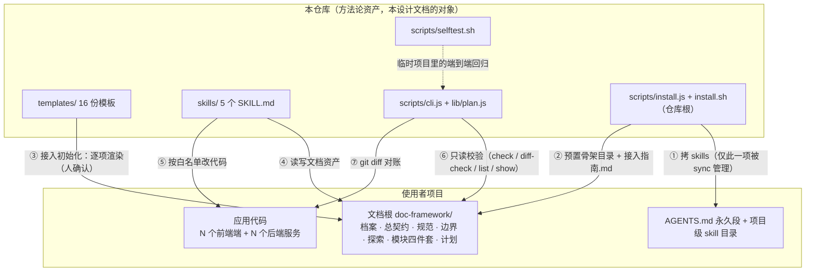
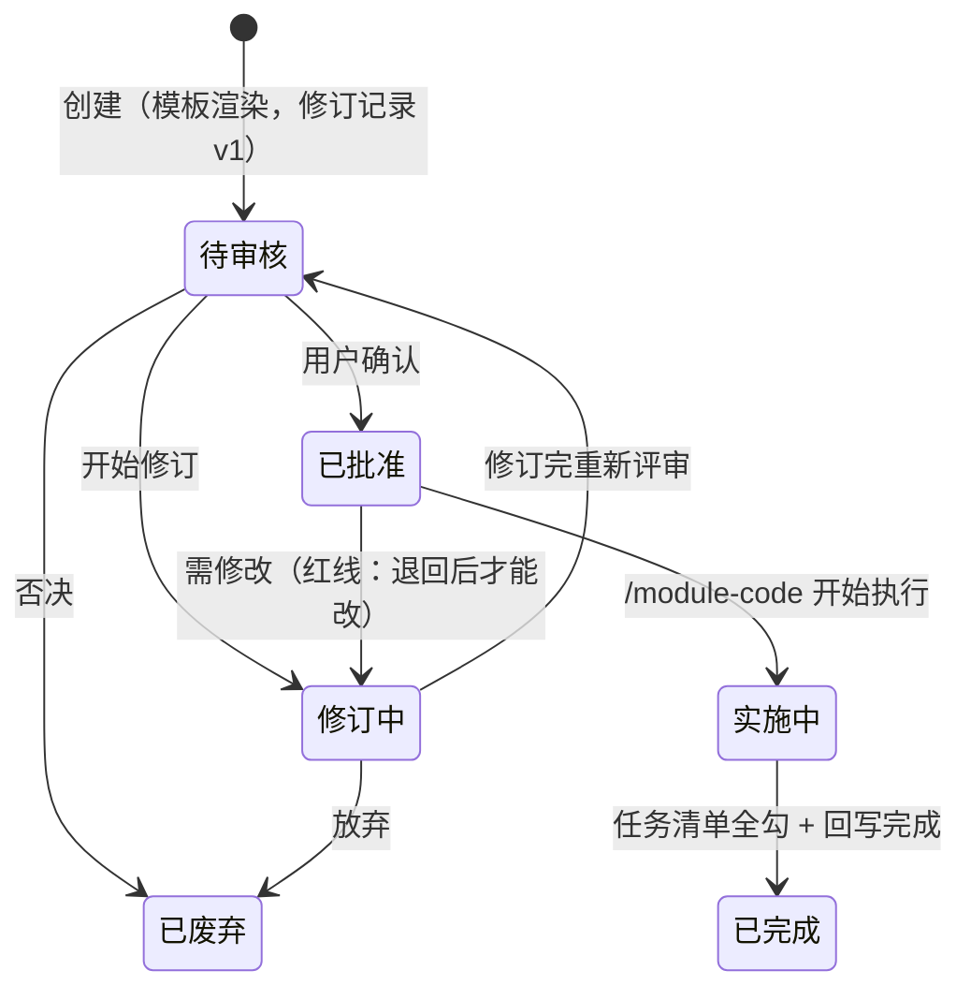
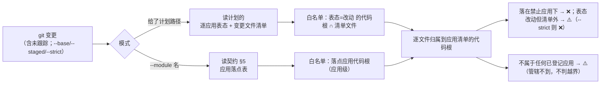

# doc-framework 设计文档

> **读者**：要改这套框架本身的人——改 `scripts/`、`skills/`、`templates/` 的开发者（含接手本仓库的 AI）。
> **不是**给使用者的：装了这套框架、在自己项目里跑五个 skill 的人看 [`README.md`](../README.md)。

## 0. 阅读约定

1. **本文是"当前实现"的权威描述**——描述仓库里的代码**现在**怎么做。设计辩论的原始提案放在 `plan/`（**编号提案与方案报告，清单见该目录——此处不重复枚举，避免必然腐坏**），**`plan/` 被 gitignore**，外部读者拿不到，所以本文**自包含**：不写"详见 `plan/xxx.md`"，需要讲清的就在这里讲清。
2. **提案 ≠ 现状**：`plan/` 记录的是"当时为什么这样改、否掉了什么"；代码与本文才是现状。两者冲突时以代码为准，并回来改本文。
3. **冲突时的优先级**：`scripts/`（机器行为） > `skills/` 与 `templates/`（AI 行为与骨架） > 本文 > `README.md`（使用者摘要）。
4. **清单类内容只有一个权威来源**，本文不复制正文、只指路：
   - 校验规则实现 → `scripts/cli.js` `check()`；解析语义 → `scripts/lib/plan.js`；
   - 产物命名 → `scripts/lib/plan.js` 的 `NAMES.zh`（唯一词表，**无第二套、无历史别名**）；
   - 自检用例清单 → `scripts/selftest.sh` 头部注释。
   本文给出**结构化描述与规则表**（帮读者建立地图），但**数字与逐条清单不在此维护**——那正是上次 README 反复漂移的原因。

---

## 1. 本仓库是什么

`doc-framework` 把一套在真实全栈项目中验证过的开发方法——**面向文档开发**（Document-Oriented Development）——抽象成**可跨项目复用的方法论资产**。仓库只装三件东西：

| 目录 | 是什么 | 谁消费 |
|------|--------|--------|
| `templates/` | 16 份骨架模板（12 份文档模板 + 4 份模块四件套） | 使用者项目**接入初始化**时一次性渲染；升级不覆盖已渲染的资产 |
| `skills/` | 5 个 `SKILL.md`（`module-explore` / `module-doc` / `module-plan` / `module-code` / `module-review`） | 拷进使用者项目的 skill 目录，被 AI 加载执行 |
| `scripts/` | `cli.js`（命令分发 + 校验）、`lib/plan.js`（文档解析器）、`install.js`（安装；仓库根另有 `install.sh` 等价入口）、`selftest.sh`（自检） | 使用者的终端 / CI；以及本仓库自己的回归 |

**仓库不装**：任何使用者项目的文档资产（契约、计划、探索记录）。这些生成在使用者项目的文档根 `doc-framework/`（中文）或 `doc-framework-en/`（英文）下，**永不回灌本仓库**（§9.4）。

**边界一句话**：本仓库管"规矩与骨架"，使用者项目管"内容"。所以本仓库的改动永远不碰使用者的契约正文。

---

## 2. 总体架构

### 2.1 分层



四层职责，**不要跨层偷懒**：

| 层 | 载体 | 性质 | 能做什么 | 不能做什么 |
|----|------|------|----------|-----------|
| 模板层 | `templates/**` | 静态骨架 | 定义节名、字段名、占位符 | 不能改已渲染的项目资产（§5.4） |
| 技能层 | `skills/*/SKILL.md` | AI 行为约束 | 探测、确认门、读写文档与代码 | 没有机器强制力——靠流程与确认门 |
| CLI 层 | `scripts/**` | 机器硬校验 | 只读检查、git 对账、安装/同步 | **不读源码、不扫代码库**（§7.5 能力边界） |
| 资产层 | 使用者项目 `doc-framework/` | 用户资产 | 长期真相 | 不在本仓库内，永不回灌 |

### 2.2 一次改动的完整数据流

```
需求（只给业务描述）
  → [可选] /module-explore      零承诺探索；待实现模块场景强制落盘探索记录
  → 通道判定                    触语义 / 含 SQL → 完整计划；跨应用 → 轻量；单应用小改 → 直改
  → /module-plan                语义写进「语义增量」节；批准 = 语义定稿 + 授权作用域
  → /module-code                按增量 + 契约不变量实施；逐项勾任务；白名单为边界
  → diff-check                  机器对账（计划白名单 / 直改用契约 §5 落点）
  → /module-doc 合并增量          按增量合并进契约正文与接口.md → 翻「合并状态=已合并」
  → /module-review              35 项检查（含增量合并完整性、通道合规审计）
  → /module-plan 归档           校验契约 §9 已登记 + 写提交 SHA → 移入 计划/归档/（独立动作）
```

**关键不变量**：契约**永不领先代码**——所以语义先写进**计划**（待生效），实施后由合并增量**落账**（已生效）。这条决定了技能分工、模板节设计、以及 `check` 的全部 v2.2 规则（§3.4）。

### 2.3 四条核心设计原则

1. **skill 不焊死任何技术栈**：所有项目特定约定收敛到项目档案（`项目档案.md` / `profile.md`），skill 一切配置从档案读取——换技术栈只换档案，不换技能。
2. **一个文档根 × N 个应用**：档案「应用清单」是 skill 的路由表（应用 → 类型/代码根/规范/数据库/依赖）。可见性 ≠ 上下文——skill 只加载涉及应用的规范与标杆。计划「逐应用表态 + 变更文件清单」即 `/module-code` 的路径白名单；直改通道以契约 §5 应用落点为应用级白名单。
3. **人机共读**：依赖图 / 状态机 / 页面结构 / 业务流程一律用 mermaid 绘制（模块依赖全景图、跨模块业务流程归总契约）——人类阅读与 AI 实施共享同一份文档。
4. **上下文从体系中来，不从人肉中来**：关联文档与代码地址是体系的自动产出（档案 → 总契约 → 导航区 → 代码扫描兜底），用户只给业务需求。

---

## 3. 契约模型规格（v2.2）

这一章是整套体系的地基，也是 `check` 的规则来源。

### 3.1 模块三态

| 状态 | 判定 | 路径 |
|------|------|------|
| **待实现模块** | 代码库中**零实现**（无目录 / 路由 / 表 / 接口 / 契约） | `/module-explore`（**强制落盘**）→ `/module-plan`（首次建模计划）→ 实施 → `/module-doc` 合并增量的 `create` 建档 |
| **存量模块（已建档）** | 有实现 + 有契约 | `/module-plan`（计划增量）→ 实施 → `/module-doc` 合并增量的 `update` 落账 |
| **存量模块（未建档）** | 有实现 + 无契约（老项目接入） | `/module-doc` **代码对账**补建（不走计划） |

**反例（最容易混的一处）**：存量模块未建档 ≠ 待实现模块。只要有一行代码 / 一张表 / 一个接口，它就是存量模块，走代码对账；待实现模块是"计划时刻"的状态，实施一落代码就转成存量模块。

**定名取舍**：中文用「待实现模块」，**弃用"绿地"**——中文"绿地"的真实搭配是"绿地开发/工程/项目"，"绿地模块"不是自然搭配，且直译词依赖"棕地"成对出现才成立。英文保留 `greenfield`（`first-build` 为正式术语，`greenfield` 作同义词）。

### 3.2 首次建模计划的判定式

**不新增「计划类型」字段**——类型由依据推导，避免多一个要人工维护、且会与依据矛盾的字段：

```
首次建模计划  ⟺  无「依据模块契约」 ∧ （有「依据探索记录」 ∨ 有「语义增量」节 ∨ 有「建模补充」节）
```

约束（`check` 硬校验，规则表见 §6.3）：必须 `完整` 形态、必须含「语义增量」全量（几乎全是 ADDED）与「建模补充」节。轻量形态不承载语义，用来承载首次建模会产出"零信息建档"。

### 3.3 语义增量（Delta）

计划的「语义增量」节是**语义变更的唯一载体**，三张固定表 + `主计划` 列：

| 表 | 列（模板固定，`parseDelta` 按此解析） | 装什么 |
|----|--------------------------------------|--------|
| `ADDED（新增）` | `# \| 目标位置 \| 对象 \| 内容 \| 主计划` | 新字段/表/接口/状态机状态/权限标识 |
| `MODIFIED（修改）` | `# \| 目标位置 \| 对象 \| 现值 \| 目标值 \| 主计划` | 语义被改写的对象（现值/目标值是**两列**） |
| `REMOVED（删除）` | `# \| 目标位置 \| 对象 \| 理由 \| 主计划` | 删除项 |

三表的**第一数据列都是「目标位置」**（这是 `check --draft-contract` 能按章节派发的前提），第三列按表语义不同：ADDED 是「内容」、MODIFIED 是「现值 + 目标值」两列、REMOVED 是「理由」——解析后统一装进 `detail`（MODIFIED 拼成 `现值 → 目标值`）。

- **只写目标语义**（不写实现步骤）：每条指明**目标位置**，可被机械合并——这是 `check --draft-contract` 能输出"增量条目 → 契约章节"清单的前提；
- **一份语义变更只由一份计划承载**：拆分计划在「主计划」列回指主计划（同模块两份都为空且增量非空 → I3 ❌）；
- **位置**：模板里固定在「逐应用表态」之后、「变更文件清单」之前——因为它是"授权语义"，要和"授权作用域"（表态 + 清单）相邻；
- **空增量**：纯实现改动写"无（纯实现改动）"，并把合并状态标 `无需合并`。

### 3.4 合并状态三值与四条不变量

`合并状态`（`> Merge state:`）三值，与计划状态**正交**：

| 值 | 含义 |
|----|------|
| `待合并`（`pending`） | 增量已实施未落账 |
| `已合并`（`merged`） | 已由 `/module-doc` 合并进契约与接口.md |
| `无需合并`（`n/a`） | 空增量（纯实现改动）或计划已废弃 |

四条不变量（设计目标，也是机器校验抓手）：

| # | 不变量 | 违反后果 |
|---|--------|----------|
| **I1** | 契约 ⊆ 代码事实（契约声明的东西必须真实存在） | `/module-review` #11 报"契约有、代码无"（漏实施） |
| **I2** | `状态=已完成 ∧ 增量非空 ∧ 合并状态≠已合并` → ❌，**且拒绝归档** | `check` 硬报错——不能带着未落账的语义归档 |
| **I3** | 同模块 ≥2 份「主计划」列为空的**非空**增量 → ❌ | `check` 硬报错——语义变更被拆散、无主。**已合并但尚未归档的计划仍计入**：同模块同一时刻只允许一份"无主的非空增量"，换新计划前先归档，或在「主计划」列回指 |
| **I4** | 增量的出口只有两个：合并，或废弃（标 `无需合并`） | 废弃计划必须把标记写成 `无需合并`，否则永远挂在"待合并" |

**I2 的归档兜底**：`git mv` 进 `计划/归档/` 不能绕过唯一机器硬校验——`check` 用 `collectArchivedPlans()` 扫模块目录与全局两个归档目录（中文 `归档/`、英文 `archive/`，并集），对归档计划同样做 I2 判定。

### 3.5 计划形态与三通道

**授权粒度 ∝ 爆炸半径**：改一个文案的授权，不该和"改状态机 + 加表 + 三端联动"共用一套文档。三条底线**不可让渡**——AI 不能自我授权（必须有一次人的确认）、不能改到范围外的应用、事后可追溯。

判据（自上而下，先命中先定）：

| # | 判据 | 通道 |
|---|------|------|
| 1 | 触及契约语义（§3/§4 出现**新**字段/表/接口/状态机状态/权限标识，或改 §8 验收场景、跨应用不变量） | **完整计划**（语义写进增量节） |
| 2 | 含 SQL 变更 / 生产数据变更（契约 §10 要登记） | **完整计划** |
| 3 | 涉及 ≥2 个应用（哪怕纯文案） | **轻量计划** |
| 4 | 单应用 + 不触语义 + 无 SQL + 预计 ≤5 文件 + 无设计决策 | **直改通道**（免计划） |
| 5 | 其余（单应用但面大 / 需留决策） | **轻量计划** |

判据 1 的客观形式：**这个改动能不能在契约里找到对应条目？** 找得到是实现，找不到就是语义变更。

**轻量计划**是同一份计划格式的低档位：只保留 `逐应用表态 / 变更文件清单 / 任务清单` 三节，头部标 `> 计划形态：轻量`，**不含语义增量节**。`check` 对轻量计划的表态与清单**缺一即 ❌**（它们是白名单），且**含非空增量即 ❌**（形态判错，应升级完整计划）。

**批准粒度从"任务"上移到"作用域"**——这是省成本的关键：

- 批准的对象是**作用域**（表态 + 清单）；扩作用域 = 扩权 → 必须退回「修订中」重新批准；
- **作用域内追加任务项 = 记账**，可直接更新 → 一份轻量计划承接同范围多轮小改，不必每次新建；
- 「已完成」计划不得追加任务（那是新改动）。

**直改通道**（免计划小改）：

- **边界来源 = 契约 §5 应用落点表**（应用级）——契约本就是长期真相，"这个业务在哪些应用存在"天然定义"这次能碰哪些应用"，所以 §5 的准确性是直改的前提；
- **硬禁用**（不进判据权衡）：SQL 与生产数据、状态机、权限标识、跨应用不变量、公共契约/共享库；
- **一次编号确认**（与 `/module-doc` 的模式确认门同构），AI 不得自我授权；
- **自动升级**：途中发现要动语义 → 立即停 → 升级完整计划 → 计划通道重做；已改部分如实汇报；
- **留痕两处**：契约 §9 记一行 `来源=实现`；提交信息首行带 `模块:{模块名}`；
- **对账**：`doc-framework diff-check --module {模块名}`。

### 3.6 计划状态机、落盘与红线



- 状态是**事实登记**：AI 登记、用户确认流转；评审在文档内或文档外皆可；
- 「实施中 / 已完成」由 `/module-code` 登记，`/module-plan` 不登记；**存在未勾选任务时不得登记「已完成」**；
- **任务清单是进度事实源**：`- [ ] 组.序号`，每完成一项就地勾选（只勾事实完成的项）；
- **红线：已批准计划不可直接修改**——退回「修订中」→ 改 → 「待审核」重新评审；修订一律**追加修订记录**（版本+1 / 日期 / 状态 / 修改点 / 评审结论），不覆盖历史；
- **归档不是状态，是位置**：已完成/已废弃的计划由 `/module-plan {模块名} 归档` 移入 `计划/归档/`，归档时**校验契约 §9 已登记本计划 → 把提交 SHA 写进该行回链**。**归档是独立动作**（实施完成 ≠ 可以归档，可能还要等生产 SQL 执行、等验收）。**归档 ≠ 删除：skill 不自动删除任何计划文件**，是否清理由人手动决定。
  > **为什么不自动删除**：归档计划没有任何枚举入口（`check`/`list` 都跳过它，需路径直达），确实可能堆积；但它同时是**决策档案**（修订记录里有评审结论、批准口径、被否方案），而**删除不可逆**。所以：skill 只负责归档与写入追溯凭据，**清理权交给人在需要时执行**（`git rm`，git 历史里仍留痕）。长期追溯靠 **契约 §9 的回链凭据（计划标识 + 提交 SHA）**：SHA → 当时真实的代码与计划快照，**不依赖计划文件存活**。

**两类计划的落盘位置**：

| 类型 | 判定 | 位置 |
|------|------|------|
| 单模块计划（默认） | 只涉及一个模块 | `模块/{模块名}/计划/YYYY-MM-DD-{主题}.md` |
| 跨模块计划 | 「依据模块契约」多行 | `计划/YYYY-MM-DD-{主题}.md`（全局，只能用 `{计划路径}` 直达） |
| 归档 | 已完成/已废弃后 | 同级 `计划/归档/`（归档后不进 glob 清单，需路径直达；**不自动删除**，清理由人决定） |

**三个触发形式**：`{模块名}`（glob 列清单，回复编号选择；无匹配自动新建）、`{计划路径}`（直达，跨模块唯一入口）、`{模块名} {YYYY-MM-DD-主题}`（精确匹配单模块计划）。归档：`{模块名} 归档`。

**归档三道守卫**：① 未完成状态禁止归档；② `已完成 ∧ 合并状态=待合并` 拒绝归档（先由合并增量落账）；③ **契约登记完整性**——增量已落账、§5 落点/§8.2 场景/§10 SQL 已登记、回写清单已勾、**§9 有对应登记行**，任一缺失拒绝归档。`已废弃` 允许归档，但归档前应把标记写成 `无需合并`。

**正交通道小结**（`/module-code` 的目标来源）：

| 计划形态 | 约束来源 |
|----------|----------|
| 完整计划 | 「语义增量」+ 契约不变量 |
| 轻量计划 | 表态 + 变更文件清单（白名单） |
| 无计划（直改） | 契约 §5 应用落点（应用级 + 硬禁用清单） |

### 3.7 常见误解（全表）

| 误解 | 正确理解 |
|------|----------|
| 计划确认后会自动实施 | 必须显式调 `/module-code`，且计划须为「已批准」 |
| 已批准的计划可以直接改 | **作用域**与**语义增量**都不能；红线是退回修订流程。作用域内追加任务项是记账，可直接更新 |
| 任务清单可以最后一起勾 | 每完成一项就地勾选；未勾完不得登记「已完成」 |
| 「已完成」的计划还能追加任务 | 不能——那是新改动，新建计划或先退回修订中 |
| 实施完成就自动归档 | 归档是独立动作，时机由人定；`list --stale N` 帮你找攒久的 |
| 跨模块计划放在某个模块目录里 | 在全局 `计划/`；`{模块名}` 只匹配模块内计划 |
| 计划是长期规范依据 | 计划是单次决策记录，归档后不作规范依据；长期看契约「变更记录」§9（含提交 SHA） |
| 改计划 = 改代码，说一声就行 | 代码只认「已批准」的计划 |
| 小改也得先建计划 | 不一定——单应用、不触语义、无 SQL 走直改通道（但要过编号确认 + 边界 + 留痕） |
| 直改 = AI 说一声就能改 | 必须给编号确认门由用户确认；AI 不得自我授权 |
| 语义变更写进契约正文 | 写进计划的增量节；实施后由合并增量落账（契约永不领先代码） |

### 3.8 成本模型（为什么这么设计）

| 场景 | 改造前 | 现在 |
|------|--------|------|
| 单次小改（单应用 3 文件） | doc（探测+确认）→ plan（渲染 8 节）→ 批准 → code → 归档 = 5 步 | `/module-code`（探测 + 编号确认）= **1 命令 + 1 次确认**，无归档 |
| 一迭代 5 次同范围小改 | 5×(建→批→执行) + 5 次归档 ≈ 20 步 | 1 次轻量授权 + 5 次执行（作用域内追加任务）+ 1 次归档 = **7 步** |
| 真正的功能开发 | 完整计划 | **不变**（决策记录、接口兼容性、验收标准正是完整计划的价值） |

**防滥用三条**（缺一条设计就烂）：① 禁止 AI 自降级（任何免计划判定都要过编号确认门）；② 自动升级永远安全、降级必须人确认；③ 事后审计——`/module-review` 第七节「通道合规审计」专查"本该建计划却直改/轻量""直改越界""作用域就地篡改"，这是防止直改通道吃掉"语义先于代码、记录后于代码"纪律的唯一手段。

---

## 4. 技能层实现

技能层是 **AI 行为约束**，没有机器强制力——所以每个技能都靠"探测 + 编号确认门 + 铁律"三段式保证可复现。

### 4.1 五个技能的职责边界

| 技能 | 职责 | 明确不做 |
|------|------|----------|
| `module-explore` | 写契约前的探索与讨论：按应用清单路由调研、澄清需求与范围、候选方案对比、有证据的推荐 | 不写契约/计划、不改代码；默认**不落盘**（待实现模块场景强制落盘）；**不越过"契约细节"水位线**（只谈要不要做/放哪/走哪条路/范围，不设计字段接口） |
| `module-doc` | 核心文档（契约/接口）的创建与更新：**三种处理方式自动探测**（合并增量 / 代码对账 / 产物补齐）+ 回写总契约 | 不写代码；不创建/修订/归档计划；不做探索讨论 |
| `module-plan` | 计划的创建、修订、状态流转、**归档**（校验 §9 登记 + 写提交 SHA + 移入 `计划/归档/`；不自动删除） | 不实施代码；不做契约/接口.md 的合并落账 |
| `module-code` | 执行改动：三通道判定 + 按依赖序实施 + 逐项勾选 + 回写 | 不创建/修改核心文档；不创建/修订/归档计划；**不得自我授权免计划** |
| `module-review` | 对照核心文档（契约/接口）与各应用代码审查，出分级问题清单 | 不改代码，只出清单与修复建议 |

**防重叠硬规则**：探索中的确认 ≠ 授权写文件（探索的确认只是"方向同意"）；文档的写权限只在 `module-doc`；计划的写权限只在 `module-plan`；代码的写权限只在 `module-code`。

`module-explore` 的**判据**是"选错了返工要动契约/计划/多个模块吗？"——要则先探索；改文案/调样式/单文件小改不必探索。它还有一个隐含职责：**防模块膨胀的刹车**（`module-explore/SKILL.md` §1′）。输出**交接包五项**：目标一句话 / 模块清单与关系 / 范围与「不做」/ 选定方案与理由 / 留给 plan 的未决问题。

### 4.2 `module-doc` 三种处理方式（合并增量 / 代码对账 / 产物补齐）

**零后缀、零参数**：模式由 AI 探测后带编号请用户确认；强制模式回编号或用自然语言。

| 处理方式 | 真相来源 | 产出与停止点 |
|------|----------|--------------|
| **合并增量** | 计划增量 + 代码事实 | `update`（存量）：按增量更新契约 §3/§4/§5/§8 + 接口.md（**合并前以代码校正**，偏离写入 §9「实施偏离」）；`create`（待实现模块首次建档）：据增量 + 建模补充生成契约 10 章 + 接口.md，并回写总契约（模块索引表 / 依赖矩阵 / 应用拓扑）；两分支都 §9 记"合并（一句话增量摘要 + 回链凭据：计划标识 @提交SHA）"并翻 `合并状态=已合并` |
| **代码对账** | 代码 | 分组差异清单（必改/建议/仅登记）→ 分组确认 → 回写契约 + 接口.md（§9 来源=代码）；**待实现模块拒绝执行**（无代码可对） |
| **产物补齐** | 契约 | 前置一致性检查 → 接口.md → 测试.md → test.sh |

**分支重定向**（判定表里的硬规则）：

- 无契约 + 无代码（待实现模块）→ **重定向 `/module-plan`**：契约永不领先代码，建档在实施后由合并增量的 `create` 完成；
- 无契约 + 有代码 → 代码对账补建历史；带新需求时先代码对账建基线，再 `/module-plan` 增量，实施后合并增量落账（复合流程 **代码对账 → 合并增量**）；
- 无需文档变更：判定不影响契约语义（纯实现/文案/样式）时，说明理由后结束，不硬写变更记录；
- **旧后缀**（新建/补文档/改造/同步）仍可作自然语言提示识别，但不再是正式语法。

**确认门格式**（编号即强制入口，零记忆）：

```
探测事实：契约存在 ✓；代码落点 12 个文件，与契约有差异 → 候选 代码对账
将写入：契约 §3/§4 + 接口.md；不生成测试
1) 确认按「代码对账」执行    2) 改为「合并增量」（按计划增量合并）    3) 改为「产物补齐」（只补 接口.md）
```

**合并增量的铁律（两分支共用）：以代码为准，不照抄计划**。因为契约 = 已生效真相，而计划写的是"批准时的目标"；实施中偏离了就以代码校正，并把偏离记进契约 §9「实施偏离」——**不回改计划正文**（计划是历史决策记录）。

**建档九步**（`create` 分支，`module-doc/SKILL.md` §2.2）在首次建模计划实施完成后执行，`check --draft-contract <计划路径>` 是这条流程的只读 checklist（§6.1）。

**映射表**（`module-doc/SKILL.md` §2.4：「增量 + 建模补充 + 代码 → 契约章节」）决定"哪些条目落到契约哪一章"，例如建模补充 M1 边界 → 契约 §2、M2 状态机 → §3.2、M3 依赖 → §2.1、M4 验收场景 → §8.2。**新增增量对象类型时，必须同步这张映射表与 `check --draft-contract` 的章节映射。**

**章节映射的机器侧单一来源**是 `scripts/lib/plan.js` 的 `CONTRACT_CHAPTERS`（`check --draft-contract` 的 `chapterOf` 按它把「目标位置」派发到 §1–§10）；selftest §19 有一条守卫断言它与本表列出的章节集合一致，防再次漂移。历史缺陷：`chapterOf` 曾只写死 §3/§4/§5/§8，§1/§2/§6/§7/§9/§10 一律落"未识别 → 人工定位"。

### 4.3 `module-plan` 的护栏

- **增量护栏**：语义变更只能写进「语义增量」节；I3 的「主计划」列语义（拆分计划回指主计划）；首次建模形态约束（必须完整 + 含增量节 + 含建模补充节）；
- **归档守卫**：`状态=已完成 ∧ 合并状态=待合并` 拒绝归档；`已废弃` 允许归档并把标记写 `无需合并`；另需**契约登记完整性**检查（§9 有登记行、增量已落账、§5/§8.2/§10 已登记、回写清单已勾）；
- **跨模块前置校验**：跨模块计划前校验「依据模块契约」已存在（被依赖方是待实现模块时可指向其首次建模计划路径）；
- `list --stale` 提供批量归档入口。

### 4.4 `module-code` 的执行序

1. **通道判定**（§0）：三通道判据 → 需要免计划时给编号确认门；
2. **加载上下文**（§1）：档案 → 总契约 → 涉及应用规范 → 标杆 → 边界；
3. **白名单自检**（§2）：每次写文件前确认路径 = 表态"改动"应用代码根 ∩ 变更文件清单；
4. **按依赖序实施**（§3）：SQL → 主责服务 → 下游/聚合 → 逐端；每完成一项**就地勾选**；
5. **一致性自检**（§4）：代码 ↔ 计划增量 ↔ 契约不变量；偏离以代码为准；
6. **回写**（§5，交付义务）：契约 §9、接口.md 接入状态、总契约索引、计划状态与任务清单。

### 4.5 `module-review` 的七节结构

| 节 | 检查范围 | 编号 |
|----|----------|------|
| 一、通用清单 | 契约↔代码一致性、接口一致、导航区、回写查账、软删除/乐观锁、SQL 参数化、密钥、输入校验、依赖注入、生产 SQL 登记 | #1–#10 |
| 二、多应用对账 | 落点对账（契约 ⊆ 代码事实）、计划表态对账、接入状态、跨服务契约一致、跨应用不变量、应用清单健康 | #11–#16 |
| 三、完成度对账 | 任务勾选属实、状态与进度一致、验收场景可追溯、归档纪律 | #17–#20 |
| 四、测试覆盖完整性 | 黑盒底线、白盒适用判定、端层/编排层适用判定 | #21–#23 |
| 五、模式与增量对账 | §9 来源四值、§9 回链凭据完整、§9 未抄计划正文、增量合并完整性、待实现模块已实施但未建档、无计划外漂移 | #24、#26、#32–#35 |
| 六、档案注入清单 | 按应用读取技术栈特有检查项 | — |
| 七、通道合规审计 | 本该建计划却走轻量/直改、直改越界、轻量形态合规、作用域就地篡改、直改留痕 | #27–#31 |

**在途计划豁免**（口径统一在 `module-review/SKILL.md`）：未归档、且 `状态 ∈ {已批准, 实施中, 已完成}` 的计划。同模块存在在途计划时，其增量覆盖的对象**不计私建**——否则"实施 → 合并"窗口内必然误报（#33）。判定顺序：先看有没有在途计划 → 有则核对增量覆盖范围（#26/#33 豁免）→ 无在途计划而代码已落、契约缺失（#32）。

**报告模板**：分级清单 `CRITICAL / HIGH / MEDIUM / LOW` + 检查统计（总/通过/各级数量）+ 完成度 + 测试覆盖 + 通道合规 + 增量与建档四个专节。门禁：CRITICAL 与 HIGH 清零才提示可提交。

---

## 5. 模板层实现

### 5.1 模板清单（`templates/`，16 份）

| 文件 | 作用 | 关键点 |
|------|------|--------|
| `项目档案.md.tpl` | 项目档案（**唯一需人工确认的文件**） | 「应用清单」表 = skill 路由表；通用约定全局段 + 应用覆盖；模板名与产物名一致（v2.4.0 起由 `profile.md.tpl` 改名） |
| `接入指南.md.tpl` | 接入引导（一次性，初始化后删除） | 旧项目扫描 / 新项目提问；「模板来源」标记供初始化拉取 |
| `AGENTS.md.tpl` | 写进项目根的永久段 | 编码纪律总纲（语义先于代码、记录后于代码）；产物命名约定 |
| `总契约.md.tpl` | 总索引 | 业务域、应用拓扑、模块索引表、依赖矩阵 + 全景图、跨模块流程、维护规则 |
| `测试规范.md.tpl` / `接口规范.md.tpl` | 全局方法论与接口约定 | 四层验证（接口/库/端/编排）；接口规范 = **统一响应外层 + 错误码 + 分页 + 接口层字段语义（取值回链档案）** + REST/认证；**兼容性红线**在总契约维护规则与计划「接口兼容性声明」节；**不设「维护」段**（维护规则归总契约 §7） |
| `规范/类型-前端.md.tpl`、`规范/类型-后端.md.tpl`、`规范/应用-{应用标识}.md.tpl` | 规范三层 | 类型层共性 + 每应用差异 |
| `边界/{能力}边界.md.tpl` | 跨模块/跨服务能力 | 工作流/附件/权限/服务间调用/事件与 MQ/鉴权网关 |
| `模块/{模块名}/契约.md.tpl` | **语义约束（业务语义唯一真相）** | 10 章；见 §5.2 |
| `模块/{模块名}/接口.md.tpl` | 字段级服务端真相（唯一事实源） | 服务归属/类型/消费方 + 各应用接入状态 |
| `模块/{模块名}/测试.md.tpl` | 测试用例 | 含**适用层与依据** |
| `模块/{模块名}/test.sh.tpl` | 可执行测试——`模块/{模块名}/test.sh` 的**唯一模板源** | 多服务 `BASE_URL` 参数化 + 流程 `PROCESS_KEY` + 审批用例（`AUDIT_USER` 留空则整段跳过）；只创建不删除、`FAIL>0` 非零退出 |
| `计划/YYYY-MM-DD-{实施主题}.md.tpl` | 实施计划 | 见 §5.2 |
| `探索/YYYY-MM-DD-{主题}.md.tpl` | 探索记录 | 第 5 节「待实现模块清单与关系」 |

### 5.2 关键节设计

**生成文档一级章编号（v2.4.0 起全体系统一）**：**所有渲染进项目的文档**一级章一律 `## N. 标题` 阿拉伯数字，二级节 `### N.M`——全局文档、模块四件套、计划、探索记录、边界文档、类型层/应用层规范**一视同仁**。禁止 `## 一、标题` 这类中文数字章号（v2.4.0 前的模板混用两套，是 AI 每次引用都要做隐式换算的漂移高发点）。

| 文档 | 一级章 |
|------|--------|
| 总契约 | `1 文档体系` / `2 业务域` / `3 应用拓扑` / `4 模块索引表` / `5 模块依赖矩阵与全景图`（5.1 矩阵 / 5.2 全景图）/ `6 业务流程清单` / `7 维护规则` / `8 使用流程` |
| 测试规范 | `1 测试策略：四层验证`（1.1 适用规则）/ `2 模块接入步骤` / `3 通用用例模板` / `4 通用验证 SQL 模板` / `5 执行规范` / `6 缺陷处理流程` |
| 接口规范 | `1 REST 风格` / `2 认证鉴权` / `3 通用响应结构`（含错误码格式，v2.4.0 合并原 §4）/ `4 分页约定`（v2.4.0 合并原 §5）/ `5 接口层字段语义（取值见档案）`（v2.4.0 替代原 §6 通用字段） |
| 计划模板 | `0 修订记录` / `1 需求理解` / `2 逐应用表态` / **`语义增量`（不编号，解析锚点）** / **`建模补充`（不编号，解析锚点）** / `3 变更文件清单` / `4 任务清单` / `5 实施顺序` / `6 关键设计决策` / `7 接口兼容性声明` / `8 验收标准` / `9 待确认事项` / `10 里程碑` / `11 回写清单` |
| 类型层 / 应用层规范 | 类型层 `0 引用与优先级` / `1 分层与目录` / `2 命名` / `3 权限体系` / `4 通用约定` / `5 标杆模板`；应用层 `1 技术栈` / `2 目录结构` / `3 栈特有约定` / `4 覆盖项` / `5 标杆模块` / `6 技术栈特有检查项` |
| 边界文档 | `1 适用范围` / `2 统一约定` / `3 接入 Checklist` / `4 常见陷阱` / `5 变更记录` |
| 探索记录 | `1 背景与问题` / `2 候选方案对比` / `3 选定方案与理由` / `4 未决问题` / `5 待实现模块清单与关系` |
| 模块测试文档 | `1 测试目标` / `2 适用层与依据` / `3 前置条件` / `4 测试账号矩阵` / `5 验收标准` / `6 端到端测试用例` / `7 库层断言` / `8 编排层用例` / `9 端层冒烟 Checklist` / `10 验证 SQL` |

> **解析锚点例外**：计划模板的「语义增量」「建模补充」两节**故意不编号**——`plan.js` 的 `mdSection` 按标题关键字切节（§7.2），加编号会让锚点名称与 `NAMES` 的约定脱钩。同理，解析器只认 `## ` 标题内的关键字，**编号本身不参与解析**，因此章节重编号属低风险改动，但仍须同步全部交叉引用。
> **引用纪律**：跨文档引用统一写 `§N` / `§N.M`（如 `总契约 §6`、`契约 §8.2`）；禁止再写 `§六` 这类中文数字章号。

**契约模板 10 章**：`1 模块定位` / `2 边界约定（2.1 依赖关系 mermaid + 2.2 不做什么 + 2.3 业务流程）` / `3 数据模型（3.1 主表 + 3.2 流程状态机 + 3.3 其他枚举）` / `4 接口概览（4.1 基础路径 + 4.2 接口清单 + 4.3 权限校验 + 4.4 接口对状态的影响）` / **`5 应用落点`（= 直改通道边界来源）** / `6 标杆参考` / `7 特殊约定与常见陷阱` / `8 测试与验证（8.1 验收标准 + 8.2 关键验收场景 + 8.3 端与编排层验收）` / **`9 变更记录`（来源四值）** / **`10 生产环境 SQL 执行登记`（防上线遗漏）**。

**§4 只放接口概览，字段细节一律进 `接口.md`**——防双维护。这是硬规则，不是风格建议。

#### 规则归属（单一职责矩阵，v2.4.0 新增）

**同一规则只写一处，其他位置只回链。** 这是各层防双维护的判据——新增或修改文档时先查此表定位唯一归属；发现同一条规则出现在两处即为漂移缺陷（review 可判）。

| 规则 / 内容 | 唯一归属 | 其他位置怎么写 |
|---|---|---|
| 契约模型总纲（语义增量 / 合并状态 / 三通道） | `AGENTS.md.tpl` 永久段 + 本文件 §3 | 其他文档只回链，不解释机制 |
| 维护规则（16 条） | **总契约 §7** | 接口规范 / 测试规范**不设"维护"段**，只回链总契约 §7 |
| 契约 §9 来源四值 | **模块契约 §9** 表 | 计划模板 / AGENTS 只提枚举，不解释 |
| 生产 SQL 登记义务 | **模块契约 §10** 表头 | 总契约 §7.11 一句 + 回链；§9 就地提醒；类型层规范一句 + 回链 |
| **字段名与取值**（主键 / 软删除 / 审计字段 / 权限标识格式 / 分页参数） | **项目档案「通用约定」** | 类型层规范、接口规范、契约 §3 全部**只回链不复制取值** |
| 分页与统一响应外层（接口层形态） | **接口规范 §3 / §4** | 档案只一句"接口层形态见接口规范" |
| 错误码格式 | **接口规范 §3**（响应体内 `code`；**不带业务域前缀，非 HTTP 状态码**） | 契约 §4 不写错误码明细（见下条判据） |
| 四层验证方法论 + 适用层判定 | **测试规范 §1 / §1.1** | 总契约 / 契约 §8 只回链 |
| 库表 / 字段映射（库层断言用） | **项目档案「应用清单」** | 测试规范 §4 只写"按档案映射执行" |
| 验收场景 SC-n | **模块契约 §8.2** | 测试.md / test.sh / 计划 §8 只引用编号，不复制场景 |
| 跨应用不变量本身 | **总契约 §7** | 契约 §3.2 / §4.4 写逐模块事实，不复述规则 |

**契约 §4 的越界判据（机器/人工均可判）**：§4 只允许出现 4.1 基础路径、4.2 接口清单（方法/路径/权限标识/说明）、4.3 权限校验规则、4.4 接口对状态的影响**四类内容**；出现**字段名 / 类型 / 长度 / 必填性 / 请求或响应示例 / 错误码明细 / JSON 结构**即越界 → 一律改放 `接口.md`。该判据同时写在契约模板 §4 节首（AI 写文档时就地可见）与 `module-doc/SKILL.md` §6.2。

**§9 来源四值** `需求 / 代码 / 实现 / 合并`：

| 值 | 何时写 | 约束 |
|----|--------|------|
| `需求` | **历史遗留**：旧模型"契约先行"时代的记录 | 只约束**新增**记录，历史不回填、不删除 |
| `代码` | 代码对账回写 | — |
| `实现` | 直改通道（只动实现、未动语义） | 一行即可 |
| `合并` | 合并增量把已批准增量落账（§3 契约模型） | **必须回链凭据**（`计划标识 @提交SHA`）——落账要有据；凭据必须"不会消失"（归档计划可由人手动清理） |

**计划模板结构**：头部字段（`依据模块契约` / `计划形态` / `状态` / `参考标杆` + `依据探索记录` / `合并状态`）→ `0 修订记录` → `1 需求理解` → `2 逐应用表态（授权作用域）` → **`语义增量`（位置固定）** → `建模补充 M1–M4` → `3 变更文件清单（SQL/服务端/前端端/其他）` → `4 任务清单` → `5 实施顺序` → `6 关键设计决策` → `7 接口兼容性声明` → `8 验收标准` → `9 待确认事项` → `10 里程碑` → `11 回写清单`。

**建模补充 M1–M4**：语义增量三张表装不下图与边界约定，建档时（合并增量的 `create` 分支）依赖本节生成契约 §1/§2/§3/§8（§6 标杆参考由建档时探测既有模块得来，不来自计划）——M1 边界与「不做什么」、M2 状态机/页面结构（mermaid）、M3 依赖与集成点、M4 关键验收 Scenario（映射到契约 §8.2）。

### 5.3 占位符与渲染纪律

- `{占位符}` 必须全部替换为项目实际值；**禁止凭空自创结构**——所有骨架一律从官方模板渲染；
- `check` 扫描文档根下所有 `.md`，剥离代码围栏与行内代码后，**只报含中日韩字符**的残留占位符（避免误报英文代码片段里的 `{...}`）；**豁免 `探索/`**——探索记录是单次决策记录，允许保留 `{待验证}` 之类的开放标记，不参与硬校验；
- 生成文档必须带**导航区**（核心文档互链），未生成的文件标"（待生成）"。

### 5.4 存档纪律：模板与永久段永不自动改写

**`templates/**` 与使用者的 `AGENTS.md` 永久段永不自动改写**（既有决策）。理由：自动改写用户的项目资产与整套体系"文档资产永不回灌、改文档归技能、AI 不擅自动用户文件"的纪律相冲。

后果（必须知道）：**升级框架 ≠ 升级文档体系**。模型升级后，已初始化项目要人工按清单替换模板并手工补 `AGENTS.md` 永久段（§9.3），否则新会话里的 AI 仍按旧模型工作。

---

## 6. CLI 层实现

### 6.1 命令清单

| 命令 | 写文件？ | 作用 |
|------|----------|------|
| `doc-framework sync` | **写**（仅 skill 文件） | 同步 skill 到最新；本地定制按 sha256 自动跳过；**不动文档根与 AGENTS.md** |
| `doc-framework check` | 只读 | 校验体系完整性；退出码 0=通过 / 1=有硬问题 |
| `doc-framework check --draft-contract <计划路径>` | 只读 | 打印"增量条目 → 目标契约章节"清单（含合并/建档九步），供「合并增量」当 checklist |
| `doc-framework diff-check <计划路径>` | 只读 | 提交前对账：git 变更 vs 计划白名单 |
| `doc-framework diff-check --module <模块名>` | 只读 | 直改通道对账：git 变更 vs 契约 §5 落点（应用级） |
| `doc-framework list [...]` | 只读 | 列在途计划（`--module/--app/--state/--stale/--orphans/--all/--json`） |
| `doc-framework show <计划路径>` | 只读 | 单个计划的结构化视图（`--json`） |

**只读纪律**：除 `sync` 外全部只读，可进 CI。`--json` 是机器消费接口，当前标 **experimental**（格式可能变动）。

`check --draft-contract` 需要分发器传参——历史坑：早期 `cli.js` 是 `process.exit(check())`，`check` 不接收 argv，所以这个选项必须同时改分发器。

### 6.2 命令参数参考（`--help` 的权威副本）

> 本表是命令参数的**唯一完整清单**（README 不复述，`doc-framework --help` 与本表同源）。

**`check`**（只读；退出码 0=通过 / 1=有硬问题；ℹ️ 提示项不影响退出码）

| 选项 | 作用 |
|------|------|
| （无） | 全量校验：骨架 → 结构版本哨兵（R4）→ 应用清单健康 → 计划体检（含语义增量/合并状态）→ 契约 §9 回链凭据（R3）→ 占位符残留 → 引导清理 |
| `--draft-contract <计划路径>` | 只读打印「增量条目 → 目标契约章节」建档清单（供 /module-doc 合并时当 checklist，**不写文件**） |

**`sync`**（**唯一会写文件的命令**；无子选项、无独立退出码）：升级已安装的 skill，靠安装标记里的逐文件 sha256 识别**本地定制并跳过**。

**`diff-check`**（提交前/CI 对账；退出码 0=通过 / 1=有越界）

| 选项 | 作用 |
|------|------|
| `<计划路径>` | 计划模式：以计划的「逐应用表态 + 变更文件清单」为白名单 |
| `--module <模块名>` | 直改通道模式：以契约 §5 应用落点表推导**应用级**白名单（**管辖范围只到应用清单登记的应用**；不属于任何已登记应用的文件只报 ⚠️、默认不失败——契约不评判它管辖不到的文件） |
| `--base <ref>` | 与指定 ref 比较（默认 `HEAD`，并含未跟踪文件） |
| `--staged` | 只检查已暂存内容（pre-commit 场景；**不并入未跟踪文件**） |
| `--strict` | 把警告（表态"改动"但清单外）也算失败 |

**`list`**（只读；列出在途计划）

| 选项 | 作用 |
|------|------|
| `--module <名>` | 只列某模块的在途计划 |
| `--app <标识>` | 只列会改动该应用的计划 |
| `--state <状态>` | 按状态过滤（中文枚举，唯一一套） |
| `--stale <天数>` | 只列日期早于 N 天前的计划（**批量归档入口**）。⚠️ 默认视图已滤掉"已完成/已废弃"，而归档对象正是它们——所以要**与 `--all` 同用**才看得到 |
| `--orphans` | 只列"缺契约**且无在途计划**"的模块（在途 = 未归档 ∧ 状态 ∈ {已批准, 实施中, 已完成}；**代码是否存在需人工确认**） |
| `--all` | 含已完成/已废弃（`计划/归档/` 里的历史遗留计划需路径直达） |
| `--json` | 机器可读（experimental） |

**`show <计划路径>`**：`--json` 同源输出；无其他选项。

### 6.3 `check()` 规则表

规则分两组：**`issues`（❌/⚠️，退出码 1）** 与 **`notes`（ℹ️，不影响退出码）**。注意 ⚠️ 前缀的占位符/引导残留也在 `issues` 里——**它们会失败**。

**① 骨架完整性**

| 检查 | 级别 |
|------|------|
| 必需文件存在（档案 / 总契约 / 测试规范 / 接口规范） | ❌ |
| 必需目录存在（模块 / 边界 / 规范 / 计划——**不含 `探索/`**，探索记录是按需产物） | ❌ |
| 有前端端应用 → `规范/类型-前端.md` 存在；有服务端应用 → `规范/类型-后端.md` 存在 | ❌ |
| 无「应用清单」的旧档案 → 回退校验 `规范/前端开发规范.md`、`规范/后端开发规范.md` | ❌ |
| 检测到英文文档根（`doc-framework-en/` / 旧名 `docs-framework/`） | ❌ 报错 + 迁移方向（§8.1） |

**①A 结构版本哨兵**（R4，v2.4.0 新增；逐份文档读 `<!-- doc-framework:docstruct vX.Y.Z -->`，与框架版本比 **major.minor**）

| 检查 | 级别 |
|------|------|
| 哨兵**存在且落后**于框架版本（如文档 v2.2、框架 v2.4） | ⚠️ 提示按 §9.3 人工对齐 |
| **完全没有哨兵**（v2.4.0 之前的文档）→ 只报**一条汇总**，不逐份刷屏 | ℹ️ |
| 哨兵版本与框架一致或更新 | — 静默 |

> **为什么"落后"进退出码、"没有哨兵"只提示**：哨兵存在意味着文档**明确声明**了自己的结构世代却已跑在新框架上（作者本可对齐而未对齐）→ 属于该修的债；未标记是历史遗留（v2.4.0 之前没有哨兵这回事），而体系纪律是"文档资产永不回灌、结构变更由人手工执行"（§5.4）——**不能用门禁逼用户改写文档**。两者级别不同是纪律要求，不是保守。
> 哨兵覆盖面：四份全局文档 + 计划模板（**仅当存在在途计划时**核对；无计划的项目不该因"缺计划模板"被提示）。

**①B 契约 §9 变更记录回链凭据**（R3；v2.4.0 新增，**v2.5.0 改判据**）

| 检查 | 级别 |
|------|------|
| §9 数据行**缺回链凭据**（来源 ∈ {`合并`,`实现`} 却既无计划标识/`.md` 引用，也无 `@提交SHA`）→ 追溯链断、落账无据 | ❌ |
| §9 单行 **> 300 字符**（疑似抄了计划正文，与"一条一行"纪律冲突） | ℹ️ 建议精简为结论+理由一句话 |
| 旧写法：回链的**计划文件不在工作区**（人工已清理或路径变更）→ 建议改用 `@SHA` | ℹ️（不硬报） |
| 来源 ∈ {`需求`,`代码`} 的行无凭据（旧版遗留的批量登记行，当年无回链规则）→ **不回填**，只计数提示 | ℹ️ |
| §9 **行的列数与表头不一致**（表格中途增删过列）→ 来源已按取值识别，校验不受影响，但表格该修 | ℹ️ |
| 契约 §9 **表头无「来源」列**（旧格式）→ 跳过该校验 | ℹ️ |
| 正常校完 N 条 | ℹ️ 计数确认 |

> **v2.5.0 改判据的理由**：原判据要求"回链的计划文件必须存在"——但**归档计划可由人手动清理**，这条会把正常清理判成错误（逼人永远留着文件）。新判据把回链从"指向可能消失的文件"改为"**指向不会消失的凭据**"：`2026-09-08 财务模块金额统一成元 @a1b2c3d` ／ `@a1b2c3d` ／ `需求#1234 @a1b2c3d`。追溯能力不降反升——SHA 可解析出当时真实的代码快照，且不依赖文件存活。
> **旧写法兼容**：反引号内的计划 `.md` 路径仍被识别为凭据（老项目不必回填）；死链只给 ℹ️，因为"归档计划被合法清理"是预期行为。
> **判据稳健性**（对应真实项目写法，见 §6.6）：按**表头列名**定位「来源」列（不写死列序）；非路径反引号 token（`ACT_RE_PROCDEF.KEY_` 之类）**不算凭据**——否则真实契约里那些变量名会被误认成引用。
> **v2.5.1 补的两个坑**：① 只认一个表头、然后把列序套用到整节，会在"表头 4 列、后段数据行 3 列"的表格上把**变更内容正文**读成来源——既让提示文本撑成上千字符（`§9 第 N 行（来源=…逐条结论…）`），又让该行因"来源不在硬校验集合内"**悄悄绕过空凭据硬报（假绿）**；现在列数与表头不一致时**按取值白名单识别来源**，提示里的行标签截断到 20 字符。② 更严重的是**只认第一张表**：模板 §9 的「回链写法」说明表排在变更记录表之前 → 整节被判"无「来源」列"、**R3 对所有新项目静默失效**；现在**逐表**识别表头（无「来源」列的说明表跳过、不计入行数）。

**② 应用清单健康**

| 检查 | 级别 |
|------|------|
| 每个应用的规范文件存在 | ❌ |
| 每个应用的代码根存在（按现状登记任意路径，但必须会话内可见） | ❌ |
| 应用代码根互相嵌套（最长前缀优先解析） | ❌ |

**③ 计划体检**（逐份在途计划）

| 检查 | 级别 |
|------|------|
| 计划无法解析 / 缺状态字段 | ❌ |
| 档案无应用清单 → 跳过应用归属校验 | ℹ️ |
| 轻量形态：缺「逐应用表态」/ 缺「变更文件清单」 | ❌ |
| 轻量形态含**非空**语义增量（应升级完整计划） | ❌ |
| 缺语义增量节（`shape≠light`，存量或本地定制模板） | ℹ️ |
| 含增量节但缺「合并状态」行 | ℹ️ |
| 「合并状态」值无法识别（与"漏填"分开报文案） | ℹ️ |
| **I2**：`已完成 ∧ 增量非空 ∧ 合并状态≠已合并` | ❌ |
| 状态=已完成 且增量为空、却没把「合并状态」标为 `无需合并`（判定嵌套在"已完成"分支里） | ℹ️ |
| **建档兜底**：`已完成 ∧ 增量非空 ∧ 合并状态=待合并 ∧ 契约缺失`（即"待实现模块已实施未建档"）；`实施中` → ℹ️ | ❌ / ℹ️ |
| 首次建模计划标 `合并状态=已合并` 但契约仍不存在（**假合并**，落账无据） | ❌ |
| 首次建模：`形态≠完整` / 缺增量节 / 缺建模补充节 | ❌ |
| 首次建模但契约**已存在**（豁免：`合并状态=已合并`——本计划就是该契约的建档载体） | ❌ |
| 首次建模硬判据：变更文件清单中的文件**已全部存在** ∧ 状态 ∈ {待审核, 修订中, 已批准} | ❌ |
| 首次建模软判据：清单文件 **≥50% 已存在** | ℹ️ |
| `依据探索记录` 为空 / 路径不存在（基准=仓库根）；= 哨兵 `无（自述）` | ❌ / ℹ️ |
| **契约引用校验**：v2.2 完整计划（含增量节）缺 `依据模块契约`，或所指契约/首次建模计划不存在；v2.1 及更早缺该行 | ❌ / ℹ️ |
| 计划无「逐应用表态」表（v2.0 前旧格式） | ℹ️ |
| 表态了未登记的应用 | ❌ |
| 清单文件不在任何已登记应用代码根下 / 未归属任何应用的 SQL | ❌ / ℹ️ |
| 清单文件落在表态「本次不改」的应用下 | ❌ |
| 清单文件所属应用未在计划中表态 | ℹ️ |
| `已完成` 但存在未勾选任务 | ❌ |
| 任务全勾但状态仍是 `实施中` / `已完成` 但回写清单未勾完 | ℹ️ |
| **I3**：同模块 ≥2 份「主计划」列为空的非空增量 | ❌ |
| **归档兜底 I2**：归档计划 `已完成 ∧ 增量非空 ∧ 合并状态≠已合并` | ❌ |
| 已废弃计划含非空增量但未标 `无需合并`（I4 的废弃出口：增量的第二条出口） | ℹ️ |

**④ 占位符残留**：文档根下 `.md` 中未渲染的 `{...}`（剥离代码围栏与行内代码；豁免 `探索/`）→ ⚠️（**进退出码**）。只报**含中日韩字符**的占位符，避免误报代码片段里的 `{...}`；模板里的示例文案也用花括号，其改法见 `templates/接入指南.md.tpl`「渲染纪律」。

**⑤ 引导清理**：项目根 `接入指南.md` 未删 → ⚠️；`{文档根}/README.md` 仍含"待初始化" → ⚠️；`AGENTS.md` 仍含接入引导段 → ⚠️。

### 6.4 `diff-check` 白名单推导



- 计划模式要求状态是可执行态（`已批准 / 实施中`）——**缺状态字段或状态认不出同样 ❌**（提交前闸门没有"警告放行"档）；
- `--staged` 的口径是"**将要提交的内容**"：只看 `git diff --cached`，**不并入未跟踪文件**（否则一个还没 `git add` 的新文件就会卡住 pre-commit）；不加 `--staged` 时默认比 `HEAD` 并含未跟踪文件；
- `--base` 取值先做保守字符校验再拼进命令（防注入）；
- 某应用代码根为 `./` 时退化为**纯文件级**清单；
- `--module` 下契约 §5 为空或未解析到 → ❌；找不到契约 → ❌（待实现模块请用计划通道）；
- **管辖范围只到「档案应用清单登记的应用」**：契约是应用级边界的来源，不宣称管全仓库。落到**已登记应用、但不在授权范围**→ ❌；**不属于任何已登记应用**的文件（仓库根脚本、构建/CI 配置等）→ ⚠️，默认不影响退出码（契约判不了它管辖不到的文件，是否该改由人判断）。注意这与 `check` 的第 565 行不同：`check` 校验的是**计划里写下的清单声明**（声明不合法即 ❌），`diff-check` 校验的是 **git 事实**（管辖范围内才判罪）——**声明严、事实宽**，是有意的不对称；
- 作用：把 `/module-review` 的多应用对账**前置到提交前**，零 prompt 依赖。

### 6.5 `list` / `show` 输出契约

- `list` 默认只列**未终结的计划**（排除已完成/已废弃与归档目录）——注意这里的"默认视图"与下面 `--orphans` 用的「在途」口径不同：后者**含**已完成（见下条），行内带「（轻量）」「（待合并）/（已合并）」与增量条数、涉及应用（表态=改动）、任务进度；`--orphans` 只列"缺契约**且无在途计划**"的模块（**代码是否存在需人工确认**——本仓库不扫描代码）；`--stale <天>` 是批量归档入口（**需与 `--all` 同用**才能看到"已完成"这类归档对象）；
- **`--orphans` 的「在途」口径**（与 `/module-review` 的统一定义一致）：**未归档 ∧ `状态 ∈ {已批准, 实施中, 已完成}`**。所以「已完成但未落账/未建档、契约缺失」的模块**不会**出现在 `--orphans` 里——这是**有意**的：它的正确出路是 `/module-doc {模块名}` 的 `create` 建档，而 `--orphans` 给的是"有代码 → 代码对账 / 零实现 → 首次建模计划"这条二选一路由，列出来反而指错路；该场景由 `check` 的**建档兜底 ❌** 兜住，`list` 也会把它显示为「（待合并）」；
- `show` 输出状态、形态、依据、语义增量与合并状态、逐应用表态与**推导出的白名单前缀**、变更文件清单、任务进度与未完成项、回写清单进度、接口兼容性；
- 两者末尾带 `Next:` 引导：`list` 默认指向 `show <计划路径>`，仅在 `--stale` 命中停滞计划时提示归档；`show` 在「待审核 / 已废弃」状态不给 Next。归档计划优先从 `archive/` 解析。

### 6.6 解析稳健性（踩过的坑，回归都在 `selftest.sh`）

| 坑 | 处理 |
|----|------|
| `合并状态` 值里带日期/冒号，用 `[^\n]+` 被行内 ASCII `:` 截断 | 取**整行**，且**中英词表都试**（中文文档里写 `merged（2025-01-02）` 也要认），先剥离尾随日期/括注 |
| 表头列位写死（把"目标值"当主计划）→ I3 漏判 | 按**表头列名**定位「主计划」，找不到则退化取**最后一列** |
| `依据模块契约` 的纯行写法（无 `>`）解析失败 | 行首 `>` 可选 |
| 单元格内含 `\|` → 静默丢列 | `tableRows` 对反引号内的 `\|` 做占位保护 |
| 哨兵 `无（自述）` 被包含匹配误判 | **精确等值**匹配 + 英文哨兵 `none (self-described)` |
| `git mv` 进 `archive/` 绕过 I2 | `collectArchivedPlans()` 兜底 |
| 值无法识别却报"缺失" | `mergeRaw` 保留原值，专门文案 |
| 字段名加粗（`> **状态**：已批准`）解析不到 → 误报"缺状态字段" | 字段正则容忍 `**` 包裹；状态/形态/契约/探索/合并状态一律「行首 `>` 可选」 |
| 「依据模块契约」只认反引号内容 → 纯行写法被判"首次建模计划" | 无反引号时按整行切分兜底（与「依据探索记录」口径对齐） |
| 计划放进 `计划/` 的自建子目录 → 绕过体检与 I2 | 递归枚举（跳过 `archive/`；嵌套目录只认日期前缀文件，避免把随手笔记当计划） |
| 「主计划」列写英文空标记（`n/a`/`none`/`empty`）→ 被当成真实回指，I3 漏判 | 空标记中英并集 |
| 应用类型词表与登记值语言不一致 → 漏校验类型层规范 | v2.6.0 起只认中文关键词（登记值必须用中文类型名，语言混用已下线） |
| 目录不可读/文件读取失败 → 抛 Node 栈给用户 | 枚举与读取统一 try/catch，降级为跳过或 ❌ 文案 |
| **节名定位大小写敏感**（手指/脚本改出 `## 语义增量（DELTA）` 这类变体）→ `mdSection` 大小写敏感会返回 null，上层**静默降级**（I2 网关失效、应用清单消失、直改边界为空），且不报任何错 → 关键词匹配加 `i` 标志 |
| **marker 的文件键分隔符**：`install.sh` 写 `/`，而 `path.join` 在 Windows 上给 `\` → 同一文件两边键不同 ⇒ 全被判"已定制"，**升级静默失效** | `sync` 比较前统一 `norm()` 归一为 `/` |
| 增量行 ID 写成短号（`A1`/`M1`/`R1`，真实项目常见）→ 整行被忽略，`delta.nonEmpty` 判错 → I2/首建形态校验跟着错 | 行首 ID 正则接受 `ADD/MOD/REM/A/M/R` + 可选分隔符 + 数字 |
| §9 表头 4 列、后段数据行少一列（`日期\|版本\|来源\|变更内容` 后段漏了「版本」）→ 死套表头列序把**变更内容正文**读成「来源」 | 列数与表头**不一致时按取值白名单识别来源**（完全相等匹配 `需求/代码/实现/合并`）；提示里的行标签**截断到 20 字符**；另给 ℹ️ 提示补正表格。回归见 selftest 15.2d |
| **§9 里有第二张表**（模板自己就有一张「回链写法」说明表排在变更记录表之前）→ 只认第一张表的表头，整节被判"无「来源」列"，**R3 对新项目静默失效** | **逐表**识别表头、逐表定位「来源」列（无该列的说明表跳过、不计入行数）。回归见 selftest 15.2e / 15.2f |

---

## 7. 解析器实现（`scripts/lib/plan.js`）

纯 markdown 解析器，**没有任何代码扫描能力**（这是设计约束，不是缺陷——见 §7.5）。

### 7.1 `NAMES.zh`：产物命名的唯一来源

`NAMES.zh` 是**文件名 / 目录名 / 章节名 / 头部字段 / 表头列 / 固定枚举值**的唯一来源（**v2.6.0 起只剩这一张**，英文表已隔离到 `scripts/lib/lang-en.js`，见 §8.3）：档案与总契约等文件名、`模块 边界 规范 计划 探索` 等目录名、`逐应用表态 / 变更文件清单 / 任务清单 / 回写清单 / 接口兼容性声明 / 应用落点 / 语义增量 / 建模补充` 等章节名、`状态 / 计划形态 / 依据模块契约 / 依据探索记录 / 合并状态` 等头部字段、表头列 `主计划`、哨兵 `无（自述）`、合并状态三值、形态两值，以及表态值与应用类型的关键词。

**但它不是全部**——以下几处映射在 `NAMES` 之外，改映射时别漏：

| 位置 | 装什么 |
|------|--------|
| `plan.js` 的 `parsePlan` 哨兵判断 | 额外硬编码 `self-described` / `none (self-described)` 两个兼容写法 |
| `templates/探索/…` 的 `> 状态：{探索中 \| 已定案 \| 已废弃}` | 探索记录的**人读**状态，解析器**不解析**。注意与计划状态枚举**同词异义**（探索的"已废弃"是"结论被推翻"，不是计划流程的终态）——不要合并这两套值 |
| `templates/AGENTS.md.tpl` 与 `templates/接入指南.md.tpl` | 契约 §9 来源四值 `requirement / code / implementation / merge`——**代码根本不解析这个值**，它只约束人与 review |
| `NAMES.moduleContract` | 四件套里**只有 `契约.md`** 进了 `NAMES`；`接口.md` / `测试.md` / `test.sh` 的名字未进（未被解析器定位） |

**改 `NAMES` 里的任何一项，必须同步下面四处副本/依赖者**：

1. `templates/AGENTS.md.tpl`（永久段里的命名与纪律约定）；
2. `templates/接入指南.md.tpl`（初始化时的模板 → 产出映射，§8.1）；
3. 相关 `skills/*/SKILL.md`（技能按这些名字读写文档）；
4. 本文 §8.1 与 `README.md` 的目录/文件名表（**副本，必须跟改**）。

漏改的后果是**静默失效**：解析器按 `NAMES.zh` 定位，而模板产出的是另一个名字——不报错，只是解析不到。因此**改完必须跑自检**（§10），并按 §8.2 的清单逐项同步。

### 7.2 主要函数

（下表省略 `reEscape` / `secCands` 这类纯工具函数；`resolveDocRoot` 是**导出入口**——`cli.js` 的 check/diff-check/list/show 全部经它定位文档根并选词表，见 §8.1。）

| 函数 | 职责 |
|------|------|
| `lexicon()` | **恒返回 `NAMES.zh`**（只支持中文产物命名）。保留本函数与 `lex` 形参只为兼容既有调用方签名，避免一次全量签名改动带来回归风险 |
| `normalizeMerge(raw)` | 合并状态归一：整行 + 中文三值 + 剥离 `（…）` 与 `YYYY-MM-DD`；认不出返回 `null`（原值留在 `mergeRaw`）。**不需要词表参数**；无英文别名（英文命名已下线） |
| `normalizeState(raw)` | 状态归一（中文枚举；英文别名已随英文模式下线，见 §8.3） |
| `mdSection(content, keyword)` | 按 `## ` 标题关键字切节（**大小写不敏感**；只认 `## `，编号不参与解析） |
| `tableRows(sectionText)` | 解析 markdown 表格行，反引号内 `\|` 占位保护（防静默丢列） |
| `parseAppRegistry(docRoot, lex)` | 解析档案「应用清单」→ `{id, type, root, spec, ...}` 数组 |
| `matchApp(apps, file)` | 文件归属：按代码根**最长前缀**匹配 |
| `appTypeMatches(lex, type, kind)` | 应用类型判定（关键词匹配；词表 = `NAMES.zh` 的 `typeFrontendWords` / `typeBackendWords`，只认中文类型名） |
| `parseContractScope(docRoot, moduleName, lex)` | 解析契约 §5 应用落点表（直改边界来源） |
| `parseChecklist(sectionText)` | 解析 `- [ ] / - [x]` 任务清单 → `{total, done, open}` |
| `planIdentity(root, planPath, lex)` | 从路径推导模块名与落盘位置（模块内 / 全局跨模块 / 历史遗留归档目录）——`archived` 按中英并集判定（`归档/` / `archive/`） |
| `parseDelta(content, lex)` | 解析「语义增量」三表 → `{added, modified, removed, total, nonEmpty, mergeState, mergeRaw, hasSection, hasMergeLine}`；`detail` 按表取（ADDED=内容 / MODIFIED=`现值 → 目标值` / REMOVED=理由） |
| `hasContract(docRoot, moduleName, lex)` | 模块契约是否存在 |
| `contractRefExists(root, docRoot, ref)` | `依据模块契约` 指向的契约**或首次建模计划**是否存在（R3 的合并行回链复用同一函数：项目根/文档根双基准 + 剥离反引号 + 跳过 `{占位符}`） |
| `parseContractMergeRows(contractContent, lex)` | 解析契约 §9 变更记录的回链凭据（R3）→ `{hasSection, hasSourceCol, rows:[{source, refs, shas, widest}]}`；按**表头列名**定位「来源」列；文件引用反引号内以 `.md` 结尾的视为文件引用，**反引号内的「日期-主题」标识**（`2026-09-11-契约对账缺陷修复`，无扩展名也认）同样计入凭据，`@` + 7–40 位十六进制识别为**提交 SHA**；`widest` 供"行过长"提示 |
| `parseDocstructVersion(content)` | 读文档里的结构版本哨兵 `<!-- doc-framework:docstruct vX.Y.Z -->`（R4）→ `{version} \| null` |
| `moduleImplementationProxy(root, plan, docRoot, lex)` | "模块是否已实现"的**代理判据**（见 §7.5） |
| `parsePlan(root, planPath, lex)` | 主入口：一次解析出计划全貌（状态/形态/依据/增量/表态/清单/任务/回写/兼容） |
| `inFileList(fileList, file)` | 文件是否在清单内（精确或前缀匹配；清单路径在 `parsePlan` 阶段已归一化） |
| `collectPlanPaths(docRoot, lex)` | 在途计划 glob（排除归档目录 `归档/`）；目录名只认 `NAMES.zh`（见 `docDirs`），递归子目录 |
| `collectArchivedPlans(docRoot, lex)` | 模块目录 + 全局归档目录（`归档/`，外加历史 `archive/`；I2 兜底） |
| `docDirs(docRoot, lex, kind)` | 取某顶层目录名（只认 `NAMES.zh`；`'modules'`/`'plans'` 返回绝对路径，`'modulePlan'` 返回相对名）——与 `hasContract`/`parseAppRegistry` 的并集口径一致，避免混排布局下计划"静默不可见" |
| `listPlans(root, docRoot, lex)` | 汇总清单 |

### 7.3 解析结果的兼容语义

| 字段 | 缺失时 | 含义 |
|------|--------|------|
| `shape` | `null` → **视为完整** | 无 `> 计划形态：` 的旧计划行为与以前一致（只给"缺增量节"ℹ️），**免迁移** |
| `delta` | 恒为对象（**不为 `null`**） | 无增量节时 `delta.hasSection=false`，各表为空 → 不触发 I2 |
| `mergeState` | `null` | 未标合并状态；有标记行但值不识别 → `mergeRaw` 保留原值 + 专门文案（`hasMergeLine` 区分"没写"与"写了但认不出"） |
| 表态表 | 缺失 | v2.0 前旧格式 → 跳过应用归属校验（ℹ️） |

### 7.4 哨兵值 `无（自述）`

仅用于**人工显式降级**（首次建模计划确实没有探索记录时），**AI 不得自行写**。英文 `none (self-described)`。

### 7.5 `moduleImplementationProxy()`：代理判据

`plan.js` / `cli.js` 只有文档路径 `fs.existsSync`、应用代码根存在性、`git diff --name-only`——**从不读源码，无路由/表/接口索引**。所以"模块是否零实现"**不能靠猜模块名**（`订单`/`order`/`trade` 拼写差异必然误判）。

| 判据 | 内容 | 后果 |
|------|------|------|
| **硬判据** | 契约已存在 | 全状态不得标首次建模 ❌ |
| **硬判据** | 变更文件清单中**全部**路径已存在 | 疑似存量：`状态∈{待审核,修订中,已批准}` → ❌ |
| **软判据** | 清单中 **≥50%** 路径已存在 | ℹ️"疑似存量模块，请确认"（`cli.js` 消费 `mostlyExist`） |

`moduleImplementationProxy()` 统计时**排除文档根下的路径与 `AGENTS.md`**（文档回写不算"模块实现"）。

**这是代理判据，不是"真的扫描代码"**。若要精确判定需引入代码索引能力——本方案明确不做（会引入语言/框架依赖，破坏"不焊死技术栈"原则）。

---

## 8. 语言模式

### 8.1 产物命名（只中文）

**文档根固定 `doc-framework/`**；目录 / 文件 / 章节 / 头部字段 / 枚举值一律中文。**英文只影响文档内容，不影响命名**。

| 项 | 值（唯一，无第二套） |
|---|---|
| 根目录 | `doc-framework/` |
| 档案 | `项目档案.md`（`## 应用清单`） |
| 顶层目录 | `模块/` `边界/` `规范/` `计划/` `探索/` |
| 全局文档 | `总契约.md` `测试规范.md` `接口规范.md` |
| 模块文档 | `模块/{模块名}/{契约.md, 接口.md}[, 测试.md, test.sh]`（测试为可选） |
| 模块计划 / 跨模块计划 / 归档 | `模块/{模块名}/计划/`、`计划/`、`计划/归档/` |
| 规范三层 | `规范/类型-前端.md`、`规范/类型-后端.md`、`规范/应用-{应用标识}.md` |
| 边界 / 探索 | `边界/{能力}边界.md`、`探索/YYYY-MM-DD-{主题}.md` |

**已于 v2.6.0 下线的旧形态**（决策与理由见 §8.3）：英文根 `doc-framework-en/`、历史英文根 `docs-framework/`、以及配套的英文文件名/目录名/章节名/头部字段/枚举值。

- **报错而非兼容**：三个入口（`check` / `list`+`show` / `diff-check`）检出这两个目录都会 `❌` 显式报错并打印迁移方向——静默当成"未初始化"会让人在几十行"缺少文件"里找不到病因；
- **迁移是人工的**：`mv doc-framework-en doc-framework` + 把内部文件名/目录名/章节名按上表改回中文；`sync`/安装脚本不代做（§12 决策：命令不动使用者的文档资产）；
- **不保留任何历史别名**（v2.6.0 决策：目前只有一个项目在用，升级压力小）：旧版中文规范文件名、历史英文枚举（`merged` / `n/a` / `done`）、混排目录名（`modules/…/plans/`、`archive/`）、英文应用类型关键词（`frontend`/`backend`）**一律不再识别**。代价是这类形态的老文档会被 `check` 报「读不出 / 无法识别」——这是**有意的响亮失败**，比留一张「永久别名表」更可维护（别名一旦留下就没人敢删）。

### 8.2 模板记法：三类，机器可验（v2.6.0 起）

| 记法 | 含义 | 解析/校验 |
|---|---|---|
| `{{字段}}` | **待填字段** | `check` 的「占位符未渲染」扫到的就是它 → 残留即 **exit 1**。**渲染干净是可机检的** |
| `{记法}` | 路径 / 命名记法（`{文档根}`、`{模块名}`、`{域}:{实体}:{操作}`） | 不是待填字段；`{域}:{实体}:{操作}` 是**权限标识格式**，本就该照原样出现在产物里（只把它们当"字段"会诱导 AI 删/填错） |
| `【…】` | 示例 / 可选项 | 渲染时按项目实际改写，**填好后连方括号删除**；不进任何校验 |

**为什么值得单独立一条**：v2.6.0 之前三类混用同一个 `{...}`，后果是 ① AI 分不清"要填"和"给你看的例子"，只能靠散文式说明兜；② `check` 也无法区分，只能一律报残留 —— 于是**门禁没法验证"AI 渲染模板"这个体系核心环节**，初始化产物永远带着一串告警（历史实测：7 份初始化模板含 109 个待填字段 + 33 处示例文案，全部同形）。分开之后，门禁可以直接断言「渲染后 `{{}}` 清零」，`selftest.sh` §18.1 就是这么做的。

**约定边界**：本文档与 `templates/` 用 `{{}}`；`scripts/lib/plan.js` 的 `NAMES.zh` 与解析正则**不关心**记法（它们只看渲染后的中文标题），因此本约定是**模板与 AI 之间的约定**，改它不影响解析器。

### 8.3 只支持中文产物命名（v2.6.0 决策；取代 v2.0–v2.5 的"中英双模式"）

**产物命名只有一套：中文。** 文档根固定 `doc-framework/`，目录/文件/章节/头部字段/枚举值一律中文；英文只影响**文档内容**，不影响命名。

**下线理由（成本结构，不是"英文不好"）**：

1. **每加一个特性都要同时维护两套命名**：`NAMES` 曾有 43 组中英对照，其中 38 组是用户直接打开/写入的文件名、目录名、章节名、头部字段、枚举值。新增一个章节/字段 = 改中文模板 + 改英文映射 + 改本文映射表 + 改 AGENTS 永久段 + 加两条语言的回归，漏一处就是**静默降级**（解析器认不出节名 → 该校验悄悄失效，不报错）。
2. **英文侧没有模板兜底**：英文产物由 AI 每次现场翻译，质量靠当次运气，且**没有机器校验**能挡住译错的节名。
3. **没有真实用户**：仓库与两条安装路径里都没有英文文档根的实际使用者。
4. **收益与成本不匹配**：英语读者真正需要的是**内容**可读；"路径必须英文"是另一件事，可以用一次性转换解决，不必让运行时长期背两套。

**架构处理（关键）**：不是删掉了事，而是**隔离**——
- 英文命名表整块移到 `scripts/lib/lang-en.js`，**运行时不得引用**，留作将来"独立英文入口"的素材；
- 解析器 `NAMES.zh` 成为唯一词表；`lexicon()` 恒返回中文；`resolveDocRoot()` 不再按目录名分派语言；
- 英文根（`doc-framework-en/` / 旧名 `docs-framework/`）在 `check`/`list`/`diff-check` 三处**显式报错**并给迁移方向——静默当"未初始化"会让人在几十行"缺少文件"里找不到病因；
- **不保留历史别名**（同上 §8.3）：命名只有一套，没有「读得进老文档」的兼容层。
- 唯一保留的英文痕迹是 `scripts/lib/lang-en.js` 这份**素材**（运行时不用），供将来做独立英文入口时消费。

**将来要英文怎么办**：新增一个**独立入口**（例如一次性把中文文档根整体转换成英文产物名的命令），消费 `lang-en.js`；**不得**让解析器重回"运行时二选一"——那正是本次下线的病根。

---

### 8.4 命名变更的同步纪律

产物命名是**解析器与模板之间的隐式契约**：解析器按 `NAMES.zh` 定位章节，而模板产出的是同一批名字。新增/改名一个章节或字段时，必须同步：

1. `scripts/lib/plan.js` 的 `NAMES.zh`（运行时唯一词表）；
2. `templates/**` 里产出该名字的模板；
3. 本文 §8.1 的表与 `README.md` 的目录/文件名表（**副本，必须跟改**）；
4. `templates/AGENTS.md.tpl` 永久段里提到该名字的地方；
   （另：**结构版本哨兵不手改**——五份模板一律写 `{{框架版本}}`，渲染时从 `package.json` 取；见 §9.3）
5. `scripts/selftest.sh` 加一条断言——**否则这次改名是静默的**（解析器认不出→该校验悄悄失效，不报错）。


## 9. 安装与升级实现

### 9.1 安装（两条路径，行为一致）

| 方式 | 入口 | 适用 |
|------|------|------|
| A：npm git 依赖 | `package.json` 依赖 + `postinstall` → `scripts/install.js` | 有 `package.json` 的全栈项目（需配 `pnpm.onlyBuiltDependencies`） |
| B：一键脚本 | `curl install.sh \| bash` | 无 `package.json` 的项目 |

`install.js` 做四件事：① 拷 `skills/*` → 项目级 skill 目录（探测 `.agents/skills` / `.claude/skills` / `.cursor/skills`，默认 `.agents/skills`，可经 `doc-framework.config.json` 配置）；② 预置 `doc-framework/` 骨架目录（`模块/ 边界/ 规范/ 计划/ 探索/` + 引导 README）；③ 生成项目根《接入指南.md》；④ 写入 `AGENTS.md` 接入引导段（**已初始化项目自动跳过**，判据 = 存在 `项目档案.md` 或 `profile.md`）。

### 9.2 版本标记与防漂移

`install.js` 在目标 skill 目录写 `.doc-framework.json`：按**相对路径**（如 `module-code/SKILL.md`）逐文件记 **sha256**。`sync` 时与官方版本比对：

- 判定粒度是**整个 skill 目录**：该目录下任一文件与 marker 里的 sha256 不符 → 整个目录被判定为本地定制、跳过覆盖（打印 `! 跳过（本地已定制）：module-code`）；
- 若 marker 的 `version` 已等于当前版本，`sync` 对该目标目录**整体 no-op**（打印"已是最新版本，无需同步"）——所以**"删掉某个文件再跑 sync"不会把它找回来**；
- 恢复官方版本的唯一可靠途径是 `pnpm rebuild doc-framework`（或重跑安装脚本）：`install.js` 的 `installSkills` **无条件先删后拷**并重写 marker，不受定制保护影响；
- 旧版 `install.sh` 写的 marker 缺逐文件 hash → 无法判定定制，按"未定制"覆盖**并明确告警**（否则会把所有官方 skill 误判为已定制、升级静默失效）；
- 安装中途失败留下的不完整目录，由上述"先删后拷"顺带修好。

历史坑：v1.0.0 的 postinstall 因 skills 是目录结构、脚本未递归处理而报 `EISDIR` 崩溃，v1.0.1 修复（逐文件递归 sha256）。**版本提示只有这一个**，不要再新增版本专属说明。

### 9.3 升级的作用域与"两处必改"

**升级目标 = 最新 tag，不是写死的版本号**（面向使用者的升级材料——README「升级」节、[`老项目升级上下文.md`](老项目升级上下文.md)——一律用"最新 tag / `<目标版本>`"表述，版本在执行时解析）：

| 要用的值 | 唯一来源 | 怎么取 |
|---|---|---|
| 钉依赖的 ref | 框架仓库**最新 tag** | `git describe --tags --abbrev=0`（或 `git ls-remote --tags <repo> \| … \| sort -V \| tail -1`）；先 `git fetch --tags` 保证本地知道远端新标签 |
| 文档结构哨兵的值（+ skill marker 的 `version`） | 框架仓库 **`package.json` 的 version**（`v` + version） | 渲染/迁移时读 `package.json`；模板侧写占位哨兵 `{{框架版本}}`（§11.2） |

**两者可以不相等，且不需要强行拉平**：当前仓库 `package.json`（2.6.0）就领先于最新 tag（v2.4.0）——中间版本没有独立发布提交。所以：

- **工具绝不自动创建 / 移动 tag**（发版是人的动作）；升级材料也不许"顺手补一个 tag 让版本对上"；
- 升级材料里**不要写死任何版本号**（除了"某约定从哪版开始"这类历史沿革表述）——写死即随发版腐坏，且示例里的版本一旦没有对应 tag，git 依赖会**静默回落到默认分支最新提交**（不是报错，最难查）；
- 哨兵一律按 `package.json` 填，不是按 tag 填——`check` 的 R4 比的是框架版本，不是标签名。

**升级命令的作用域是 skill 文件，仅此而已**：`sync` / 安装脚本**绝不**重命名、移动或改写使用者的文档根与 `AGENTS.md`（除首次安装写入引导段）。文档体系的任何结构变化一律**由人手工执行**，命令最多给提示。

升级 ≠ 迁移。模型升级后（如契约模型 → 语义增量模型），已初始化项目至少**两处必改**，否则新会话里的 AI 仍按旧模型工作：

1. **`AGENTS.md` 编码纪律总纲**（＝ `templates/AGENTS.md.tpl` 的「编码纪律」条）：改为"语义变更写进计划的「语义增量」节，实施后由 `/module-doc` 的合并增量把增量合并进契约"；
2. **契约模板 §9**：删除"契约定稿登记"，来源枚举扩为 `需求 / 代码 / 实现 / 合并`。

小改动通道则**无需文档迁移**：没有 `> 计划形态：…` 行的旧计划视为"未标注"，行为与以前一致（不按轻量计划加严）。

**v2.3.0 起新增的第三项（可选，但建议对齐）**：中文模式归档目录改名 `计划/archive/` → `计划/归档/`。识别层对归档目录名取中英并集，**老目录不会失效**（`archived` 判定、`collectArchivedPlans` 兜底、在途 glob 排除三处都认两个名字），所以迁移失败也不会产生"归档计划被当成在途计划"的假阳性；但同一文档根内应保持单一语言，建议 `git mv 计划/archive 计划/归档`（模块级 `git mv 模块/{名}/计划/archive 模块/{名}/计划/归档`），并同步项目 `AGENTS.md` 里的路径描述——**这两步人来做，`sync` 不碰**。

**v2.4.0 起新增的第四项（可选，纯一致性）**：**所有生成文档**的一级章号从中文数字改为阿拉伯数字，并把文档内 `§三/§四/§六` 一类引用统一成 `§3/§4/§6`。涉及——

| 文档 | 覆盖章号 |
|---|---|
| 四份全局文档 | 总契约 §1–§8；测试规范 §1–§6；接口规范 §1–§5 |
| 计划模板 | §0–§11（「语义增量」「建模补充」不编号） |
| 类型层 / 应用层规范 | 类型层 §0–§5；应用层 §1–§6 |
| 边界文档 | §1–§5 |
| 探索记录 | §1–§5（「待实现模块清单与关系」仍是第 5 节） |
| 模块测试文档 | §1–§10 |

**解析器不认编号**（`plan.js` 的 `mdSection` 只按 `## ` 标题内的关键字切节，见 §7.2），旧编号文档照常被 `check`/`diff-check`/`list` 解析，故**不影响功能，可只在新项目生效**；若要对齐，改章号时**同步改正文里的 `§N` 交叉引用**（漏改只影响人读，不报错）。另：模板 `profile.md.tpl` 改名 `项目档案.md.tpl`——**只影响「模板来源」表怎么写**，产物名与解析逻辑不变。

**v2.4.0 起新增的第五项（可选，纯一致性）**：四份全局文档的**单一职责**（详见 §5.2「规则归属」矩阵）——接口规范不再承载"维护流程"段（归总契约 §7），**字段名与取值的唯一真相收敛到档案「通用约定」**，类型层规范与接口规范只回链不复制；契约 §4 新增越界判据。已初始化项目若要对齐（章号按 v2.4.0 的阿拉伯数字写法）：① 档案「通用约定」节首补一句唯一真相声明；② 类型层规范「通用约定」节（`## 4.`）删掉 `del_flag 0/2`、`pageNum/pageSize` 一类取值复制，改回链；③ 契约 §4 节首补越界判据。**不迁移也不影响解析与校验**——这是防漂移的一致性收敛，不是功能依赖。

> **迁移清单单一来源**：本节 9.3 是"框架升级后已初始化项目要改什么"的唯一权威清单（README「升级」节只给场景与回链，不复述清单）。

**v2.5.0 起：契约 §9「变更记录」收敛（老项目不迁移也能用）**——核心变化是**§9 只记结论、理由与被否方案另有归属**，以及**归档不删除文件**：

| 已初始化项目要对齐的动作 | 说明 |
|---|---|
| 契约 §9 新增行改为「**结论 + 理由一句话 + 回链凭据**」 | 计划标识 @SHA / @SHA / 需求#编号；详细论证留在探索记录与计划里 |
| 旧行**不必回填** | check 只对 `合并`/`实现` 行的空凭据硬报；`需求`/`代码` 的旧版批量登记行只计数提示 |
| 旧的计划路径写法**继续被识别** | 指向已清理计划只给提示（建议改用 @SHA），不硬报 |
| 单行超过 300 字符 | 提示精简（多为抄了计划正文） |
| **归档不删文件** | 归档 = 校验 §9 已登记、写提交 SHA、移入 `计划/归档/`；**清理由人手动决定** |

> **不迁移也不破功能**：check/list 对旧结构照常工作（哨兵会提示版本落后）。
> **探索记录从按需变为关键决策必填**：存在被否方案 / 跨模块取舍 / 否定性结论时必须落盘——计划是单次决策记录（归档后不进清单、且可能被清理），契约 §9 又只记结论一句话，所以「为什么不那样」只在这里。

**v2.5.1 起：§9 校验修复（多表 / 列序）+ 写短（无结构变更，无需迁移）**：

| 变化 | 说明 |
|---|---|
| **写短**（作者侧） | `check` 的"单行 >300 字符 → ℹ️"判据**不变**——变的是写法：契约模板 §9 补了**正/反例**（`清理 XxxMapper 休眠分支（无语义变更）@a1b2c3d`），`/module-code`、`/module-doc` 回写规则明写「**实施细节（类名/方法/行号/SQL 片段/取证过程）属提交信息与计划，§9 不抄**」。理由：`@SHA` 已指向那份提交，抄一遍等于同一事实存两份，且抄来的正文会随代码改动失效 |
| **解析修复**（工具侧） | ① §9 里**多张表**时**逐表**识别表头（模板的「回链写法」说明表排在变更记录表之前，只认第一张表会让 R3 对新项目**静默失效**）；② 表格"表头 4 列、后段数据行 3 列"（中途漏了「版本」列）不再把**变更内容正文**读成「来源」——列数与表头不一致时按**取值白名单**识别来源（完全相等匹配 `需求/代码/实现/合并`），提示里的行标签截断到 20 字符，并新增一条 ℹ️ 提示补正表格；③ **模板自洽**：契约模板的示例行补 `@a1b2c3d`，模板必须通过它自己教的检查 |
| **验证靶子换了** | 校准规则要拿**当前模板渲染出的新项目**跑 `check`（`scripts/selftest.sh` 14.2f 已内建这条回归）；**旧版本初始化的项目只能当"真实 markdown 形态"的语料**，不能用它的行来评判新规则的遵从度——存量行都写在规则生效之前 |

> **已初始化项目无需任何动作**：结构未变，且哨兵只比 `major.minor`——带 v2.5.0 哨兵的文档不会因框架升到 v2.5.1 而变红。

**v2.6.0 起：只支持中文产物命名（中英双模式下线）——英文根项目必须迁移**：

| 项目形态 | 要做什么 |
|---|---|
| 中文根 `doc-framework/` | **无需任何动作**。哨兵只比 `major.minor`，v2.5.x 文档不会因升到 v2.6.0 变红；历史英文枚举（`merged`/`n/a`）、旧版中文规范名、混排目录名仍被识别为**数据兼容别名** |
| 英文根 `doc-framework-en/` 或历史名 `docs-framework/` | **必须迁移**（命令不会代做）：① `mv doc-framework-en doc-framework`；② 内部文件名/目录名/章节名/头部字段/枚举值按 §8.1 的产物命名表改回中文（`profile.md`→`项目档案.md`、`modules/`→`模块/`、`## 5. Application footprint`→`## 5. 应用落点`、`> Status:`→`> 状态：` 等）；③ 契约 §9 来源列与 `合并状态` 值改中文；④ 同步项目 `AGENTS.md` 里的路径与命名描述。迁移前 `check`/`list`/`diff-check` 会**显式报错**并打印这条方向，不会静默当成"未初始化" |
| 两个根并存（中文根 + 遗留英文根） | `check` 给一条 ⚠️ 提示清理遗留目录（不阻塞）；中文根仍是唯一文档根 |

> **为什么必须人工**：迁移会重命名使用者的文档资产，而"命令绝不改写文档根"是体系的硬纪律（§9.4、§12）。将来若要有英文，走**独立转换入口**（一次性转换），不让解析器重回运行时二选一——决策与理由见 §8.3。

### 9.4 文档资产永不回灌

`templates` 升级只影响**新项目初始化**；已初始化项目的 `doc-framework/` 下档案与契约是**自有资产**，升级与安装**永不回灌、永不改写**。想用新能力必须走上面的手工迁移路径。

---

## 10. 自检体系

### 10.1 位置与运行

```bash
bash scripts/selftest.sh                      # 需 node >= 16
NODE_BIN=/path/to/node bash scripts/selftest.sh   # PATH 无 node 时
```

机制：`mktemp -d` 建临时项目 → `mk_project` 渲染多应用骨架 → 在临时目录里跑真实 `cli.js` → 断言输出 → 计数 `PASS/FAIL`，**PASS 全绿才是合并门禁**。

**`scripts/selftest-render-fixture.py`**：把 `templates/` 下**全部模板**渲染成一套完整文档骨架的共用夹具（§10.2 类目 15 的「模板自洽」与类目 18 的「全模板渲染闭环」都用它，故独立成文件而非内联两份）。它同时是**渲染纪律的可执行定义**——长 token 优先 + 迭代到不动点、（框架版本）取自 `package.json`、示例标记整段删除、路径记法落值；**改渲染规则时先改它**。

> **为什么值得单独存在**：体系把「渲染模板」这一步交给 AI，而渲染成果此前**没有任何机器验证**（全部夹具都是手写 heredoc）。漏登记占位符、同一 token 三义（待填 / 记法 / 示例）、短 token 吞长 token——这三类问题都是这个闭环建起来之后才被机器抓住的。

### 10.2 权威清单在哪

**覆盖类目与用例清单只在 `scripts/selftest.sh` 头部注释维护**——**README 与本设计文档都不记数**。原因：这份清单随每次加固增补反复漂移（历史上 20 → 31 → 34 → 36 → 37 → 38 → 42 → 43），写在别处必然对不上。

类目（结构性描述，具体条目见脚本头）：

| # | 类目 |
|---|------|
| 1–2 | 基础：官方模板渲染后 `check` 通过；代码围栏示例不入白名单 |
| 3–6 | 路径与解析：`./apps/x` 归一化；含空格路径整格解析；坏计划/目录参数干净报错（不抛 Node 栈） |
| 7–8 | 占位符与文档根：**英文文档根已下线**（`doc-framework-en/`、旧名 `docs-framework/` → 显式报错 + 迁移方向，三个入口都有守卫，中文根不误伤）；探索记录的开放标记不参与占位符硬校验 |
| 9 | 兼容：v1.x 旧项目（无应用清单 / 旧格式计划）`check` 通过 |
| 10–11 | 通道：直改 `diff-check --module` 边界；轻量计划形态与 `list --stale` |
| 12 | 轻量计划全链路（应用清单解析 + 白名单对账 + 契约 §5 直改边界） |
| 13 | **契约模型 v2.2**：语义增量 / 合并状态三值 / I2（含归档兜底）/ I3 主计划列 / 首次建模形态与分档 / 哨兵（含纯行写法）/ 轻量自洽 / MODIFIED 列位 / 带日期与无法识别的文案 / v2.1 免迁移 / 生命周期全绿 |
| 14 | **审查加固**（解析稳健性与闸门口径）：无反引号的「依据模块契约」不误判首次建模 / 计划子目录不可绕过 I2 / 加粗字段名 / 单段路径进白名单 / diff-check 缺状态硬报错 / `--staged` 不含未跟踪 / 首次建模缺形态行硬报错 / 建档兜底要求增量非空 / 「已合并」但契约缺失硬报错 / 主计划列 `n/a` 视为空 / `list --state` 中文枚举 / 中文占位符残留 / 应用类型中英词表并集（数据兼容别名） / **已废弃计划的 I4 出口提示 / 混排目录布局不再静默盲区** |
| 15 | **R3/R4 规则（v2.4.0 新增，v2.5.x 扩充）**：结构版本哨兵存在且落后 → ⚠️ 进退出码；无哨兵 → 仅 1 条汇总 ℹ️ 且不影响退出码；契约 §9 `合并`/`实现` 行**空凭据 → ❌**、死链（指向已清理计划）→ ℹ️；**非 `.md` 反引号 token 不算引用**（误报回归）；§9 无「来源」列 → 仅 ℹ️ 降级；单行 >300 字符 → ℹ️；**列数与表头不一致时来源仍按取值正确识别**（列序错位回归：不把正文当来源、不因此漏报空凭据、提示文本不混入正文）；**§9 内说明表排在变更记录表之前时不静默跳过**（多表回归）；**契约模板渲染后自洽**（§9 被识别 + 示例行满足自己教的回链规则）；**模板哨兵版本 == `package.json` 版本**（防发版忘改模板） |
| 16 | **v2.5.1 §9 加固**：单行 >300 字符提示写短 / 硬校验只针对 `合并`·`实现` 行 / 「日期-主题」标识也认凭据 / 列数与表头不一致时来源按取值识别（不把正文当来源） |
| 17 | **解析健壮性 + 安装/同步闭环**：节名定位**大小写不敏感**（中文节名夹大写英文词）/ 变更记录标题与 `ADD-1` 编号增量被识别 / `sync` 不再因 marker 缺条目误判本地定制 / `install` 的 `targetDirs` 空值不倒进项目根 + 幽灵技能目录清理 |
| 18 | **接入初始化闭环**（v2.5.1 审核补测）：模板的**待填占位符必须都在《接入指南.md》「模板 → 产出映射」登记**（漏登记＝初始化漏填；既有用例都是手填模板，从未覆盖这条链路）/ 占位符残留报告必须带**文件 + 个数 + 改法**（旧实现把整份文件的 token 挤成一行，数百字符刷屏）/ 残留花括号**进退出码**（硬问题）/ **test.sh 模板单一来源**：唯一源存在且无重复副本（防「同一产物多份模板」复活） |

### 10.3 加用例的纪律

**每条加固回归对应一次真实发现**（自检或代码审核）。加用例时同步做两件事：① 在脚本头对应类目下补一行说明；② 确认它在**旧实现上会失败**（否则它不构成回归，只是重复覆盖）。

**模板单一来源**：`模块/{模块名}/test.sh` 的模板源只有一处——`templates/模块/{模块名}/test.sh.tpl`。历史上这个产物有三份提供者（`scripts/e2e_template.sh` 与 `templates/scripts/e2e_template.sh` 逐字节相同，加模块模板一份），其中两份靠"必须逐字节一致"的断言强同步——**那是把重复制度化，不是修复**。已合并为一份，自检用例改成**防复活守卫**（18.3）：唯一源存在、且历史两份副本不得重现。**不要再为同一产物复制第二份模板。**

---

## 11. 改这套框架的开发流程

### 11.1 改哪一层

| 想改的东西 | 落点 | 必须同步 |
|-----------|------|----------|
| 识别的新名字（章节/字段/值） | `plan.js` 的 `NAMES` | 模板、相关 skill、§8 映射表、README 映射表 |
| 新的校验规则 | `cli.js` `check()` | `selftest.sh` 新用例 + 脚本头类目 |
| AI 行为/流程 | 对应 `SKILL.md` | 若涉及名字/节结构 → 模板同步 |
| 文档骨架结构 | `templates/**` | `plan.js`（若解析）、skill（若引用节名）、**§5** |
| 安装/同步行为 | `install.js` / `install.sh` | — |

### 11.2 同步 checklist（改动前先读，改动后逐项打勾）

```
□ 解析器      plan.js：NAMES / 解析函数是否要改？（改 NAMES 必跑自检）
□ 模板        templates/**：节名、字段名、占位符是否一致？
□ 哨兵        五份模板一律写**占位哨兵** `{{框架版本}}`——**不需要**随 package.json 改
              （渲染时从 package.json 取；selftest 有一条断言卡住"有人又硬编码版本"）

□ 技能        skills/*/SKILL.md：引用的节名与流程是否一致？
□ 自检        selftest.sh：新用例 + 头部类目说明
□ 本文档      docs/设计文档.md：§3 规格 / §5 模板 / §6 规则表 / §7 函数表 / §8 映射
□ README      仅当影响使用者用法时（摘要不许与本文冲突；规则/参数/迁移清单**不在 README 复述**）
```

**最容易漏的是"模板 + 技能 + 解析器"三者的名字一致性**：解析器按 `NAMES` 定位，模板产出这些名字，skill 读写这些名字——任一不同步就是静默失效（不报错，只是解析不到）。

### 11.3 版本与发布

- 版本在 `package.json`；git 依赖建议钉 `#vX.Y.Z`（不带 `#ref` 时解析默认分支最新提交，且 lockfile 会锁 SHA）；
- **版本号有第二个消费方**：文档结构哨兵（R4）。**但已不需要手工同步**：五份模板写占位哨兵 `{{框架版本}}`，渲染时从 `package.json` 取——`selftest.sh` 断言五份都用占位符，防有人硬编码回去；
- `files` 字段决定发布内容（`skills/` `templates/` `scripts/`）——**`docs/` 不进 npm 包**（这是仓库开发者文档）；
- 提交信息：本仓库自身不要求 `模块:{模块名}` 前缀（那是使用者项目的约定）。

### 11.4 改动前必做

```bash
bash scripts/selftest.sh     # 改前先确认基线全绿，否则无法区分"我改坏了"和"本来就坏"
```

---

## 12. 历史沿革与已定决策

### 12.1 沿革表

| 版本/改动 | 问题 | 结论 | 被否掉的方案 |
|-----------|------|------|--------------|
| v1.x → **v2.0 多应用工作区** | 心智模型是"项目 = 一前一后"，多端多服务装不下 | 档案「应用清单」= 路由表；契约保持业务语义唯一真相，应用只是落点 | 按应用各建一套契约（语义分裂） |
| **小改动通道** | 计划同时干"决策记录/授权/进度"三件事，小改只需要授权 | 三通道（完整/轻量/直改）；授权粒度 ∝ 爆炸半径；批准粒度上移到"作用域" | 一律走完整计划；或允许 AI 自行判断免计划 |
| **module-doc 三种处理方式（合并增量 / 代码对账 / 产物补齐）** | 四个后缀（新建/补文档/改造/同步）要靠记后缀 | 零后缀 + 自动探测 + 编号确认门 | 保留后缀；或让用户手选处理方式 |
| **契约模型 v2.2** | 契约同时承担"需求分析"与"已生效真相"，导致契约领先代码 | 契约 = 已生效真相（应然 ≡ 实然，永不领先代码）；语义变更走计划「语义增量」节，实施后由合并增量落账；取消"需求驱动（契约先行）" | 契约先行（旧模型）；把语义变更写进契约正文；为首次建模新增"计划类型"字段 |
| **v2.4.0 全局文档章号统一 + 单一职责矩阵** | 总契约同文件内混用 `§六`（中文数字章）与 `§5.1`（阿拉伯数字子节），skill 引用 `§三/§四` 需隐式换算，是 AI 漂移高发点；`profile.md.tpl` 模板名与产物 `项目档案.md` 不一致；接口规范内部双写（分页 §3/§5 两遍、错误码把 `{域}` 当数值前缀）；档案「通用约定」的字段取值被类型层规范与接口规范各复制一份 | 四份全局文档 + 计划模板一级章统一 `## N. 标题`；跨文档引用统一 `§N` / `§N.M`；模板改名 `项目档案.md.tpl`；计划模板「语义增量 / 建模补充」保持不编号（解析锚点）；**新增「规则归属（单一职责矩阵）」**——同一规则只写一处、其他只回链；接口规范 6 章并为 5 章；契约 §4 写死越界判据 | 保留中文数字章；给章节加自定义 HTML 锚点（过度设计，解析器本就按关键字切节） |
| **v2.5.0 §9 变更记录收敛 + 回链改凭据** | 归档计划没有任何枚举入口（check/list 都跳过）；且**旧版本初始化的项目**里 §9 大量抄写计划正文（该语料实测：134 行中 72 行超过 300 字符，最长 1313 字符——反映的是规则生效**前**的写作习惯）；回链指向会消失的文件（归档计划可被人工清理）会让正常清理被判成错误 | **§9 收敛**：一条一行、只记结论+理由一句话+回链凭据；**回链改指不变凭据**（计划标识 + @SHA / 需求#编号），旧路径写法兼容、死链只提示；硬校验只针对 `合并`/`实现` 行；探索记录改为**关键决策必填**。**归档仍归 /module-plan，但 skill 不自动删除计划文件**——决策档案的清理权归人 | 自动删除归档计划（不可逆、丢决策档案）；§9 整章删除（丢「为什么改」，且 R3 与检查 11 失去依据）；建「归档计划索引文档」（又一个索引，必然腐坏） |
| **v2.3.0 归档目录名跟语言走** | 中文模式归档目录从 `计划/archive/` 改名 `计划/归档/`；识别层若只认当前语言的名字，另一语言目录下的归档计划会被当成**在途计划**扫回体检（`list --stale` 也误报） | 归档目录名 = 语言相关（中文 `计划/归档/`、英文 `plans/archive/`），识别层取**中英并集**——`archived` 判定、`collectArchivedPlans` 兜底、在途 glob 排除三处同口径 | 只认当前语言的名字（混排布局下静默误判） |
| **v2.4.0 README 分层** | README 同时承担"使用者文档"与"规则全集"两职：FAQ 复述 `diff-check`/`list`/`show` 参数全集（与 `--help`、本文件双写）、「升级」节列了 5 条迁移清单（与本文件 §9.3 双写）、五技能章节与总览表重复；新人读完仍不知道"我该先看哪节" | README 顶部加**按角色入口表** + 显式声明"本文件是使用者文档，规则/参数/迁移清单不在本文件复述"；命令参数与本文件新增 §6.2「命令参数参考（`--help` 的权威副本）」为唯一全集；迁移清单唯一归属 §9.3；FAQ Q7/Q8 压成一句话 + 回链 | 把 README 拆成多文件（过度；使用者不需要跳三跳才看到安装） |
| **v2.5.1 §9 校验真装上 + 模板自洽** | **拿"旧版本初始化的项目"当验证靶子，暴露不出真问题**——正确做法是拿**当前模板渲染出的新项目**跑 `check`，这才发现致命缺陷：契约模板 §9 里「回链写法」说明表排在变更记录表**之前**，而 `parseContractMergeRows` **只认第一张表的表头** → 整节被判"无「来源」列"、**R3 对所有新项目静默失效**（v2.5.0 的主打功能等于没装）；模板自带的示例行本身也不满足它教的回链规则（`{计划标识 @提交SHA}` 不被识别 → 一旦校验真跑起来就会 ❌）。此外"写短"确实没有兜底：>300 字符只是 ℹ️（不进退出去码），全靠作者自觉 | ① **逐表识别**：扫描 §9 内每张表、按各自表头定位「来源」列（无「来源」列的说明表不计入行数）；② **模板自洽**：示例行补 `@a1b2c3d`，模板必须通过它自己教的检查；③ **列数与表头不一致时按取值白名单识别来源**，提示标签截断 20 字符，另给 ℹ️ 提示补正表格；④ **作者侧写短**：模板 §9 加正/反例，`/module-code`、`/module-doc` 回写规则明写"实施细节属提交信息与计划，§9 不抄" | 用旧语料的"超长行占比"论证新规则失效（存量行**都写在规则生效之前**，测不出遵从度）；提高阈值到 600 / 取消 >300 检查（无据可依，且把"抄正文"变成默许） |
| **v2.5.1 代码审查修复（解析健壮性 ×2 + 安装闭环）** | 代码审查发现三处"静默降级"：① 节名若被写成 `## 语义增量（DELTA）` 这类大小写变体，`mdSection` 返回 null → **I2 网关失效、应用清单消失、直改边界为空，且不报错**；② 增量行 ID 写成短号 `A1`/`M1`/`R1`（真实项目常见）整行被忽略 → `delta.nonEmpty` 判错，I2 与首建形态校验跟着错；③ 安装标记的文件键在 Windows 上给 `\`、`install.sh` 写 `/` → 键不一致 ⇒ 所有文件被判"已定制"，**升级静默失效**。另：`list --stale` 默认视图已滤掉"已完成"，而批量归档的对象正是它们 → 给出 `--all` 提示 | ① `mdSection` 匹配加 `i` 标志；② 增量 ID 正则接受 `ADD/MOD/REM/A/M/R` + 可选分隔符 + 数字；③ `sync` 比较前 `norm()` 归一 `/`；④ `list` 补 `--all` 提示。四项均补了 selftest **类目 17** 回归 | 让"大小写敏感 / 只认长 ID"保持原样（上下层静默降级且不报错，属最难查的一类） |
| **v2.5.1 文档一致性对账** | 三方审计（代码 × 技能 × 模板 × 文档）找出 55 处互相矛盾，其中两处会**主动误导 AI**：① 三处把"轻量计划"说成"单应用小改"，与通道判据表（单应用 + ≤5 文件 + 无决策 → **直改通道**）直接冲突 → AI 会给本该直改的小改建轻量计划；② 四处称"建模补充生成契约 §1/§2/§6/§8"，而 §6「标杆参考」是建档时**探测**既有模块得来，计划里根本没有该信息 → 建档时对着计划编 §6 | 以**代码与模板为准**逐处对齐：轻量形态改述为"不触语义且**跨应用或改动面大**"（5 处）；建模补充改 `§1/§2/§3/§8`（4 处，含一处漏网）；README/设计文档的 §9 判据从"死链即硬错"回退到 v2.5.0 口径（**空凭据 ❌ / 死链 ℹ️**）；module-review 两条 §9 检查从「三」移入「五」并重编号 **#34/#35**（消除 #21/#22 重复，与 §4.5 映射对齐）；计划文件名去掉多余的「实施」（4 处）；selftest 哨兵一致性由"只查总契约 1 份"改为**五份全查**（并验证过：改坏一份即报错） | 把过时描述记进待办"以后再改"（两处会**持续**误导 AI 选错通道）；继续逐个枚举 `plan/` 提案清单（必然腐坏，已改为"清单见目录"） |
| **v2.4.0 机检 R3/R4** | §4.2 早已规定"来源=合并的行必须回链计划路径"，但**只有 /module-doc 的 AI 流程在遵守，`check` 不验**——计划一改名/归档，契约 §9 就成了断链的追溯凭据（查不出某条语义是谁批准的）；同时"框架升级 ≠ 文档体系升级"没有任何机器可读提示，已初始化项目只能靠人记得读 §9.3 | **R3**：契约 §9 `合并` 行回链校验（断链/空 → ❌；按表头列名定位来源列；只认反引号内 `.md` token；无来源列的旧格式降级 ℹ️）。**R4**：文档结构版本哨兵（落后 → ⚠️ 进退出码；无哨兵 → ℹ️ 不影响退出码）。两者级别不同的理由见 §6.3 ①A（**判据已被 v2.5.0/v2.5.1 修订**：回链改指"不变凭据"、死链只给 ℹ️；计划哨兵的覆盖面到 v2.5.1 才真正生效） | 把 R4 也做成硬失败（会用门禁逼用户改写文档，与"文档资产永不回灌"纪律冲突）；R1（契约 §4 越界机检）/R2（§4.2↔接口.md 对账）本轮未做（误报率待真实数据校准） |

### 12.2 不可回退清单

每条都记录了"若推翻需先解决什么"——**不要在没有解决前提下悄悄改回去**。

| 决策 | 若推翻需先解决 |
|------|----------------|
| 模板与 `AGENTS.md` 永久段**永不自动改写** | 自动改写用户资产的权限与冲突检测；与"文档归技能"纪律的冲突 |
| 文档资产**永不回灌** | 用户改了模板渲染结果后如何合并；版本冲突如何可视化 |
| **不自动迁移**（目录改名等只提示） | 同上；且 `check` 只打印建议、不影响退出码 |
| **只支持中文产物命名**（v2.6.0，取代 v2.0–v2.5 的中英双模式） | 每加一个特性要同时维护 43 组中英命名、英文侧无模板兜底且无机器校验、漏改即静默降级；实际没有英文根用户。**处理方式是隔离而非删除**：英文命名表移入 `scripts/lib/lang-en.js` 留作将来独立入口的素材，解析器只保留 `NAMES.zh`；英文根显式报错 + 迁移方向；保留与命名无关的**数据兼容别名**（§8.1） |
| **不新增「计划类型」字段** | 判定式无法覆盖的真实场景（目前：依据推导足够） |
| **不引入代码扫描/索引能力** | 语言与框架无关性；"skill 不焊死技术栈"原则 |
| **`plan/` 提案区不纳入 git** | 提案需要对外可读时（届时把结论沉淀进本文 §3/§12，而非直接公开提案） |
| **清单类内容单一权威来源**（README/本文不记数） | 需要一个不会随实现漂移的同步机制 |

### 12.3 提案区（`plan/`，gitignored）

`契约模型改造方案.md`（契约模型 + 首次建模 + I1–I4 推导）、应用清单与路由方案、module-doc 三种处理方式方案、三通道与成本模型等，**清单见目录**。

它们是**一次性决策记录**：记录"当时为什么这样改、否掉了什么"。**现状以代码与本文为准**。
